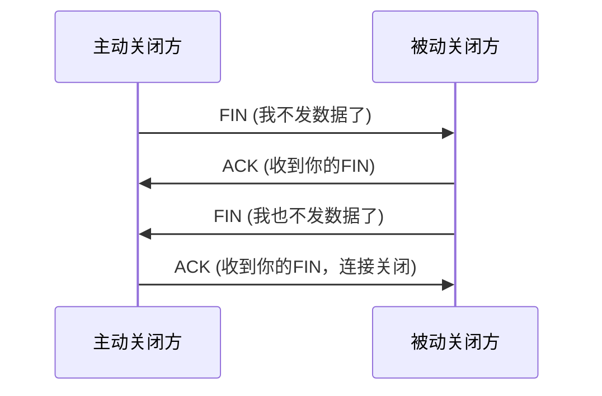
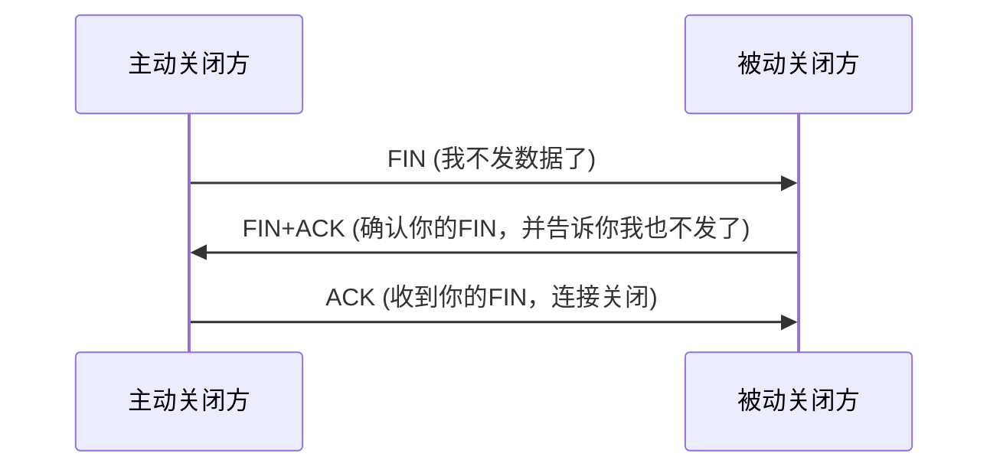
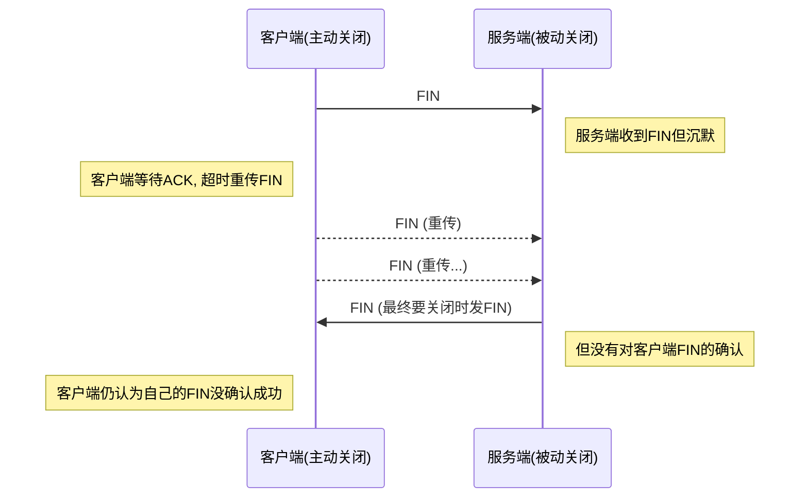
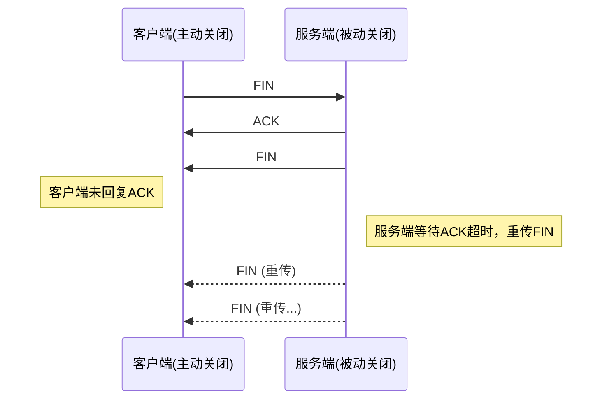

## 基础知识

## 面试题

### TCP 与 UDP 的区别

| 特性     | TCP                                       | UDP                               | QUIC (基于 UDP)                         |
| -------- | ----------------------------------------- | --------------------------------- | --------------------------------------- |
| 可靠性   | ✅ 可靠传输（丢包重传、顺序保证、无重复） | ❌ 不可靠（可能丢包、乱序、重复） | ✅ 可靠（自己实现 ACK、重传、乱序处理） |
| 连接建立 | 三次握手，RTT 开销高                      | 无连接，零 RTT                    | 内建 0-RTT 握手（和 TLS 1.3 一起）      |
| 延迟     | 较高（握手 + 队头阻塞）                   | 很低（无握手，直接发）            | 很低（无内核队头阻塞，支持多路复用）    |
| 安全性   | 需要配合 TLS/SSL 实现                     | 无                                | 内建 TLS 1.3，加密默认启用              |
| 拥塞控制 | 内建（但升级慢，依赖内核）                | ❌ 无                             | ✅ 自己实现，可快速迭代                 |
| 应用场景 | HTTP/1.1、HTTP/2、邮件、文件传输等        | DNS、语音/视频通话、游戏、直播    | HTTP/3、CDN、移动网络加速               |
| 典型问题 | 队头阻塞（一个包丢了，后面全卡住）        | 需要应用层自己造“可靠机制”        | 解决队头阻塞，多路复用独立传输          |

### TCP 建立断开连接的过程

三次握手

1. 客户端发 SYN（seq=x）→ 服务端：“我能发”；
2. 服务端发 SYN+ACK（seq=y，ack=x+1）→ 客户端：“我能收也能发”；
3. 客户端发 ACK（ack=y+1）→ 服务端：“我知道你能收”；

四次挥手

1. 客户端发 FIN（seq=u）→ 服务端：“我要断开了”；
2. 服务端发 ACK（ack=u+1）→ 客户端：“我知道你要断开”；
3. 服务端发 FIN（seq=v）→ 客户端：“我也断开了”；
4. 客户端发 ACK（ack=v+1）→ 服务端：“我知道你也断开了”；

四次挥手特定情况下能变为 3 次挥手

1. 合并第二步 ACK 和第三步 FIN
   被动关闭方在收到 FIN 后，直接回复 带 ACK 的 FIN（FIN+ACK）。
   主动关闭方收到后再发最后一个 ACK。
   整体就成了 三次挥手。
   适用场景：服务端（被动关闭方）正好没有数据发送

但是如果要干掉第一个或者第二个 ACK 是不可行的

如果省略第一个 ack

- 如果不立刻 ACK，主动关闭方就不知道自己的 FIN 是否被收到，会以为丢包，触发 重传 FIN。
- 这会导致双方的 状态机不同步（客户端以为自己还没关闭发送端，服务端其实已经准备关闭）。

如果省略第二个 ACK

- 如果主动关闭方不对服务端的 FIN 做确认，服务端就无法确定它的 FIN 是否到达，可能会反复重传 FIN。
- 直到超时，连接才会被强制关闭。

### TCP 可靠的原因

1. 序列号和确认号（seq，ack）
2. 超时重传
3. 滑动窗口 和拥塞控制（慢启动、拥塞避免、快速重传、快速恢复）
4. 校验和
