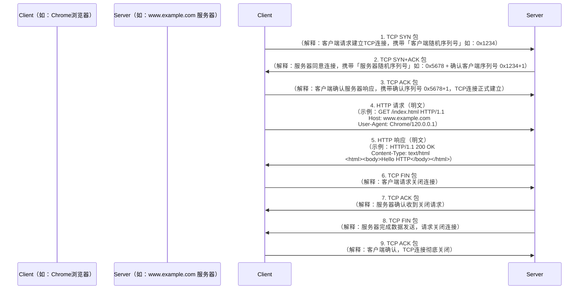
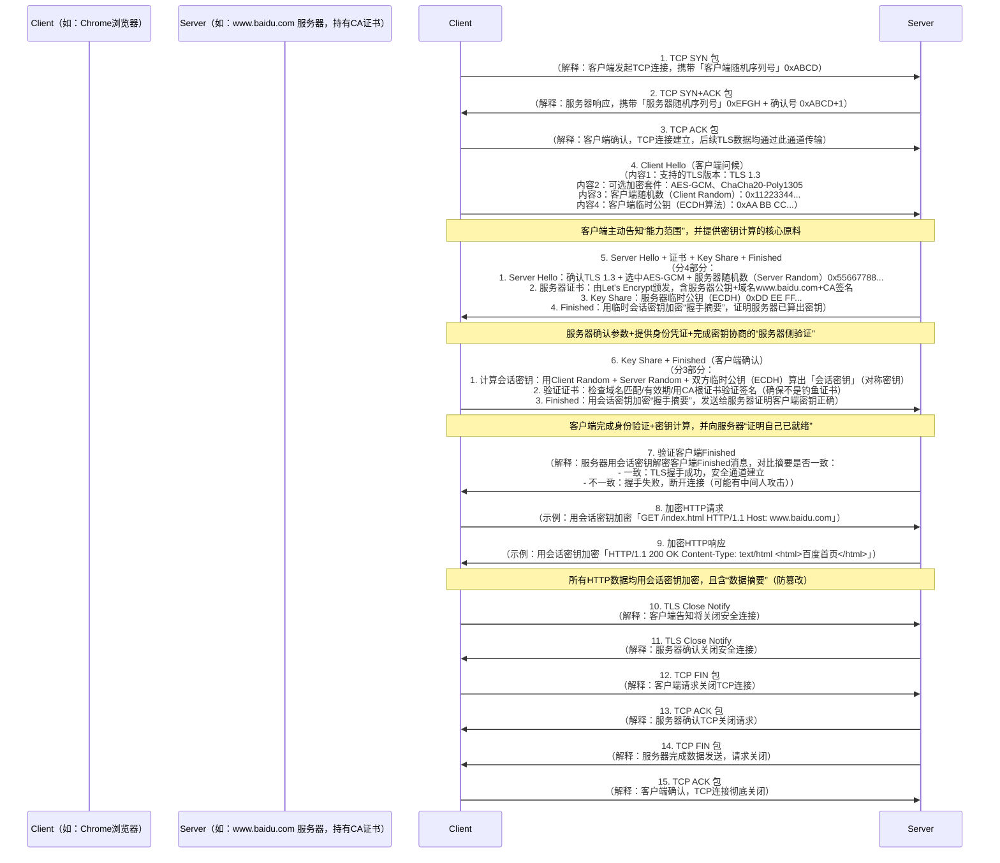

## 基础知识

## 面试题

### TCP 与 UDP 的区别

| 特性     | TCP                                       | UDP                               | QUIC (基于 UDP)                         |
| -------- | ----------------------------------------- | --------------------------------- | --------------------------------------- |
| 可靠性   | ✅ 可靠传输（丢包重传、顺序保证、无重复） | ❌ 不可靠（可能丢包、乱序、重复） | ✅ 可靠（自己实现 ACK、重传、乱序处理） |
| 连接建立 | 三次握手，RTT 开销高                      | 无连接，零 RTT                    | 内建 0-RTT 握手（和 TLS 1.3 一起）      |
| 延迟     | 较高（握手 + 队头阻塞）                   | 很低（无握手，直接发）            | 很低（无内核队头阻塞，支持多路复用）    |
| 安全性   | 需要配合 TLS/SSL 实现                     | 无                                | 内建 TLS 1.3，加密默认启用              |
| 拥塞控制 | 内建（但升级慢，依赖内核）                | ❌ 无                             | ✅ 自己实现，可快速迭代                 |
| 应用场景 | HTTP/1.1、HTTP/2、邮件、文件传输等        | DNS、语音/视频通话、游戏、直播    | HTTP/3、CDN、移动网络加速               |
| 典型问题 | 队头阻塞（一个包丢了，后面全卡住）        | 需要应用层自己造“可靠机制”        | 解决队头阻塞，多路复用独立传输          |

### TCP 建立断开连接的过程

三次握手

1. 客户端发 SYN（seq=x）→ 服务端：“我能发”；
2. 服务端发 SYN+ACK（seq=y，ack=x+1）→ 客户端：“我能收也能发”；
3. 客户端发 ACK（ack=y+1）→ 服务端：“我知道你能收”；

四次挥手

1. 客户端发 FIN（seq=u）→ 服务端：“我要断开了”；
2. 服务端发 ACK（ack=u+1）→ 客户端：“我知道你要断开”；
3. 服务端发 FIN（seq=v）→ 客户端：“我也断开了”；
4. 客户端发 ACK（ack=v+1）→ 服务端：“我知道你也断开了”；

四次挥手特定情况下能变为 3 次挥手

1. 合并第二步 ACK 和第三步 FIN
   被动关闭方在收到 FIN 后，直接回复 带 ACK 的 FIN（FIN+ACK）。
   主动关闭方收到后再发最后一个 ACK。
   整体就成了 三次挥手。
   适用场景：服务端（被动关闭方）正好没有数据发送

但是如果要干掉第一个或者第二个 ACK 是不可行的

如果省略第一个 ack

- 如果不立刻 ACK，主动关闭方就不知道自己的 FIN 是否被收到，会以为丢包，触发 重传 FIN。
- 这会导致双方的 状态机不同步（客户端以为自己还没关闭发送端，服务端其实已经准备关闭）。

如果省略第二个 ACK

- 如果主动关闭方不对服务端的 FIN 做确认，服务端就无法确定它的 FIN 是否到达，可能会反复重传 FIN。
- 直到超时，连接才会被强制关闭。

### TCP 可靠的原因

1. 序列号和确认号（seq，ack）
2. 超时重传
3. 滑动窗口 和拥塞控制（慢启动、拥塞避免、快速重传、快速恢复）
4. 校验和

### HTTP和HTTP通信全过程

#### http

#### https

### 可能会问的问题

#### 网络层面

1. TCP/IP 网络模型的层次及前端开发中的作用

   TCP/IP 模型通常分为 **4 层**（从下到上）：

   - **网络接口层**：负责物理传输（如以太网、Wi-Fi），处理数据帧的发送和接收。
     前端体现：前端不直接操作，但网络硬件（如路由器）的稳定性会影响资源加载速度。
   - **网络层**：核心是 IP 协议，负责数据包的路由和寻址（通过 IP 地址）。
     前端体现：DNS 解析（将域名转为 IP 地址）是网络层的关键操作，前端的所有请求（如 `fetch`、图片加载）都依赖 DNS 解析结果。
   - **传输层**：包含 TCP 和 UDP 协议，负责端到端的数据传输。
     前端体现：
     - TCP 用于 HTTP/HTTPS 请求（保证数据可靠传输，如页面资源、接口数据）；
     - UDP 用于实时性要求高的场景（如 WebRTC 视频通话、WebSocket 底层有时也用 UDP）。
   - **应用层**：包含 HTTP、HTTPS、WebSocket 等协议，定义数据交互格式。
     前端体现：直接使用的协议层，如 `XMLHttpRequest`、`fetch` 基于 HTTP，`WebSocket` 协议用于实时通信，前端框架的接口请求均基于此层。

2. TCP 的三次握手与四次挥手

   三次握手（建立连接）

   **流程**：

   1. 客户端发送 `SYN` 包（请求建立连接，携带初始序列号 `seq=x`）；
   2. 服务器回复 `SYN+ACK` 包（同意连接，携带 `seq=y` 和确认号 `ack=x+1`）；
   3. 客户端回复 `ACK` 包（确认收到，携带 `ack=y+1`）。

   **设计原理**：

   - 确保双方「发送」和「接收」能力均正常（三次交互可验证双向通信）；
   - 防止「失效的连接请求」被服务器接收（若仅两次握手，客户端超时重发的旧 `SYN` 可能被服务器误认，导致资源浪费）。

   四次挥手（断开连接）

   **流程**：

   1. 客户端发送 `FIN` 包（请求关闭，`seq=u`）；
   2. 服务器回复 `ACK` 包（确认关闭请求，`ack=u+1`）；
   3. 服务器发送 `FIN` 包（服务器数据发送完毕，请求关闭，`seq=v`）；
   4. 客户端回复 `ACK` 包（确认服务器关闭，`ack=v+1`）。

   **设计原理**：

   - TCP 是「全双工」通信，双方需各自关闭发送通道（因此服务器的 `FIN` 和 `ACK` 不能合并，需分两次发送）；
   - 确保双方数据均已传输完毕（客户端最后一次 `ACK` 会等待超时，防止服务器未收到确认而重发 `FIN`）。

3. 从输入网址到网页显示的全过程

   1. **DNS 解析**：将域名（如 `www.baidu.com`）转为 IP 地址（如 `180.101.50.242`），优先查本地缓存，再查 DNS 服务器。

   2. **建立 TCP 连接**：通过三次握手与目标服务器建立可靠连接。

   3. **HTTPS 握手（若适用）**：客户端与服务器协商加密算法，交换证书，生成会话密钥（用于后续加密通信）。

   4. **发送 HTTP 请求**：客户端发送请求行（方法、路径）、请求头（`User-Agent`、`Cookie` 等）、请求体（如 POST 数据）。

   5. **服务器处理请求**：解析请求，查询数据库，生成响应（状态码、响应头、响应体）。

   6. 接收响应并渲染

      - 浏览器解析 HTML 生成 DOM 树，解析 CSS 生成 CSSOM 树，合并为渲染树；

      - 布局（计算元素位置）、绘制（像素填充）、合成（图层合并），最终显示页面。

   **涉及协议**：DNS、TCP、TLS（HTTPS）、HTTP；关键步骤核心是「寻址 → 连接 → 传输 → 渲染」。

4. HTTP/1.1 与 HTTP/2 的区别及优化

   | 特性       | HTTP/1.1                   | HTTP/2                       |
   | ---------- | -------------------------- | ---------------------------- |
   | 传输方式   | 文本传输，明文可读         | 二进制分帧，不可读           |
   | 多路复用   | 无（连接数限制，队头阻塞） | 支持（单连接并行传输请求）   |
   | 头部压缩   | 无（重复头部浪费带宽）     | HPACK 算法压缩头部           |
   | 服务器推送 | 无                         | 可主动推送关联资源（如 CSS） |
   | 优先级     | 无                         | 支持请求优先级排序           |

   **HTTP/2 优化点**：

   - 解决 HTTP/1.1 的「队头阻塞」（一个请求阻塞同连接所有请求）；
   - 减少连接建立开销（单连接承载多请求）；
   - 压缩重复头部（如 `Cookie`、`User-Agent`），降低带宽消耗。

5. HTTPS 握手过程及 RSA 加密的作用

   握手过程（简化）：

   1. 客户端发送「客户端问候」：支持的加密算法（如 RSA）、随机数 `C`。
   2. 服务器回复「服务器问候」：选择加密算法（RSA）、随机数 `S`、服务器证书（含公钥）。
   3. 客户端验证证书：确认证书有效性（通过 CA 根证书），生成「预主密钥 `P`」，用服务器公钥加密 `P` 后发送。
   4. 服务器用私钥解密 `P`，双方基于 `C+S+P` 生成「会话密钥」。
   5. 后续通信：用会话密钥（对称加密）传输数据。

   **RSA 的作用**：

   - 在握手阶段安全传输「预主密钥 `P`」（公钥加密 → 私钥解密，确保只有服务器能解密）；
   - 非对称加密（RSA）仅用于密钥交换，后续数据传输用对称加密（效率更高）。

6. HTTP 与 WebSocket 的区别及应用场景

   核心区别：

   - **HTTP**：单向通信（客户端请求 → 服务器响应），无状态，连接随响应结束关闭（短连接）。
   - **WebSocket**：全双工通信（双方可主动发送数据），持久连接，连接建立后保持打开状态。

   应用场景：

   - **HTTP**：适合「请求 - 响应」模式，如页面加载、接口查询（大部分网页场景）。
   - **WebSocket**：适合实时通信，如聊天软件、股票行情更新、在线协作工具（需服务器主动推送数据）。

   **为什么需要 WebSocket**：
   HTTP 轮询（定时请求）效率低（冗余请求多），而 WebSocket 一次连接可双向通信，减少带宽和服务器压力。

7. DNS 查询机制及前端优化

   工作机制：

   1. **本地缓存查询**：先查浏览器缓存、操作系统缓存（如 `hosts` 文件）。
   2. **递归查询**：若本地无缓存，本地 DNS 服务器（如路由器）向根域名服务器 → 顶级域名服务器（如 `.com`）→ 权威域名服务器查询，最终返回 IP。

   前端优化手段：

   - **DNS 预解析**：通过 `<link rel="dns-prefetch" href="https://cdn.example.com">` 提前解析第三方域名，减少后续请求的 DNS 耗时。
   - **减少域名数量**：合并静态资源域名（如将图片、JS 放在同一 CDN 域名），减少 DNS 查询次数。

8. TCP 半连接队列、全连接队列与前端加载

   - **半连接队列**：存放处于 `SYN_RCVD` 状态的连接（三次握手第一步，客户端发送 `SYN` 后）。
   - **全连接队列**：存放完成三次握手（`ESTABLISHED` 状态）但未被应用层（如服务器）处理的连接。

   对前端的影响：

   - 若队列满，新连接会被丢弃，导致前端资源（如 JS、图片）加载超时、重试，延长页面加载时间。

   前端应对：

   - 减少并行请求数（避免同时发起过多连接）；
   - 使用 HTTP/2 多路复用（单连接承载多请求，减少连接建立）；
   - 合理设置缓存（减少重复请求）。

9. 跨域通信的网络协议层面思路

 跨域的核心是浏览器的「同源策略」，以下方法利用协议特性突破限制：

    1. **CORS（跨域资源共享）**：
       - 利用 HTTP 扩展头（如 `Access-Control-Allow-Origin`），服务器通过响应头声明允许的跨域来源，浏览器验证后放行。
    
    2. **JSONP**：
       - 利用 `<script>` 标签不受同源限制的特性，通过动态创建 `script` 发送请求，服务器返回回调函数包裹的数据（基于 HTTP 协议）。
    
    3. **WebSocket**：
       - 握手阶段使用 HTTP，但协议升级后（`Upgrade: websocket`）不受同源限制，基于 WebSocket 协议本身的跨域支持。
    
    4. **iframe + postMessage**：
       - 基于 HTML5 API，但底层依赖 HTTP 连接，通过 `postMessage` 跨窗口通信，规避同源限制。

10. TCP 拥塞控制及大文件上传优化

拥塞控制机制：

TCP 通过以下算法避免网络拥塞：

1. **慢启动**：初始发送窗口小（如 1 个 MSS），每收到确认窗口翻倍（指数增长）。
2. **拥塞避免**：窗口增长到阈值后，每轮确认窗口 +1（线性增长）。
3. **快重传**：收到 3 个重复 ACK 后，立即重传丢失的包（不等待超时）。
4. **快恢复**：重传后窗口减半，进入拥塞避免阶段（而非重新慢启动）。

大文件上传优化（基于拥塞控制）：

1. **分块上传**：将大文件拆分为小块（如 1MB / 块），类似 TCP 分段，单个块丢失不影响整体，减少重传成本。
2. **控制并发数**：限制同时上传的块数量（如 3-5 个），避免触发拥塞控制（窗口收缩）。
3. **动态调整块大小**：根据网络状况（如丢包率）调整块大小（差网络用小 block）。
4. **使用 HTTP/2 多路复用**：单连接传输多块，减少 TCP 连接建立开销，避免多连接竞争带宽导致的拥塞。

5. 请解释 IPv4 地址的结构（网络位 + 主机位），并说明 A、B、C 类 IP 地址的分类依据和默认子网掩码分别是什么？前端开发者在对接后端接口时，为什么偶尔会遇到 “192.168.x.x” 或 “10.x.x.x” 这类 IP，它们属于什么类型的地址？
6. 什么是子网掩码？它的核心作用是什么？如果给定一个 IPv4 地址 “192.168.1.100” 和子网掩码 “255.255.255.128”，如何计算该 IP 所在的子网网络地址和广播地址？这对前端部署多环境（开发 / 测试 / 生产）的服务器 IP 规划有什么参考意义？
7. 什么是公网 IP 和私网 IP？为什么大多数设备（如电脑、手机）使用的是私网 IP，却能访问互联网？NAT（网络地址转换）技术在其中扮演了什么角色？前端开发中，为什么本地启动的服务（如`localhost:3000`）只能本地访问，而配置成 “192.168.1.5:3000” 后同局域网内的设备能访问？
8. “无连接” 和 “不可靠” 分别指什么？既然 IP 不可靠，为什么前端请求还能稳定获取数据？TCP 协议是如何弥补 IP “不可靠” 缺陷的？如果 IP 数据包在传输过程中丢失或出错，会对前端请求产生什么影响（如页面加载卡住、接口超时）？
9. 什么是网关？它和路由器的区别是什么？前端开发中，为什么有时候连接公司 WiFi 能正常访问内网接口（如`10.0.0.200:8080`），但连接手机热点就无法访问？这和网关配置有什么关系？
10. ICMP 协议的核心作用是什么？它和 IP 协议的关系是怎样的？前端开发中，当遇到 “接口请求超时” 或 “无法访问该网站” 时，为什么常用`ping`和`traceroute`（或`tracert`）命令排查问题？这两个命令分别利用了 ICMP 的哪些报文类型？
11. 用`ping`命令测试某个服务器 IP（如`ping 114.114.114.114`）时，返回 “请求超时” 是否一定代表该服务器不可用？可能的原因有哪些？前端开发者如何通过`ping`的结果初步判断是 “本地网络问题”“路由问题” 还是 “服务器问题”？
12. `traceroute`命令能显示数据包从本地到目标 IP 的 “路由路径”，它的原理是什么？如果`traceroute`结果中某一跳出现 “\* \* \*”，说明什么问题？这对前端排查 “不同地区用户访问页面速度差异大” 有什么帮助？
13. 为什么需要从 IPv4 过渡到 IPv6？IPv4 的地址耗尽问题具体是怎么产生的？IPv6 地址的结构（128 位）相比 IPv4（32 位）有哪些优势？目前前端开发中，是否需要适配 IPv6？如果用户的网络同时支持 IPv4 和 IPv6，浏览器会优先使用哪种协议发起请求？
14. IPv4 向 IPv6 过渡的技术有哪些（如双栈、隧道、NAT64）？请简单说明 “双栈技术” 的原理，以及它对前端部署的影响（如服务器是否需要同时配置 IPv4 和 IPv6 地址，CDN 是否支持 IPv6 加速）。
15. CDN（内容分发网络）的核心原理是 “就近访问”，它如何通过 IP 实现这一目标？当前端加载 CDN 上的资源（如`https://cdn.example.com/jquery.js`）时，DNS 解析 CDN 域名得到的 IP 为什么是 “就近节点” 的 IP，而不是源服务器的 IP？这对前端资源加载速度有什么提升作用？
16. 前端开发中，为什么有些接口会限制 “仅允许特定 IP 访问”（即 IP 白名单）？这种限制是在哪个网络层面实现的？如果本地开发环境的 IP 不在白名单中，如何通过 “代理服务器” 绕过该限制（请结合 IP 转发的思路说明）？
17. 什么是 “IP 欺骗” 攻击？它的原理是什么？前端开发者在对接支付、用户登录等敏感接口时，为什么后端会要求同时验证 “IP 地址” 和 “Token”？这能防范哪些安全风险？
