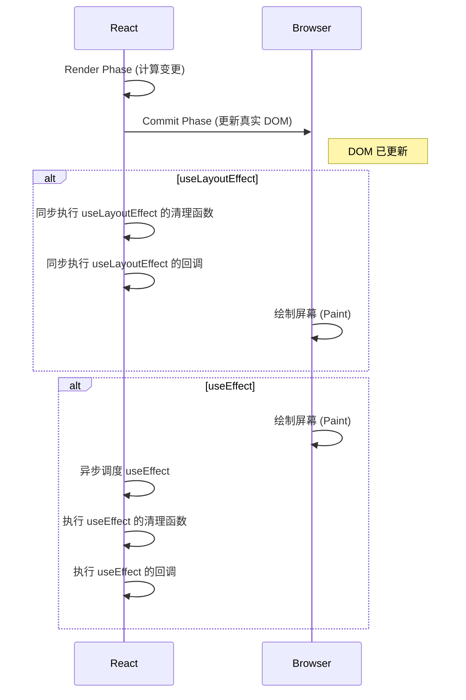

# React 核心原理：Fiber、Reconciler 与 Hooks 全解析

## 引言

现代 React 的核心由三大基石构成：**Fiber 架构**、**Reconciliation（协调过程）** 与 **Hooks API**。这三个系统深度交织，协同工作，为开发者提供了高效的 UI 渲染、简洁的状态管理和声明式的开发体验。Fiber 作为重构后的核心算法，为异步、可中断的渲染提供了基础；其内置的 **Scheduler（调度器）** 负责对任务进行优先级排序和时间分片；**Reconciler（协调器）** 在 Fiber 架构之上，通过高效的 **Diffing（差异比对）** 算法找出最小化的 DOM 更新；而 **Hooks** 则提供了一套优雅的 API，让开发者能以函数式的方式“钩入”React 强大的状态管理和生命周期机制。

本指南旨在深入剖析这几个核心概念，融合高层设计哲学与底层实现细节，提供一个全面而深入的理解框架。

---

## 第一部分：奠基之石 —— Fiber 架构与 Scheduler 调度器

在 React 16 之前，React 使用一个被称为“Stack Reconciler”的同步递归模型。当一个复杂的组件树需要更新时，JavaScript 主线程会被长时间占用，直到整个树的遍历和比对完成，这常常导致页面卡顿和用户输入无响应。为了解决这个核心痛点，React 团队对核心算法进行了彻底的重构，引入了 Fiber 架构。

### 1.1 设计哲学：从同步到异步

React Fiber 的核心设计目标是实现**增量渲染（Incremental Rendering）**，从而提升其在动画、布局和手势等复杂交互场景下的性能。这意味着渲染任务可以被拆分成小块（工作单元），分散在多个帧中执行，从而避免主线程被长时间阻塞。

Fiber 架构的关键特性包括：

- **可中断与恢复**：在有更高优先级的更新（如用户输入）到达时，能够暂停、中止或复用正在进行中的渲染工作。
- **优先级调度**：为不同类型的更新分配优先级，确保紧急任务优先执行。
- **并发能力**：为未来的 Concurrent Mode（并发模式）提供底层支持，允许 React 同时处理多个状态版本。

### 1.2 核心数据结构：Fiber 节点

Fiber 架构的基本工作单元是 **Fiber 节点**，它是一个普通的 JavaScript 对象。在渲染过程中，每一个 React 组件（包括函数组件、类组件和原生 DOM 节点）都会被转换成一个 Fiber 节点。这些节点通过特定的指针连接，形成一个链表形式的树状结构，即 **Fiber 树**。

与代表“蓝图”且不可变的 React 元素不同，Fiber 节点是可变的，它承载了组件在渲染过程中的所有工作信息。

一个简化的 Fiber 节点结构包含：

- **树结构指针**: `child` (指向第一个子节点)、`sibling` (指向下一个兄弟节点) 和 `return` (指回父节点)，共同构成了链表树。
- **组件信息**:
  - `tag`: 标识 Fiber 节点的类型，如 `FunctionComponent`, `ClassComponent`, `HostComponent` (DOM 节点)等。
  - `key`: 组件的唯一标识符。
  - `type`: 组件的构造函数或 DOM 节点的标签名。
- **状态与 Props**:
  - `pendingProps`: 新传入的、待处理的 props。
  - `memoizedProps`: 上一次渲染完成后确定的 props。
  - `memoizedState`: 上一次渲染完成后确定的 state。**对于函数组件，这里存放着 Hooks 的链表**。
- **副作用标记**:
  - `flags` (或 `effectTag`): 一个二进制掩码，用于标记此 Fiber 节点需要执行的 DOM 操作，如 `Placement` (插入)、`Update` (更新)、`Deletion` (删除)等。
- **更新队列**: `updateQueue`: 一个存储待处理的 state 更新、回调函数和 DOM 更新的队列。
- **调度信息**: `lanes` 和 `childLanes`: 用于标记更新优先级的通道。
- **双缓冲指针**: `alternate`: 指向另一个 Fiber 树（当前树或工作中的树）中对应的 Fiber 节点的指针。这个指针是实现“双缓冲”机制的关键。

### 1.3 执行流程：双缓冲与工作循环

Fiber 架构采用“**双缓冲（Double Buffering）**”技术来执行更新。React 在内存中同时维护两棵 Fiber 树：

1.  **Current 树**：代表当前已经渲染到屏幕上的 UI。
2.  **Work-in-Progress (WIP) 树**：正在后台构建的、代表新更新的树。

更新流程分为两个主要阶段：

1.  **Render Phase (渲染阶段)**: 这是一个在内存中进行、**可中断**的过程。React 从根节点开始，遍历 WIP 树，为每个 Fiber 节点调用 `render` 方法（或函数组件本身），计算出新的 state 和 props，并通过 Diffing 算法（详见第二部分）找出变更，为需要更新的节点打上 `effectTag` 标记。如果此时有更高优先级的任务进来，React 可以暂停当前工作，转而去处理更高优先级的任务。
2.  **Commit Phase (提交阶段)**: 这是一个**不可中断**的同步过程。一旦 WIP 树构建完成，React 就会进入提交阶段。它会遍历带有 `effectTag` 的 Fiber 节点形成的“副作用列表”，并将所有变更一次性、原子地应用到真实的 DOM 上。完成后，WIP 树将成为新的 Current 树。

这种分离的设计确保了用户看到的 UI 不会出现不一致的中间状态，同时也使得耗时的渲染工作可以在不阻塞主线程的情况下进行。

### 1.4 调度引擎：Scheduler 深度剖析

支撑 Fiber 异步特性的核心是 Scheduler（调度器）。它是一个独立于 React 的包，负责管理任务的优先级和执行时机。

#### 1.4.1 为什么需要 Scheduler？

1.  **解决 UI 卡顿**：JavaScript 的执行和浏览器的渲染/绘制共享同一个主线程。如果一个 JS 任务（如 React 的组件渲染）耗时过长，就会阻塞绘制，导致页面掉帧和卡顿。Scheduler 通过将长任务拆分成小块，并在浏览器的空闲时段执行，来保证页面的流畅性。
2.  **处理任务优先级**：并非所有更新都同等重要。用户输入（如打字、点击）的反馈需要立即响应，而后台数据加载的 UI 更新则可以稍后进行。Scheduler 需要一种机制来区分并优先处理高优先级的任务。

#### 1.4.2 Scheduler 的核心机制

- **优先级定义**: Scheduler 内置了五种优先级：

  1.  `ImmediatePriority` (1): 立即执行，同步。
  2.  `UserBlockingPriority` (2): 用户阻塞级别，如用户输入，必须尽快执行。
  3.  `NormalPriority` (3): 普通优先级。
  4.  `LowPriority` (4): 低优先级。
  5.  `IdlePriority` (5): 空闲优先级，可以被无限期推迟。

- **任务队列：小根堆**: Scheduler 使用**小根堆（Min-Heap）**作为任务队列的数据结构。小根堆的特性是堆顶永远是值最小的元素。在 Scheduler 中，这个“值”由任务的**过期时间 (`expirationTime`)** 决定。过期时间越早（值越小），优先级越高。

- **动态优先级与饥饿问题**: 一个任务的 `expirationTime` 由 `startTime` (任务创建时间) 和 `timeout` (由优先级决定) 计算得出。这意味着一个低优先级的任务虽然初始 `timeout` 很长，但随着时间的推移，它的“紧迫性”会动态增加。这种机制巧妙地解决了**饥饿问题**——即低优先级任务不会因为高优先级任务的不断插入而永远得不到执行。

- **时间分片 (Time Slicing)**: Scheduler 的目标是在不影响用户体验的前提下，尽可能多地完成工作。它通过 `MessageChannel` 创建一个宏任务，在这个宏任务中执行一个 `workLoop`。`workLoop` 会在一个 `while` 循环中不断从任务队列（小根堆）中取出最高优先级的任务来执行。

  为了不阻塞主线程，这个循环不是无限的。每次执行一个小任务后，它都会通过 `shouldYieldToHost()` 函数检查当前时间片是否已经用完（默认为 **5ms**）。如果时间片用完，`workLoop` 就会中断，并调度下一个宏任务在未来继续执行剩下的工作。

- **可中断的大任务**: 对于耗时超过 5ms 的大任务，React 自身（或开发者）需要将其设计为可中断的。通常的范式是，任务执行一小部分工作后，检查 `shouldYieldToHost()`。如果需要让出主线程，它会返回一个函数（代表任务的剩余部分）。Scheduler 会将这个返回的函数作为该任务新的 `callback`，使其在下一个调度周期中继续执行，从而实现了大任务的拆分和中断。

---

## 第二部分：协调逻辑 —— Reconciliation 与 Diffing 算法

当组件的 state 或 props 变化时，React 需要确定如何以最高效的方式更新真实 DOM。这个过程被称为 **Reconciliation（协调）**，其核心是 **Diffing（差异比对）** 算法。

### 2.1 Diffing 的三大策略

比较两棵通用树的差异，传统算法的复杂度高达 O(n³)。为了将复杂度降低到 O(n)，React 团队基于 Web UI 的实践特点，提出了三个启发式的策略：

#### 2.2.1 Tree Diff: 层级比较

React 对虚拟 DOM 树进行分层比较，两棵树只会对同一层级的节点进行比较。如果一个 DOM 节点发生了跨层级的移动，React 不会去寻找并移动它，而是会直接在旧位置删除它，在新位置创建一个新的。

> **最佳实践**：避免跨层级移动 DOM 节点，这会导致不必要的销毁和重建，以及组件状态的丢失。

#### 2.2.2 Component Diff: 组件比较

- **不同类型的组件**：如果两个组件的类型不同（例如 `<div>` 变成了 `<span>`，或 `<Button>` 变成了 `<Link>`），React 会直接销毁旧的组件实例（及其所有子节点），并创建一个全新的组件实例。
- **相同类型的组件**：如果组件类型相同，React 会保留组件实例，仅更新其 `props`，然后对其子节点进行递归的 Diffing。

#### 2.2.3 Element Diff: 元素比较（`key` 的重要性）

当比较同一层级的一组子元素时（例如 `<ul>` 下的多个 `<li>`），React 需要一种方式来识别每个元素在多次渲染之间的对应关系。这就是 `key` 属性发挥作用的地方。

- **不使用 `key` 的情况**: React 会按索引顺序进行比较。如果在列表头部插入一个新元素，React 会错误地认为所有后续元素的内容都发生了改变，从而导致对每个元素都进行不必要的更新操作。
- **使用 `key` 的情况**: `key` 属性为每个元素提供了稳定且唯一的标识。React 可以通过 `key` 快速识别出哪些元素是新增的、删除的、还是仅仅移动了位置，从而执行最高效的更新（例如，只进行一次插入或移动操作）。

> **`key` 的选择**：
>
> - **最佳选择**：使用数据中稳定且唯一的标识符，如 `item.id`。
> - **不推荐**：使用数组的**索引 `index` 作为 `key`**。当列表项会发生重新排序、插入或删除时，使用索引会导致性能问题和潜在的 state bug。只有当列表是完全静态的，且列表项没有自身状态时，才可安全地使用索引。

### 2.2 Diffing 与副作用列表

在 Fiber 架构中，Diffing 过程（即 Render Phase）本身并不会直接操作 DOM。当 Reconciler 发现一个节点需要更新时，它会在该节点的 Fiber 上添加一个 `effectTag`（例如 `Update`, `Placement`）。在整个 Render Phase 结束后，React 会得到一个只包含带有 `effectTag` 的 Fiber 节点的**副作用列表（Effect List）**。在随后的 Commit Phase，Renderer 会遍历这个列表，一次性将所有变更应用到 DOM，确保更新的原子性。

### 2.3 对比分析：React vs. Vue 3 Diff 算法

虽然都使用虚拟 DOM，但 React 和 Vue 3 的 Diff 算法在列表比较上有所不同：

- **React**: 采用从左到右的单向遍历。它会遍历新列表，在旧列表中通过 `key` 寻找可复用的节点。
- **Vue 3**: 采用**双端比较（Double-Ended Diff）**算法。它同时从新旧列表的头部和尾部开始比较，试图最大化地复用节点。对于中间乱序的部分，它会计算出**最长递增子序列**，以实现最小化的 DOM 移动操作。

在某些复杂的列表重排场景下，Vue 3 的算法可能执行更少的 DOM 操作。但 React 的并发模式和时间分片能力，则从另一个维度优化了复杂更新下的用户体验。

---

## 第三部分：上层 API —— React Hooks 深度剖析

React Hooks（在 React 16.8 中引入）彻底改变了 React 组件的编写方式。它允许函数组件“钩入”React 的 state 和生命周期等特性，解决了类组件存在的诸多问题，如逻辑复用困难（高阶组件、Render Props 导致的“嵌套地狱”）、`this` 指向混乱、以及生命周期方法逻辑分散等。

### 3.1 核心机制：Hooks 链表

React Hooks 的实现并非魔法，其核心依赖于 **Fiber 节点** 和一个**单向链表**。

- **关联 Fiber**: 每个函数组件都对应一个 Fiber 节点。
- **存储在 `memoizedState`**: 该组件内所有 Hooks 的信息，都以**链表**的形式存储在对应 Fiber 节点的 `memoizedState` 属性上。
- **调用顺序至关重要**: React 内部没有为每个 Hook 命名。它完全依赖于 **Hooks 的调用顺序**来在多次渲染之间正确地将 state 与对应的 Hook 关联起来。当组件首次渲染时，React 会按顺序创建 Hook 对象并构建链表。在后续更新时，它会再次按顺序遍历这个链表来获取每个 Hook 的状态。

这就是为什么 Hooks **必须在函数组件的顶层无条件调用**，绝不能在循环、条件判断或嵌套函数中调用的根本原因。打破这个规则会打乱 Hooks 链表的顺序，导致 React 无法正确匹配状态。

#### Hooks 链表结构示例

假设有如下组件：

```jsx
function MyComponent() {
  const [count, setCount] = useState(0);
  useEffect(() => {
    /* ... */
  }, []);
  const memoizedValue = useMemo(() => count * 2, [count]);
}
```

其对应的 Fiber 节点的 `memoizedState` 会形成如下链表结构：

```
FiberNode.memoizedState:
  Hook1 (useState) -> { memoizedState: 0, queue: { ... }, next: Hook2 }
    |
    v
  Hook2 (useEffect) -> { memoizedState: { deps: [], ... }, next: Hook3 }
    |
    v
  Hook3 (useMemo) -> { memoizedState: 0, deps: [0], next: null }
```

### 3.2 常用 Hooks 实现原理

#### `useState`

`useState` 是最基础的 Hook，其内部实现可以看作是 `useReducer` 的一个简化版。

- **首次渲染 (Mount)**: React 创建一个 Hook 对象，将初始值存入其 `memoizedState`，并创建一个与该 Hook 的更新队列（`queue`）绑定的 `dispatch` 函数（即 `setState`）。
- **更新 (Update)**: 当调用 `setState(newState)` 时，React 会：

  1.  创建一个 `update` 对象。
  2.  将这个 `update` 对象推入对应 Hook 的更新队列中。
  3.  调度一次新的渲染。
  4.  在下一次渲染该组件时，React 会遍历更新队列，计算出最新的 state，并更新 Hook 的 `memoizedState`。

- **批量更新 (Batching)**: 在 React 18 中，所有 `setState` 调用（无论是在事件处理函数、`setTimeout` 还是 Promise 中）都会被自动批量处理。这意味着多次 `setState` 调用只会在事件结束后触发一次重新渲染，以提升性能。

- **函数式更新与闭包陷阱**: 当新 state 依赖于旧 state 时，应使用函数式更新 `setState(prevState => prevState + 1)`。这可以避免因闭包导致获取到过时的 state 值。

#### `useEffect` 与 `useLayoutEffect`

这两个 Hooks 用于处理副作用（数据获取、订阅、DOM 操作等）。它们唯一的区别在于**执行时机**。

- **`useEffect` (异步执行)**:

  - **执行时机**: 在浏览器完成**绘制**之后异步执行。
  - **优点**: 不会阻塞浏览器的绘制过程，用户体验更流畅。
  - **适用场景**: 绝大多数副作用，如 API 请求、事件订阅等。

- **`useLayoutEffect` (同步执行)**:
  - **执行时机**: 在所有 DOM 变更**之后**、浏览器进行**绘制之前**同步执行。
  - **优点**: 可以读取 DOM 布局并同步触发重新渲染，在浏览器绘制前完成所有变更，避免用户看到闪烁的中间状态。
  - **适用场景**: 需要在 DOM 更新后立即测量布局（如 `getBoundingClientRect`）并同步修改 DOM 的场景。

**执行流程对比**:



- **依赖项数组 (`deps`)**:
  - `[]` (空数组): 副作用仅在组件挂载时执行一次，卸载时执行清理。
  - `[a, b]` (有依赖): 当任何依赖项（通过 `Object.is` 比较）发生变化时，重新执行副作用。
  - 不提供: 每次渲染后都执行副作用。

#### `useMemo` 与 `useCallback`

这两个是性能优化 Hooks，用于避免不必要的计算和渲染。

- **`useMemo(() => computeExpensiveValue(a, b), [a, b])`**: 缓存一个**计算结果（值）**。只有当依赖项 `[a, b]` 变化时，才会重新执行计算函数。
- **`useCallback((...args) => { ... }, [deps])`**: 缓存一个**函数引用**。只有当依赖项 `[deps]` 变化时，才会重新创建函数。它等价于 `useMemo(() => fn, [deps])`。

它们通常与 `React.memo` 结合使用，当向子组件传递对象或函数作为 props 时，通过缓存来避免因父组件渲染导致引用变化，从而防止子组件进行不必要的重新渲染。

#### `useRef`

`useRef` 返回一个可变的 ref 对象，其 `.current` 属性被初始化为传入的参数。该对象在组件的整个生命周期内保持不变。

- **主要用途**:
  1.  **访问 DOM 节点**: 将 ref 对象附加到 DOM 元素的 `ref` 属性上，即可通过 `ref.current` 直接访问该 DOM 节点。
  2.  **存储可变值**: 可以在多次渲染之间持久化一个可变值，且**修改 `.current` 不会触发重新渲染**。这对于存储定时器 ID、保存上一次的 state/props 等场景非常有用。

#### `useContext`

`useContext(MyContext)` 用于订阅并读取 React Context 的值。当 `Context.Provider` 的 `value` 发生变化时，所有使用该 `useContext` 的组件都会自动重新渲染。

#### `useImperativeHandle`

`useImperativeHandle(ref, createHandle, [deps])` 通常与 `React.forwardRef` 结合使用，它允许你自定义暴露给父组件的 ref 实例。这是一种命令式的逃生舱口，可以让你限制父组件对子组件内部 DOM 的直接访问，而是暴露一个更清晰的 API（如 `ref.current.focus()`）。应谨慎使用，避免破坏声明式的组件模型。

---

## 总结：协同工作的艺术

React 的现代架构是一个精妙的协同系统：

1.  **Hooks (`useState`) 触发更新**: 当 `setState` 被调用，它会在组件对应的 Fiber 节点的更新队列中添加一个更新。
2.  **Scheduler 调度任务**: Scheduler 接收到更新信号，根据其优先级（如用户输入为高优）创建一个任务，并将其放入小根堆任务队列中。
3.  **Reconciler 在 Render Phase 工作**: 在浏览器空闲时，Scheduler 开始执行任务。它会启动 Reconciler，在可中断的 Render Phase 中构建 WIP Fiber 树。Reconciler 遍历 Fiber 节点，执行组件函数，处理 Hooks 链表，并通过 Diffing 算法标记需要 DOM 操作的节点 (`effectTag`)。
4.  **Renderer 在 Commit Phase 应用更新**: Render Phase 完成后，Reconciler 会得到一个副作用列表。它进入不可中断的 Commit Phase，将所有 DOM 变更一次性应用到屏幕上。
5.  **`useEffect` 执行**: 在 Commit Phase 完成且浏览器绘制后，`useEffect` 中定义的副作用被异步执行。

从同步到异步，从递归的堆栈到可中断的链表，Fiber、Scheduler、Reconciler 和 Hooks 的演进与协作，共同构成了 React 高性能、高响应性和优秀开发体验的基石。理解它们的工作原理，是成为一名高效 React 开发者的关键。
