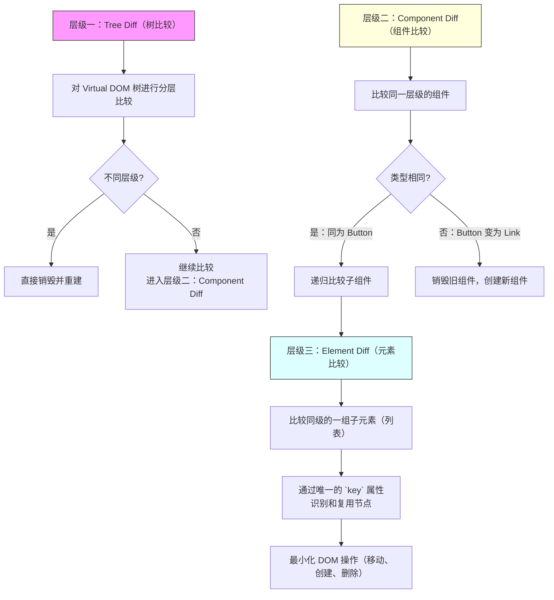
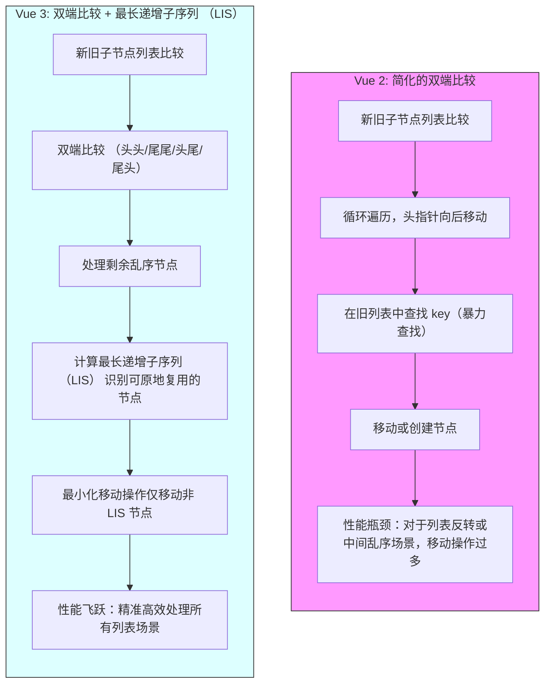
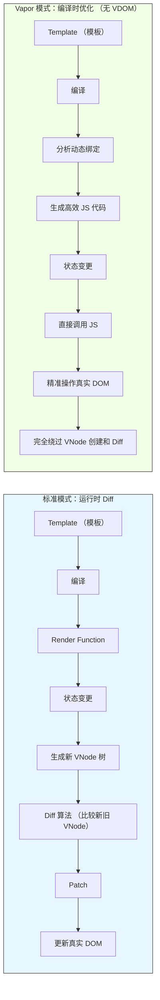

# React vs. Vue: 深度对比 Diff 算法

## 引言

在现代前端开发中，React 和 Vue 已成为两大主流框架。它们成功的核心在于引入了虚拟 DOM (Virtual DOM) 和高效的 Diff (Reconciliation) 算法，极大地优化了 UI 更新的性能。通过在内存中维护一个轻量级的 DOM 表示，框架能够计算出最小的变更集，并仅将这些变更应用到实际的 DOM 上，从而避免了昂贵的、全局性的 DOM 操作。尽管目标一致，React 和 Vue 在 Diff 算法的具体实现、优化策略和设计哲学上却存在显著差异。理解这些差异不仅能帮助我们更深入地掌握框架的内部工作原理，还能指导我们在开发实践中编写出性能更优的代码。本报告将深入探讨并详细对比 React 和 Vue 3 的 Diff 算法。我们将分别剖析各自的核心概念、算法流程、关键优化策略以及最佳实践，旨在为你提供一份全面、清晰且具有深度的技术参考。

## 一、React Diff (Reconciliation) 算法原理

React 的核心特性之一是其高效的 Reconciliation 算法，它使 React 能够以最小的代价更新实际的 DOM，从而提高应用程序的性能。本部分将深入探讨 React Diff 算法的工作原理和优化策略。

### 1.1 基本工作原理和三大策略

#### 1.1.1 虚拟 DOM 与 Diff 算法概述

虚拟 DOM 是真实 DOM 的 JavaScript 对象表示。当组件的状态发生变化时，React 会：

1. 根据最新状态创建一个新的虚拟 DOM 树。

2. 将新的虚拟 DOM 树与旧的虚拟 DOM 树进行比较（此过程即 Diff 或 Reconciliation）。

3. 计算出将旧树转换为新树所需的最小变更集合。

4. 将这些变更以“补丁”的形式应用到实际的 DOM 上。这个过程可以简化为：**状态更新 → 生成新** **VDOM** **→ 新旧** **VDOM Diff** **→ 生成变更补丁 → 更新真实 DOM**。

#### 1.1.2 传统 Diff 算法的局限性

在计算机科学中，比较两棵树的差异是一个复杂的问题，传统算法的时间复杂度高达 O(n³)，其中 n 是树中节点的数量。对于现代 Web 应用中庞大而复杂的 DOM 树，这种复杂度的算法是完全不可接受的。

#### 1.1.3 React 的三大启发式策略

为了将时间复杂度从 O(n³) 优化到 O(n)，React 团队基于对 Web UI 特性的观察，提出了三个大胆且有效的假设（策略）：

1. **Tree** **Diff** **(层级比较)**: 两个不同类型的元素会产生不同的树。

2. **Component Diff (组件比较)**: DOM 节点的跨层级移动操作极少，可以忽略不计。

3. **Element** **Diff (元素比较)**: 开发者可以通过 `key` 属性来标识一组子元素在不同渲染中保持稳定。这三个策略构成了 React Diff 算法的基石，如下图所示：

### 1.2 三大策略详解

#### 1.2.1 Tree Diff: 层级比较

这是 React Diff 的第一层。它对虚拟 DOM 树进行**分层比较**，只比较同一层级的节点。

- **工作方式**: React 会逐层遍历新旧两棵树。如果一个节点在某一层级消失了，React 会直接销毁该节点及其所有后代，而不会尝试在其他层级中寻找它。

- **影响**: 这种策略极大地简化了比较过程。但它也意味着，**跨层级的 DOM 节点移动会被识别为“删除”和“创建”**，而非“移动”。这会导致性能损耗和组件状态的丢失。因此，在开发中应尽量避免跨层级移动节点。如果需要切换组件的显隐，优先使用 CSS 或条件渲染，而非改变其在 DOM 树中的层级。

#### 1.2.2 Component Diff: 组件比较

当比较同一层级的节点是组件时，Component Diff 策略生效：

1. **类型相同**: 如果新旧组件的类型相同（例如，都是 `<Button />`），React 会保留该组件实例，更新其 props，并对其子节点递归地执行 Diff 算法。

2. **类型不同**: 如果组件类型不同（例如，从 `<Button />` 变为 `<Link />`），React 会认为这是一个彻底的改变。它会卸载旧组件（包括其所有子节点和状态），并挂载一个全新的组件。

- **性能优化**: 对于同类型组件，开发者可以通过 `React.memo` (函数组件) 或 `shouldComponentUpdate` / `PureComponent` (类组件) 来进行优化。如果这些优化方法返回 `false`，React 将跳过对该组件及其整个子树的 Diff 过程，从而避免不必要的渲染。

#### 1.2.3 Element Diff: 元素比较

这是 Diff 算法中最复杂的部分，负责处理同一层级下的一组子节点（例如 `<ul>` 下的多个 `<li>`）。React 默认从左到右依次比较新旧两个列表。

**1. 不使用** **`key`** **的问题**如果不提供 `key`，React 会按索引进行比较。这在某些场景下会导致灾难性的性能问题。例如，在列表头部插入一个新元素：

- **旧列表**: `<li>A</li>`, `<li>B</li>`

- **新列表**: `<li>C</li>`, `<li>A</li>`, `<li>B</li>`React 的比较过程会是：

1. 比较 `index 0`: 旧 `<li>A</li>` vs 新 `<li>C</li>`。内容不同，更新 DOM。

2. 比较 `index 1`: 旧 `<li>B</li>` vs 新 `<li>A</li>`。内容不同，更新 DOM。

3. 比较 `index 2`: 旧列表没有，新列表有 `<li>B</li>`。创建一个新的 `<li>` 并插入。原本只需要一次“插入”操作，现在却变成了两次“更新”和一次“插入”，效率低下。

**2. 使用** **`key`** **的优化**`key` 属性为每个子元素提供了稳定且唯一的标识。当 `key` 存在时，React 会使用 `key` 来匹配新旧列表中的元素。

- **旧列表**: `<li key="A">A</li>`, `<li key="B">B</li>`

- **新列表**: `<li key="C">C</li>`, `<li key="A">A</li>`, `<li key="B">B</li>`React 的比较过程变为：

1. React 发现新列表中的 `key="A"` 和 `key="B"` 在旧列表中也存在，因此它可以复用这两个 DOM 节点。

2. 它只需要创建一个 `key="C"` 的新节点，并将其插入到正确的位置。

3. 对于 `key="A"` 和 `key="B"` 的节点，React 会执行移动操作，而不是更新。这样，操作就从“更新+更新+插入”优化为了“插入+移动+移动”，DOM 复用率大大提高。

**3.** **`key`** **的选择**

- **最佳选择**: 使用数据中**稳定且唯一**的标识符，如数据库记录的 `id`。

- **不推荐**: **绝对不要使用数组索引** **`index`** **作为** **`key`**，除非列表是完全静态的（不会新增、删除、重排）。因为当列表顺序改变时，`index` 作为 `key` 会导致与不使用 `key` 时同样的问题，并可能引发组件状态错乱。

### 1.3 性能优化最佳实践

1. **合理使用** **`key`**: 这是最重要的一点。为列表中的每一项提供稳定、唯一的 `key`。

2. **避免不必要的渲染**: 使用 `React.memo`、`useMemo`、`useCallback` 来缓存组件、计算结果和函数，避免因 props 引用变化而导致的无效渲染。

3. **使用不可变数据**: 始终通过创建新对象或数组来更新状态，而不是直接修改它们。这使得 React 的浅比较能够快速生效。

4. **组件拆分**: 将庞大的组件拆分为更小的、职责单一的组件。这样，状态变更只会影响到相关的子组件，而不是整个大组件。

5. **避免在渲染函数中创建新对象或函数**: 类似 `style={{ color: 'red' }}` 或 `onClick={() => {}}` 这样的代码会在每次渲染时创建新的引用，导致子组件即使在 props 内容未变的情况下也会重新渲染。

## 二、Vue 3 Diff 算法原理

Vue 3 的 Diff 算法同样基于虚拟 DOM，但其实现方式和优化策略与 React 有着显著的不同。Vue 3 最大的特点是**将编译时优化与运行时算法相结合**，实现了极为高效的更新机制。

### 2.1 核心概念与渲染管线

- **虚拟 DOM (VNode)**: Vue 将模板编译为返回 VNode 的渲染函数。VNode 是一个描述真实 DOM 元素的 JS 对象，包含了 `type`, `props`, `children`, `key` 等信息。

- **`patch`** **函数**: 这是 Vue 更新机制的核心。当状态变更时，会生成新的 VNode 树。`patch` 函数负责对比新旧 VNode (`n1` 和 `n2`)，找出差异并应用到真实 DOM 上。

- **`sameVnode`** **逻辑**: 在 `patch` 过程中，`isSameVNodeType` 函数用于判断两个 VNode 是否可被视为“相同”的节点，从而可以进行复用和内容更新，而不是销毁和重建。判断标准是：**`vnode1.type === vnode2.type && vnode1.key === vnode2.key`**。

### 2.2 Element Diff: 双端比较算法 (Double-Ended Diff)

当处理同一层级的子节点列表时，Vue 3 采用了先进的**双端比较（或称四指针）算法**，在 `patchKeyedChildren` 函数中实现。该算法通过四个指针（`oldStartIdx`, `oldEndIdx`, `newStartIdx`, `newEndIdx`）从新旧两个列表的两端同时向中间进行比较，以最大化地减少节点移动。算法主要分为以下几个步骤：

**1. 同步首尾（四种快捷比较）**循环比较，直到新旧任一列表的头尾指针相遇：

1. **头对头 (Head-to-Head)**: `oldStart` vs `newStart`。如果 `sameVnode`，则 `patch` 它们，并将两个头指针向后移动一位。

2. **尾对尾 (Tail-to-Tail)**: `oldEnd` vs `newEnd`。如果 `sameVnode`，则 `patch` 它们，并将两个尾指针向前移动一位。

3. **旧头对新尾 (Head-to-Tail)**: `oldStart` vs `newEnd`。如果 `sameVnode`，则 `patch` 它们，并将旧头节点**移动**到旧尾节点之后，然后旧头指针后移，新尾指针前移。

4. **旧尾对新头 (Tail-to-Head)**: `oldEnd` vs `newStart`。如果 `sameVnode`，则 `patch` 它们，并将旧尾节点**移动**到旧头节点之前，然后旧尾指针前移，新头指针后移。

**2. 处理剩余节点（新增或删除）**当上述循环结束后，有两种情况：

- 旧列表已遍历完 (`oldStartIdx > oldEndIdx`)，但新列表还有剩余。此时，将新列表中剩余的节点 (`newStartIdx` 到 `newEndIdx`) 全部**创建并插入**。

- 新列表已遍历完 (`newStartIdx > newEndIdx`)，但旧列表还有剩余。此时，将旧列表中剩余的节点 (`oldStartIdx` 到 `oldEndIdx`) 全部**卸载删除**。

**3. 处理中间乱序节点（Keyed Lookup + LIS）**如果上述步骤结束后，新旧列表的中间部分都还有剩余节点，说明这部分是乱序的。Vue 会进入一个更复杂的处理阶段：

1. **建立映射**: 为新列表的剩余节点创建一个 `key -> index` 的映射表，用于快速查找。

2. **遍历旧节点**: 遍历旧列表的剩余节点。

3. 如果在映射表中**找不到**对应的 `key`，说明该旧节点在新列表中不存在，直接**卸载**。

4. 如果在映射表中**找到**了，就 `patch` 这两个新旧节点，并记录下它们的位置关系。

5. **移动与创建**: 最后，处理移动和创建操作。Vue 在这里引入了一个强大的优化：**最长递增子序列 (Longest Increasing Subsequence, LIS)**。

### 2.3 高级优化策略

#### 2.3.1 最长递增子序列 (LIS)

LIS 算法是 Vue 3 Diff 性能超越许多框架的关键。在处理上述乱序节点时，Vue 不是简单地将每个节点移动到新位置，而是：

1. 根据新列表中乱序节点在旧列表中的原始位置，计算出一个索引序列。

2. 对这个序列应用 LIS 算法，找到其中最长的一段保持相对顺序不变的节点序列。

3. **这些在 LIS 中的节点被视为“稳定”的，不需要移动**。

4. Vue 只需移动那些**不在 LIS 中**的节点，并将新创建的节点插入到正确位置。这极大地减少了 DOM `move` 操作的数量，将最坏情况下的性能提升了一个数量级。

#### 2.3.2 编译器优化：静态标记 (Patch Flags)

这是 Vue 3 与 React 最大的不同之处。Vue 的编译器在编译模板时，会静态分析其中的动态部分，并为 VNode 添加**补丁标记 (\*\***`patchFlag`\***\*)**。

- **工作方式**: `patchFlag` 是一个数字，通过位运算可以表示多种动态类型。例如：

- `1`: 文本内容是动态的 (`TEXT`)

- `2`: class 是动态的 (`CLASS`)

- `4`: style 是动态的 (`STYLE`)

- **影响**: 在 Diff 过程中，Vue 看到带有 `patchFlag` 的 VNode 时，就不再需要进行完整的 props 比对。它会直接根据 `patchFlag` 的值，只更新那些被标记为动态的属性。例如，如果一个元素只有文本是动态的，Vue 就只会更新其 `textContent`，完全跳过对 `class`, `style` 等其他属性的比较。

#### 2.3.3 编译器优化：静态提升 (Static Hoisting)

对于模板中完全静态的内容（没有绑定任何动态数据），Vue 编译器会将其 VNode 的创建逻辑**提升**到渲染函数之外。

- **工作方式**: 这些静态 VNode 只会被创建一次，并在后续的所有渲染中被复用。

- **影响**: 这大大减少了 VNode 的创建开销和内存占用，并使得 Diff 过程可以**完全跳过**对这些静态子树的比较。

### 2.4 最佳实践

`key` 的使用原则与 React 基本一致：**为列表中的每一项提供稳定、唯一的** **`key`**，并且**不要使用** **`index`** **作为** **`key`**。这对于 Vue 的双端比较和 LIS 优化算法能够高效工作至关重要。

- 在 Vue 3 中，当在 `<template>` 标签上使用 `v-for` 时，`key` 应该被放置在 `<template>` 标签上。

- 对于 `v-if`/`v-else`/`v-else-if` 分支，Vue 3 会自动处理，通常不再需要手动添加 `key`。

### 2.5 Vue Diff 算法的演进：从 Vue 2 到 Vue 3

Vue 的 Diff 算法并非一成不变，从 Vue 2 到 Vue 3，其核心 `updateChildren` 逻辑经历了关键的演进，旨在解决特定场景下的性能瓶颈，并结合编译器实现更深层次的优化。

#### 2.5.1 Vue 2 的双端比较 (Double-Ended Diff)

Vue 2 在处理子节点列表时，已经采用了广受好评的双端比较算法。这个算法的核心思想与 Vue 3 的前几个步骤类似，通过在新旧两个子节点列表的两端设置头尾四个指针，并进行四次核心比较：

1. **头对头 (Head-to-Head)**

2. **尾对尾 (Tail-to-Tail)**

3. **旧头对新尾 (Head-to-Tail)**

4. **旧尾对新头 (Tail-to-Head)**

通过这四种快捷路径，Vue 2 能够高效处理大部分常见的列表更新场景，如在列表头部或尾部添加/删除元素。

**局限性**：当上述四种比较都未命中时，Vue 2 会进入一个“乱序”处理阶段。它会为旧列表的子节点创建一个基于 `key` 的索引映射 (`key -> index`)。然后，它会遍历新列表的子节点，并使用 `key` 在旧列表的映射中查找可复用的节点。如果找到了，就执行 `patch` 并移动节点；如果找不到，则创建新节点。

这种方法的**主要问题在于移动策略相对朴素**。它只是简单地将找到的节点移动到正确的位置，但没有计算一个全局最优的移动方案。在某些复杂的重排序场景下（例如，将列表完全倒序），这可能导致大量的、不必要的 DOM 移动操作，从而影响性能。

#### 2.5.2 Vue 3 的 LIS 优化：更智能的移动

Vue 3 继承了 Vue 2 的双端比较策略，但在处理乱序节点时引入了革命性的优化：**最长递增子序列 (Longest Increasing Subsequence, LIS)**。

当双端比较结束后，如果列表中仍有乱序的节点，Vue 3 的处理流程是：

1. **映射与遍历**: 与 Vue 2 类似，为新列表的乱序部分创建 `key -> index` 映射。

2. **计算 LIS**: Vue 3 会构建一个记录新节点在旧列表中位置的索引序列。然后，对这个序列应用 LIS 算法，找到其中最长的一段保持相对顺序不变的节点序列。

3. **最小化移动**: **LIS 算法的精髓在于，所有位于这个最长递增子序列中的节点都被认为是“稳定”的，它们不需要移动**。Vue 3 只需要移动那些不在此序列中的节点，并创建全新的节点。

**核心优势**：通过 LIS 算法，Vue 3 能够以最小的 DOM 操作次数完成列表的重排序。相比 Vue 2 的逐个移动，LIS 提供了一个全局最优解，显著减少了 DOM `move` 操作，尤其是在处理大型和复杂的列表更新时，性能提升巨大。

## 三、Vue 的未来：无虚拟 DOM 的 Vapor 模式

在 Vue 3 已经通过编译时优化（如 Patch Flags）将性能推向新高度的同时，Vue 团队并未止步。受 Solid.js 等框架的启发，一个更激进的、可能改变游戏规则的实验性功能正在开发中——**Vapor 模式**。

### 3.1 什么是 Vapor 模式？

Vapor 模式是一种全新的编译策略，其核心思想是**在可能的情况下，彻底绕过虚拟 DOM**。

- **标准 VDOM 模式**: 依赖于一个运行时过程。组件的 `render` 函数被执行以创建 VNode 树，然后通过 Diff 算法比较新旧 VNode 树，最后将差异应用到真实 DOM。

- **Vapor 模式**: 是一种纯编译时策略。它会分析你的组件模板，并直接生成高度优化的、用于执行精确 DOM 操作的 JavaScript 代码。它不再生成 VNode 树，也不再需要一个通用的 Diff 算法。

### 3.2 Vapor 模式 vs. VDOM 模式

|              |                                           |                                                     |
| ------------ | ----------------------------------------- | --------------------------------------------------- |
| 特性         | 标准 VDOM 模式                            | Vapor 模式                                          |
| **核心机制** | 运行时 Diffing                            | 编译时生成精确指令                                  |
| **虚拟 DOM** | 必需，用于 Diff 计算                      | 完全绕过，无 VDOM 开销                              |
| **更新方式** | 计算 VNode 差异，然后打补丁               | 直接调用原生 DOM API (如 `setText`, `setAttribute`) |
| **性能开销** | 内存中需维护 VDOM 树，Diff 过程有计算成本 | 内存占用极低，运行时开销极小                        |
| **更新粒度** | 组件级或通过 Patch Flags 优化的属性级     | 精确到单个绑定或事件                                |

下图清晰地对比了两种模式的工作流程：

### 3.3 性能优势与使用场景

Vapor 模式的目标是实现性能的极致化：

1. **更快的更新**: 由于没有了 Diffing 的开销，数据更新可以直接转化为 DOM 操作，速度极快。

2. **更低的内存占用**: 无需在内存中维护完整的 VDOM 树，对内存敏感的应用和低端设备非常友好。

3. **更小的包体积**: 需要的运行时支持代码大大减少，有助于优化首屏加载速度。

**适用场景**：

- **性能敏感型应用**: 对于需要频繁更新、包含大量数据可视化的应用，Vapor 模式能带来显著的性能提升。

- **嵌入式组件**: 当你需要将 Vue 组件嵌入到其他应用或现有网站中时，Vapor 模式的轻量级特性使其成为理想选择。

**渐进式采用**：Vapor 模式被设计为可以与现有的 VDOM 组件共存。开发者可以选择性地为项目中的特定组件开启 Vapor 模式，从而在不重构整个应用的前提下，对关键路径进行性能优化。

虽然 Vapor 模式目前仍处于实验阶段（计划在 Vue 3.6+ 版本中提供），但它清晰地指明了 Vue 框架的未来演进方向：通过更智能的编译器，最大限度地减少运行时负担，将性能推向新的极限。

### 3.4 深度思辨：Vapor 模式背后的哲学权衡

即便 Vue 3 的编译器已经能够通过补丁标记实现精准的“靶向更新”，但它在标准模式下依然保留了虚拟 DOM（Virtual DOM）。这并非历史遗留，而是出于深思熟虑的架构权衡。同时，Vapor 模式的出现，也并非要取代 VDOM，而是作为一种重要的补充。

#### 为什么 Vue 3 依然需要虚拟 DOM？

答案在于 **灵活性** 与 **普适性**。虚拟 DOM 本质上是一个中间抽象层，它解耦了组件逻辑与具体的渲染环境。这个抽象层带来了几点至关重要的好处：

1. **跨平台渲染能力**：虚拟 DOM 提供了一个统一的接口，使得 Vue 不仅可以渲染到浏览器 DOM，还能通过自定义渲染器（Custom Renderer）渲染到其他平台，例如原生移动端（如 Weex、NativeScript）、小程序、桌面应用（Electron）甚至终端。如果没有 VDOM 这个抽象层，为每个平台编写一套高度优化的直接操作 API 将会极其复杂且难以维护。

2. **支持高度动态化组件**：虽然编译器在静态分析模板方面非常强大，但总有一些场景是编译期无法完全覆盖的。例如，使用 `render` 函数手写的组件、动态加载的组件或基于用户输入动态生成结构的组件。在这些情况下，静态分析的优势无法发挥，而 VDOM 的运行时比较机制则成为了处理这类动态场景的可靠后盾。

3. **更丰富的生态与开发者工具**：VDOM 的存在使得时间旅行调试（Time-travel debugging）、组件快照测试等高级开发工具的实现变得更加简单和直观。开发者工具可以检查 VDOM 树的状态，而不是直接与复杂的原生 DOM API 交互。

简而言之，**虚拟 DOM 是 Vue 为了保障框架的灵活性、生态完整性和普适性而保留的关键抽象**。它为框架提供了一个稳定、可预测的中间层，确保了 Vue 能够应对复杂多变的业务场景和未来的技术发展。

#### 为什么还要引入 Vapor 模式？

Vapor 模式的诞生，是 Vue 在追求极致性能道路上的又一次探索。它并非要否定 VDOM，而是为特定场景提供一个 **“性能优先”的可选方案**。

其核心思想是：**在可以放弃部分动态性灵活性，以换取更高性能的场景下，彻底绕过虚拟 DOM**。

Vapor 模式通过编译期的深度静态分析，将组件模板直接转换为不依赖虚拟 DOM 的、性能极高的原生 JavaScript 指令。它的优势在于：

1. **极致的性能**：由于没有了 VDOM 的创建（createVNode）和运行时比较（diff）开销，更新性能可以达到接近原生 JavaScript 的水平。

2. **极小的运行时体积**：由于大部分工作在编译期完成，Vapor 组件的运行时代码非常轻量，几乎不包含虚拟 DOM 的核心逻辑，非常适合用于构建独立的 Web Components 或嵌入到对体积敏感的应用中。

因此，Vapor 模式并非取代，而是一种 **模式切换**。开发者可以根据组件的特性来选择：对于那些结构稳定、性能要求极高的组件，可以使用 Vapor 模式；而对于那些需要高度动态性或依赖`render`函数的复杂组件，则继续使用标准的 VDOM 模式。这种混合使用的能力，让 Vue 在性能和灵活性之间找到了一个更优的平衡点。

## 四、React 的哲学演进：从开发者显式优化到编译器自动优化

React 的架构哲学并非一成不变，而是随着社区实践和技术发展不断演进。其中最显著的变化之一，就是对待性能优化的态度——从早期推崇开发者手动、显式地进行优化，到如今（React 19 及以后）转向由编译器自动化完成。

### 4.1 为什么 React 最初依赖手动优化？

React 的早期设计哲学高度重视 **显式性（Explicitness）** 和 **开发者控制权（Developer Control）**。它认为，框架应该提供强大而清晰的工具，而如何使用这些工具以达到最佳性能，则应由开发者来决定。`React.memo`、`useCallback` 和 `useMemo` 这些手动优化的 API 正是这一哲学的体现。

这种设计的初衷是：

1. **清晰的依赖关系**：开发者需要手动声明一个记忆化计算（`useMemo`）或回调（`useCallback`）所依赖的数据。这迫使开发者思考组件的数据流和依赖关系，理论上能写出更可控的代码。

2. **赋予开发者最终控制权**：React 相信开发者最了解自己的应用。在某些复杂场景下，自动化的优化可能并非最优解。手动 API 将性能优化的决策权完全交给了开发者，让他们可以进行细粒度的控制。

3. **保持核心库的简洁**：React 的核心理念是“UI = f(state)”，即将 UI 视为状态的函数。早期的 React 更专注于提供一种纯粹的、可预测的 UI 构建方式，而将性能优化的复杂性作为可选的、需要开发者主动介入的部分。

然而，这种哲学在实践中也暴露了巨大的挑战。

### 4.2 为什么 React 19 转向编译器自动优化？

随着 React 应用的规模和复杂度不断增长，社区和 React 团队都意识到，完全依赖手动优化存在着几个难以克服的痛点：

1. **极易出错（Error-Prone）**：手动管理依赖数组是 React 开发中最常见的错误来源之一。忘记添加依赖会导致 **陈旧闭包（Stale Closures）** 等难以调试的 bug；而添加了不必要的依赖则会破坏记忆化的效果，导致性能不升反降。

2. **心智负担过重（High Cognitive Load）**：开发者需要时刻记住何时使用`useMemo`，何时使用`useCallback`，并精确地管理它们的依赖。这分散了开发者本应投入到业务逻辑上的精力。所谓的“过早优化”和“过度优化”问题也因此变得普遍。

3. **难以实现全局最优**：单个开发者很难对整个应用做出全局最优的优化决策。手动的、局部的优化往往是零散的，甚至可能相互冲突。

正是为了解决这些问题，React 团队推出了 **React 19 Compiler**（前身为 React Forget）。这标志着 React 哲学的一次重大而务实的演进：**承认手动优化的局限性，并相信编译器能够比大多数人在大多数情况下做得更好**。

React 19 编译器的核心工作是：

- **自动分析与记忆化**：编译器在构建时会自动分析代码，理解组件的依赖关系，并自动地、安全地应用`memo`、`useMemo`和`useCallback`等优化。开发者不再需要手动编写这些 Hooks。

- **保证性能与正确性**：通过编译期的静态分析，编译器可以比人脑更精确地追踪依赖，从根本上消除因依赖数组管理不当而引发的 bug，确保组件在默认情况下就具有良好的性能。

总而言之，React 从手动优化到编译器自动化的转变，是一次 **从“赋予开发者控制权”到“为开发者减负”的务实进化**。它承认了在现代复杂应用中，依赖管理的复杂性已经超出了人工处理的理想范畴。通过将这项繁重且易错的工作交给编译器，React 旨在让开发者能够更专注于业务逻辑，同时获得一个默认就高性能且更健壮的应用。

## 五、总结与对比

|               |                                                                                            |                                                                                 |
| ------------- | ------------------------------------------------------------------------------------------ | ------------------------------------------------------------------------------- |
| 特性          | React                                                                                      | Vue                                                                             |
| **核心哲学**  | UI = f(state)，函数式思想，推崇显式状态和单向数据流。后转向编译器辅助优化。                | 渐进式框架，易于上手，通过模板和响应式系统降低开发心-智负担，兼顾灵活性与性能。 |
| **Diff 算法** | 单向遍历（从左到右）+ Keyed Heuristics。                                                   | 双端比较 + 最长递增子序列（LIS）。                                              |
| **优化方式**  | **演进中**：从依赖开发者手动优化（`memo`, `useCallback`）转向编译器自动优化（React 19+）。 | **编译时优化为主**：编译器自动优化（静态提升、补丁标记）为主，手动优化为辅。    |
| **更新粒度**  | 组件级。父组件更新默认会导致子组件重新渲染（手动或自动优化前）。                           | **响应式**：数据变更后，通过编译器优化，可实现“靶向更新”，精准到具体 DOM 属性。 |
| **并发模式**  | 支持（React 18+ Fiber 架构），可中断渲染，提升高负载下应用响应性。                         | 目前不支持，但计划中。                                                          |
| **灵活性**    | 极高，通过 JSX 和 JavaScript 的完全集成，可以实现非常复杂的动态逻辑。                      | 较高，模板语法覆盖了绝大多数场景，也支持 Render 函数和 Vapor 模式应对不同需求。 |

1. 将新的虚拟 DOM 树与旧的虚拟 DOM 树进行比较（此过程即 Diff 或 Reconciliation）。

2. 计算出将旧树转换为新树所需的最小变更集合。

3. 将这些变更以“补丁”的形式应用到实际的 DOM 上。这个过程可以简化为：**状态更新 → 生成新** **VDOM** **→ 新旧** **VDOM Diff** **→ 生成变更补丁 → 更新真实 DOM**。
