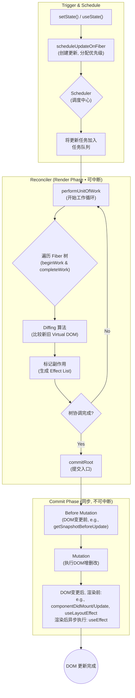
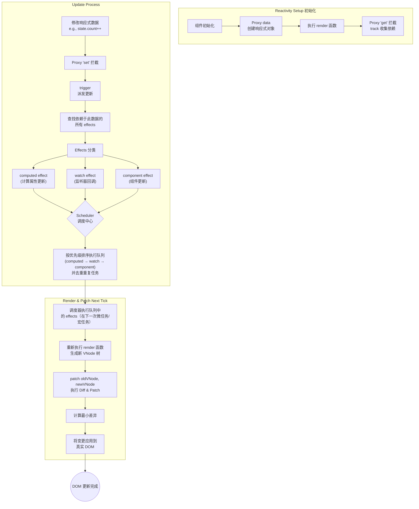

## 导言

本文档旨在深入剖析并对比分析两大主流前端框架——Vue 和 React——其核心的更新流程。理解这两个框架如何响应数据变化、调度更新、以及最终将变更渲染到 DOM，对于前端开发者进行性能优化、解决复杂问题以及做出技术选型至关重要。我们将通过流程拆解、源码解读和可视化图表，力求清晰、详尽地展示其内部工作机制的异同。

## React 更新流程深度解析

React 的更新机制以其独特的 Fiber 架构为核心，采用一种可中断、可恢复的异步更新策略。整个流程可以被划分为三个主要阶段：**调度（Scheduler）、协调（Reconciler） 和 提交（Commit）**。

### 核心流程概述

1. 触发更新（Trigger）:

- 更新的起点通常是组件状态的变更，例如调用 this.setState() 或 useState 的 setter 函数。
  **状态更新触发，创建「Update 任务」**
  同时，React 会将这个 Update 对象加入到对应组件 Fiber 节点的 UpdateQueue（更新队列） 中（每个 Fiber 节点都有自己的 UpdateQueue，保证组件更新隔离）。

- 每次更新都会被赋予一个优先级（Lane），用于后续的调度决策。
  **Lane 优先级分配 —— 给任务 “贴优先级标签”**
  - 常见 Lane 优先级（从高到低）：
    - ImmediateLane：同步优先级（如 flushSync 包裹的更新），必须立即执行，阻塞其他任务；
    - UserBlockingLane：用户交互优先级（如点击、输入），优先级高，避免用户感知卡顿；
    - NormalLane：普通优先级（如定时器回调、网络请求回调）；
    - LowLane/IdleLane：低优先级（如列表滚动时的非关键更新、统计上报），可被高优先级任务打断。
  - 例子：
    - 用户点击按钮触发的 setState → 分配 UserBlockingLane；
    - setTimeout 回调中的 setState → 分配 NormalLane。

2. 调度阶段（Scheduler）:

- React 不会立即处理每次状态变更，而是通过调度器来管理更新任务。
- 调度器根据更新的优先级决定何时执行协调过程。高优先级的更新（如用户输入）会插队，而低优先级的更新（如数据获取）可能会被延迟、合并甚至中断。
  - 根据 Lane 优先级，判断是 “同步任务” 还是 “异步任务”：
    - 高优先级 Lane（如 ImmediateLane）→ 同步任务，直接进入 “同步执行队列”，立即执行；
    - 中低优先级 Lane（如 UserBlockingLane、NormalLane）→ 异步任务，进入 “异步任务队列”，等待浏览器空闲时执行。
    - 高优先级任务 “插队”：如果新任务的 Lane 优先级高于队列中已有的任务，Scheduler 会暂停当前执行的低优先级任务，优先执行新的高优先级任务（这是 Concurrent Mode 的核心能力）。
    - 任务入队格式：Scheduler 会将 “执行更新的回调函数（如 performSyncWorkOnRoot/performConcurrentWorkOnRoot）” 和对应的 Lane 优先级绑定，一起加入队列
  - 同一事件循环内合并同优先级任务
    - React 会在 同一浏览器事件循环（Event Loop）的宏任务阶段，对 “相同组件、相同 Lane 优先级” 的更新任务进行合并，避免重复执行，核心逻辑：
      - 合并时机：当同一事件循环内多次触发同一组件的同优先级更新（如短时间内连续调用 setState(prev => prev + 1)），React 不会创建多个独立任务，而是将这些更新合并到同一个 UpdateQueue 中。
      - 合并规则：对于 “函数式更新”（如 setCount(prev => prev + 1)），React 会按顺序执行所有更新函数（保证最终结果正确）；对于 “值更新”（如 setCount(count + 1)），由于闭包问题，React 会取最后一次更新的值（但推荐用函数式更新避免此问题）。
      - 底层实现：在 scheduleCallback（Scheduler 的核心函数）中，React 会检查当前事件循环是否已有同优先级的任务，如果有，则复用该任务，只更新 UpdateQueue 的内容，避免重复调度。

3. 协调阶段（Reconciler / Render Phase）:

- 这是 React 更新流程的核心，也被称为“Render”阶段。此阶段的工作在内存中进行，并且可以被异步、可中断地执行。
- React 会从根 Fiber 节点开始，构建一棵新的“工作中的（Work-in-Progress）” Fiber 树。
- 在此过程中，它会执行著名的 Diffing 算法，找出新旧两棵树之间的差异。
- 这个遍历和比较的过程被称为 performUnitOfWork，它以 Fiber 节点为单位进行工作。如果主线程有更高优先级的任务，React 可以暂停协调过程，稍后再从断点处恢复。
- 所有计算出的变更（如增、删、改节点）都会被标记为“副作用（Side Effect）”并记录在 Fiber 节点的 effectTag 上。

4. 提交阶段（Commit Phase）:

- 一旦整个 Fiber 树的协调工作完成，React 会进入提交阶段。
- 此阶段是同步且不可中断的，以确保 DOM 的一致性。
- React 会遍历带有副作用标记的 Fiber 节点，并根据 effectTag 将所有变更一次性地应用到真实的 DOM 上。这个过程主要由 commitRoot 函数负责。
- 提交阶段还包括调用生命周期方法（如 componentDidMount, componentDidUpdate）和 Hooks（如 useEffect, useLayoutEffect）。

> 核心理念：**React 的更新是“pull-based”的**。它不会精确地知道是哪个状态变了，而是当状态变更时，它会“拉取”整个组件树的信息，通过自顶向下的 Diff 过程找出需要更新的部分。Fiber 架构的引入使得这个庞大的 Diff 过程可以被拆分成小任务，异步执行，从而避免阻塞浏览器主线程。

React 的 Fiber 承担了虚拟 DOM+组件实例

### 关键源码解读

以下是 React Reconciler 中的一些关键函数，它们揭示了更新流程的核心实现：

- scheduleUpdateOnFiber: 这是发起更新的入口函数。当 setState 或 useState 被调用时，此函数会被触发，它负责创建更新对象、分配优先级（Lane），并将其放入待处理队列，最后启动调度流程。
- performUnitOfWork: 这是协调阶段（Render Phase）的核心工作单元。它接收一个 Fiber 节点，处理该节点（即调用组件的 render 方法），然后创建或更新其子节点的 Fiber。处理完毕后，它会返回下一个要处理的 Fiber 节点，形成一个循环，直到整棵树遍历完成。
- commitRoot: 这是提交阶段的入口。在协调阶段完成后，此函数被调用，它会同步执行所有被标记了副作用（effectTag）的 DOM 操作，并调用相应的生命周期方法和 Hooks。

下图清晰地展示了从状态变更到 DOM 更新的完整流程：



## Vue 更新流程深度解析

Vue 的更新机制构建在其精细的响应式系统之上。**它能够精确地追踪到是哪个状态发生了变化**，并只对受影响的组件进行更新。整个流程可以概括为：**依赖收集（Dependency Tracking）、派发更新（Triggering） 和 补丁（Patching）。**

### 核心流程概述

1. 响应式与依赖收集（Reactivity & Dependency Tracking）:

- 在组件初始化时，Vue 3 使用 Proxy 来包装 data 对象。当组件的 render 函数被执行时，它会访问这些响应式数据。
- Proxy 的 get 拦截器会触发 依赖收集 过程（track 函数）。它会记录下当前正在执行的副作用函数（effect，通常是组件的渲染函数）与被访问的数据属性之间的依赖关系，形成一个“订阅者-发布者”模式。

2. 触发更新（Triggering）:

- 当代码修改了响应式数据时（例如 this.name = 'new name'），Proxy 的 set 拦截器会被触发。
- set 拦截器会调用 trigger 函数，根据之前收集的依赖关系，找到所有依赖于该数据属性的 effect。

3. 调度与队列（Scheduler & Queue）:

- trigger 并不会立即重新执行所有相关的 effect。相反，它会将这些 effect 推入一个异步更新队列中，并由调度器（Scheduler）来管理。
- 这种机制可以有效地对同一事件循环中的多次数据变更进行去重和合并，避免不必要的重复渲染。例如，在一次操作中连续修改了同一个数据多次，最终只会触发一次组件更新。

4. 渲染与补丁（Render & Patching）:

- 在下一个 tick（通常是微任务），调度器会清空更新队列，并执行其中的 effect，即重新运行组件的渲染函数。
- 渲染函数会生成一个新的 VNode (Virtual DOM) 树。
- Vue 的渲染器（Renderer）会调用 patch 函数，对新旧两棵 VNode 树进行 Diffing。
- patch 函数会高效地找出两棵树之间的最小差异，并只将这些差异应用到真实的 DOM 上，完成最终的页面更新。

Vue3 的虚拟 DOM 和组件实例职责清晰

```js
const vnode = {
  type: "div", // 或组件对象（如App）
  props: { className: "xxx" }, // DOM属性或组件props
  children: [
    /* 子VNode */
  ], // 子节点
  patchFlag: 0b10, // 编译优化标识（如仅props更新）
  component: null, // 关键：仅当type是组件时，指向「组件实例」
  el: null, // 指向最终渲染的真实DOM
};
```

```js
const componentInstance = {
  vnode: vnode, // 关键：指向当前组件对应的VNode（双向引用）
  type: App, // 组件定义（如setup函数、options）
  ctx: { count: ref(0) }, // 组件上下文：存储ref/reactive状态、setup返回值
  setupState: { count: 0 }, // setup函数返回的状态（如const { count } = setup()）
  data: {}, // 选项式API的data（已兼容到setupState）
  props: { msg: "hello" }, // 接收的props（响应式）
  emit: (event) => {}, // 事件触发函数
  // 其他生命周期、依赖收集相关属性
};
```

关键源码解读
以下是 Vue 3 响应式和运行时核心中的关键函数：

- createSetter / set (in @vue/reactivity): 这是 Proxy 的 set 陷阱的实现。当响应式数据被修改时，它被调用。其核心职责是更新原始值，并调用 trigger 函数来启动更新通知流程。
- trigger (in @vue/reactivity): 这是派发更新的核心。它根据给定的 target 和 key，从依赖映射中查找所有相关的副作用函数（effects），并将它们交给调度器准备执行。
- patch (in @vue/runtime-core): 这是 VDOM Diff 和 Patching 过程的入口。它接收新旧两个 VNode，通过一系列复杂的比较逻辑（如同层比较、key 值比较等），计算出最小的 DOM 操作，并将其应用到真实 DOM 上。



## React vs. Vue 更新机制对比分析

为了更直观地理解两个框架的设计哲学和实现差异，下表从几个核心维度对它们的更新机制进行了对比：

| 特性维度          | React                                                                 | Vue                                                                        |
| ----------------- | --------------------------------------------------------------------- | -------------------------------------------------------------------------- |
| **核心思想**      | **Pull-based (拉取驱动)**                                             | **Push-based (推送驱动)**                                                  |
| **更新粒度**      | **组件级别**：从状态变更的组件开始，自顶向下 Diff                     | **组件级别/指令级别**：精确知道哪个数据变化，只更新依赖该数据的组件        |
| **状态追踪**      | 不可知：无法直接知道是哪个 state 变化                                 | 可知：通过 `Proxy` 精确追踪到具体的数据属性                                |
| **更新触发**      | 调用 `setState` 或 `useState` setter                                  | 直接修改响应式数据                                                         |
| **批处理策略**    | **自动批处理**：在事件处理函数中自动合并更新                          | **自动批处理**：在 nextTick 前自动合并更新                                 |
| **Diff** **算法** | **Fiber** **Reconciler**：基于 Fiber 节点的异步、可中断 Diff          | **模板\*\***编译\***\*优化 + 双端** **Diff**：利用静态模板信息优化比较过程 |
| **性能优化**      | 依赖开发者手动优化，如 `memo`, `useCallback`, `shouldComponentUpdate` | 自动化程度高，框架内置优化，但也可手动控制                                 |
| **开发者心智**    | 开发者需关注组件的渲染边界和依赖关系，心智负担相对较重                | 响应式系统对开发者透明，心智负担相对较轻                                   |

## 总结

React 和 Vue 在更新流程上选择了两条截然不同的技术路径，这深刻地反映了它们各自的设计哲学。

- **React** 凭借其强大的 **Fiber 架构** 和 **pull-based** 模型，提供了极高的灵活性和可控性。它将更新过程分解为可调度、可中断的任务，保证了复杂应用下的用户体验。然而，这也要求开发者有更强的性能优化意识，需要手动管理组件的渲染时机。

- **Vue** 则通过其精巧的 **响应式系统** 和 **push-based** 模型，实现了更自动化、更高效的更新。它能够精准地定位到变化的源头，以最小的代价完成 DOM 更新，极大地降低了开发者的心智负担。

总而言之，两者没有绝对的优劣之分，而是适用于不同场景和团队偏好的解决方案。深入理解它们的内部工作原理，将帮助我们更好地驾驭这些工具，构建出更健壮、更高性能的应用程序。

## 深度剖析：设计哲学与调用栈

本节将深入探讨两大框架在更新流程中的具体函数调用栈，并解析 React 为何选择了一条与 Vue 不同的设计哲学路径。

### 更详细的函数调用栈

#### 1. React 更新调用栈 (以 Class Component 为例)

当开发者调用 `this.setState()` 时，React 内部会触发一系列复杂的调度和协调过程，直至最终更新 DOM。其核心调用路径可以概括如下（[from](https://stackoverflow.com/questions/38524269/how-do-you-get-any-useful-call-stack-information-when-debugging-react-native)）：

1. **`setState()`**: 用户代码调用，更新请求的入口。
2. **`enqueueSetState()`**: 将更新请求放入组件实例的更新队列中。
3. **`scheduleUpdateOnFiber()`**: 这是更新调度的起点。React Scheduler 会根据更新的优先级（如用户交互、数据获取等）来决定何时执行。
4. **`performSyncWorkOnRoot()`** **/** **`performConcurrentWorkOnRoot()`**: 根据是同步更新还是并发更新，进入不同的工作循环入口。
5. **`performUnitOfWork()`**: 这是 Fiber 架构的核心工作单元。它会处理一个 Fiber 节点，然后返回下一个要处理的节点。这个过程是可中断的。
   1. **`beginWork()`**: 在“Render Phase”的“捕获”阶段，根据 Fiber 节点的类型（如 ClassComponent, FunctionComponent）决定如何处理。对于组件，它会调用 `render()` 方法，并对子节点进行 diff。
6. **`completeUnitOfWork()`**: 在“Render Phase”的“冒泡”阶段，当一个节点及其所有子树都处理完毕后，此函数被调用，用于构建“effect list”（一个记录了所有 DOM 变更的链表）。
7. **`commitRoot()`**: 当整个 Fiber 树的 Render Phase 完成后，进入“Commit Phase”。此阶段不可中断。
   1. **`commitMutationEffects()`**: 执行所有 DOM 的增、删、改操作。
   2. **`commitLayoutEffects()`**: 调用 `componentDidMount` / `componentDidUpdate` 和 `useLayoutEffect` 钩子。
   3. **`commitPassiveEffects()`**: 异步调度 `useEffect` 钩子的执行。

#### 2. Vue 3 更新调用栈

Vue 3 的更新流程由其精确的响应式系统驱动。当一个响应式数据被修改时，调用栈如下[[47]](https://blog.51cto.com/u_17353607/13976601)[[49]](https://jianshu.com/p/1205a2ec0bb3)：

1. **Proxy** **`set`** **trap**: 当执行 `data.property = newValue` 时，Proxy 的 `set` 处理器被触发。
2. **`trigger()`**: `set` 处理器内部调用 `trigger` 函数，它的作用是根据变化的属性，从一个全局的 `targetMap` 中找到所有依赖该属性的 `effect`。
3. **`triggerEffects()`**: 遍历并执行所有找到的 `effect`。
4. **`scheduler()`**: `effect` 在执行时，并不会立即重新渲染，而是将任务推入一个调度器队列中。调度器会进行去重，并使用 `Promise.then()` 等微任务机制，在下一个“tick”异步地、批量地执行更新。
5. **`effect.run()`** **/** **`instance.update()`**: 调度器最终会执行组件的渲染 `effect`，即 `instance.update`。
6. **`renderComponentRoot()`**: 执行组件的渲染函数（`render()`），生成新的 VNode 子树。
7. **`patch(n1, n2)`**: 这是 VDOM diff 和 patch 的核心。`n1` 是旧的 VNode 树，`n2` 是新生成的 VNode 树。
   1. **`processComponent()`**: 如果 VNode 是一个组件，则调用此函数进行更新。
   2. **`updateComponent()`**: 检查组件是否需要更新（`shouldUpdateComponent`），如果需要，则递归调用 `patch` 来更新其子树。
   3. **`patchElement()`** **/** **`patchChildren()`**: 如果 VNode 是普通元素，则对比属性（`patchProps`）并对子节点进行 diff。对于子节点列表，Vue 3 采用优化的双端 diff 算法（包含最长递增子序列算法）来最小化 DOM 操作[[50]](https://blog.51cto.com/wds0/13660908)[[51]](https://blog.51cto.com/wds0/13854114)。

---

### 设计哲学思辨：为何 React 不像 Vue 那样自动响应？

React 的核心设计理念是 **“UI 是状态的纯函数映射 (UI = f(state))”**[[42]](http://m.toutiao.com/group/7512713976526963210/)。这一理念深刻地影响了其架构选择，并解释了为何它没有采用类似 Vue 的自动、精细化响应式系统。

#### 1. 可预测性 vs. 便利性

- **React\*\***：拥抱显式和可预测性**React 选择了“拉”（pull）模型。当状态通过 `setState` 显式更新后，React 会自顶向下地重新渲染整个受影响的子树，然后通过 VDOM Diff 来计算出最小的 DOM 变更。这种模式虽然看起来“笨重”，但它提供了极高的可预测性：**任何状态变更的来源都是明确的（\***\*`setState`\*\***），其影响范围是清晰的（当前组件及其所有子组件）\*\*。开发者无需关心复杂的依赖追踪细节，心智模型相对简单：数据变了，UI 就可能变，React 会搞定剩下的。这避免了 Vue 中可能出现的“隐式”更新——开发者有时可能不清楚是哪一行代码的修改触发了某个遥远组件的更新。
- **Vue：追求便利性和开发效率**Vue 选择了“推”（push）模型。其响应式系统自动追踪每个组件在渲染时使用了哪些数据，建立起一个精细的依赖关系图（[from](https://blog.csdn.net/qq_60893085/article/details/133553352)）。当数据变化时，系统可以精确地“推送”通知给所有依赖该数据的组件，实现“指哪打哪”的更新（[from](http://m.toutiao.com/group/7512713976526963210/)）。这极大地提升了开发便利性，开发者几乎不需要手动进行性能优化。但代价是，这个过程对开发者来说是“魔法”和“隐式”的，在大型复杂应用中，追踪一个意外的更新来源可能会变得困难。

#### 2. 性能权衡：VDOM Diff vs. 精细化追踪

- **React** **的性能假设**React 团队认为，在大多数应用中，组件级别的重新渲染和 VDOM Diff 的开销是可以接受的，尤其是随着 JavaScript 引擎的性能提升和 Fiber 架构的引入（它将渲染过程碎片化，避免阻塞主线程）（[from](https://blog.csdn.net/m0_55049655/article/details/145123797)）。React 的性能瓶颈通常不在于 Diff 算法本身，而在于不必要的组件重新渲染。因此，它提供了 `React.memo`, `useCallback`, `useMemo` 等工具，将优化的责任**显式地**交给开发者（[from](https://wap.zol.com.cn/ask/x_30084378.html)）。开发者可以根据应用的具体性能表现，有针对性地进行优化。
- **Vue 的性能优势**Vue 的精细化依赖追踪在理论上性能更高，因为它从源头上避免了不必要的组件渲染和 Diff 计算。在组件更新频繁、数据依赖关系复杂的场景下，Vue 的自动优化能力通常表现更优。Vue 3 的编译时优化（`PatchFlag`）更是将这种优势发挥到极致，它可以跳过静态内容，只对动态绑定的部分进行 Diff（[from](https://blog.51cto.com/wds0/13660908)）。

#### 3. 架构定位：库 vs. 框架

- React：一个专注的 UI 库 React 始终将自己定位为一个用于构建用户界面的库（A JavaScript library for building user interfaces），而非一个大而全的框架。它只关心视图层。这种专注性使其更具灵活性和可组合性。不内置响应式系统，意味着状态管理可以完全独立出来，从而催生了像 Redux、MobX、Zustand 等丰富的状态管理生态。开发者可以根据项目需求自由选择最适合的架构方案。
- Vue：一个渐进式的框架 Vue 的定位是一个“渐进式框架”（The Progressive Framework），它提供了一套更完整的解决方案，包括官方的路由（Vue Router）和状态管理（Pinia/Vuex）。其内置的响应式系统是整个框架的基石，深度整合在各个部分中。这种“全家桶”式的设计降低了开发者的心智负担和选择成本，提供了更平滑的学习曲线和开箱即用的开发体验。

**总结**

React 不采用自动响应式系统，是其核心设计哲学的直接体现。它牺牲了一部分开发的便利性，换取了更高的可预测性、代码的显式性和架构的灵活性。它相信“UI 作为状态的函数”这一简单模型，并将性能优化的控制权交给了开发者。而 Vue 则走了另一条路，通过内置一个强大的响应式系统，为开发者提供了极致的便利性和开箱即用的高性能，这使其成为一个更“框架化”的解决方案。两者没有绝对的优劣，只是在设计权衡上做出了不同的选择，适用于不同的团队偏好和项目需求。
