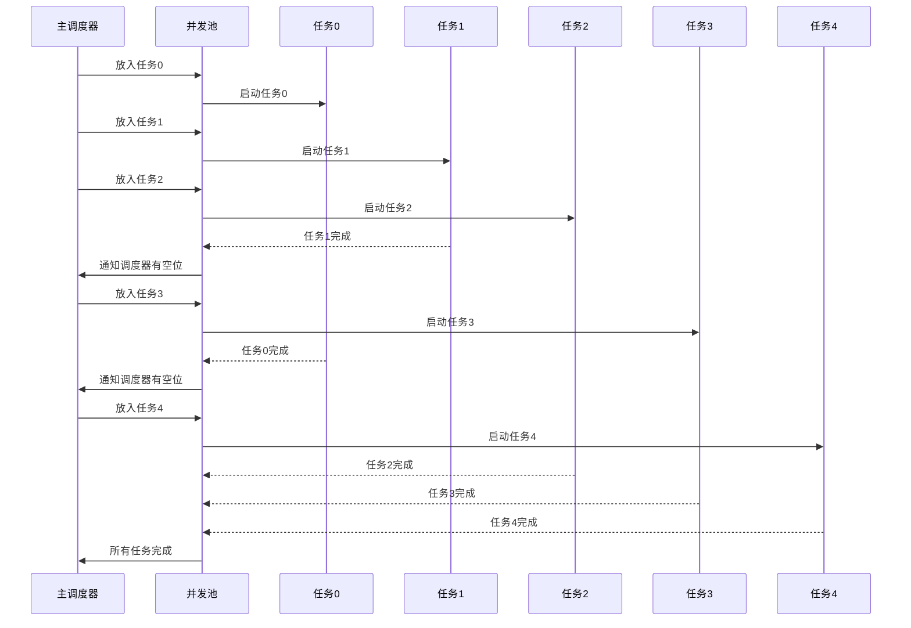

# 固定并发任务池（控制并发数量 + 保证顺序）

## Promise.race+Promise.allSettled 进行实现

**场景**  
常见的需求之一：

- 从任务列表中取出固定数量的任务并发执行
- 每当一个任务完成（无论成功还是失败）就立刻取出下一个任务
- **保证返回结果的顺序与任务的提交顺序一致**
- 需要知道每个任务的下标位置

---

### 设计思路

1. **任务池 + Map 存储 Promise 与下标的关系**  
   Map 的 key 存放正在执行的 Promise，value 存放它的下标。  
   当某个 Promise 执行完成后，通过下标将结果写入结果数组，并从池中删除。

2. **并发限制**  
   当任务池大小达到 `limit` 时，用 `Promise.race()` 找出最先完成的那个任务，等待它结束再放入新的任务。

   > 注意：`Promise.race` 接收的是 iterable，这里建议用 `Array.from(pool.keys())` 保证兼容性。

3. **保证顺序**  
   通过在 Map 中记录下标，确保结果写入到对应位置，而不是按完成先后顺序来排列。

4. **处理剩余任务**  
   当循环结束时，池中可能还有未完成的任务，需要用 `Promise.allSettled()` 等待它们全部完成。

---

#### 并发池运行流程（示例：limit = 3）



### 代码实现

```js
async function asyncPool(requestFns, limit) {
  const res = [];
  const pool = new Map();

  for (let i = 0; i < requestFns.length; i++) {
    // 等待池中有空位
    if (pool.size >= limit) {
      await Promise.race(Array.from(pool.keys()));
    }

    const index = i;
    const startTime = Date.now();

    console.log(`[开始] 任务 ${index} 入池，当前池子大小: ${pool.size + 1}`);

    const promise = Promise.resolve()
      .then(() => requestFns[index]())
      .then(
        (value) => {
          res[index] = { status: "fulfilled", value };
        },
        (reason) => {
          res[index] = { status: "rejected", reason };
        }
      )
      .finally(() => {
        pool.delete(promise);
        console.log(
          `[完成] 任务 ${index} 用时 ${
            Date.now() - startTime
          }ms，当前池子大小: ${pool.size}`
        );
      });

    pool.set(promise, index);
  }

  await Promise.allSettled(pool.keys());
  return res;
}
```

调用：

```jsx
const tasks = Array.from(
  { length: 10 },
  (_, i) => () =>
    new Promise((resolve) => setTimeout(() => resolve(i), Math.random() * 2000))
);

asyncPool(tasks, 3).then(console.log);
```

## 其他实现

### 使用第三方库 p-limit

```js
import pLimit from "p-limit";

const limit = pLimit(3);
const results = await Promise.all(tasks.map((task) => limit(task)));
```

### Scheduler 模式（调度器）

```js
class Scheduler {
  constructor(limit) {
    this.queue = []; // 存放待执行的任务
    this.max = limit || 2; // 最大并发数
    this.running = 0; // 当前正在运行的任务数
  }

  async add(task) {
    // 如果正在运行的任务数小于最大并发数，直接执行任务
    if (this.running < this.max) {
      this.runTask(task);
    } else {
      // 否则将任务推入队列等待
      await new Promise((resolve) => this.queue.push(resolve));
      this.runTask(task);
    }
  }

  runTask(task) {
    this.running++;
    task().then(() => {
      this.running--;
      // 执行队列中的下一个任务
      if (this.queue.length > 0) {
        const nextTask = this.queue.shift();
        nextTask(); // 通过 resolve 来触发下一个任务
      }
    });
  }
}
const task = (ms, content) => {
  return () =>
    new Promise((resolve) => {
      setTimeout(() => {
        console.log(content);
        resolve(content);
      }, ms);
    });
};

const scheduler = new Scheduler(2);
scheduler.add(task(1000, 1));
scheduler.add(task(500, 2));
scheduler.add(task(300, 3));
scheduler.add(task(400, 4));
```

### 批处理

```js
async function poolBatch(tasks, limit) {
  const res = [];
  let index = 0;

  while (index < tasks.length) {
    const batch = tasks.slice(index, index + limit).map((fn, i) =>
      fn().then(
        (value) => (res[index + i] = { status: "fulfilled", value }),
        (reason) => (res[index + i] = { status: "rejected", reason })
      )
    );
    await Promise.allSettled(batch);
    index += limit;
  }
  return res;
}
```

优点：简单易懂
缺点：批次之间存在空档期，不能真正做到“完成一个就补一个”。
