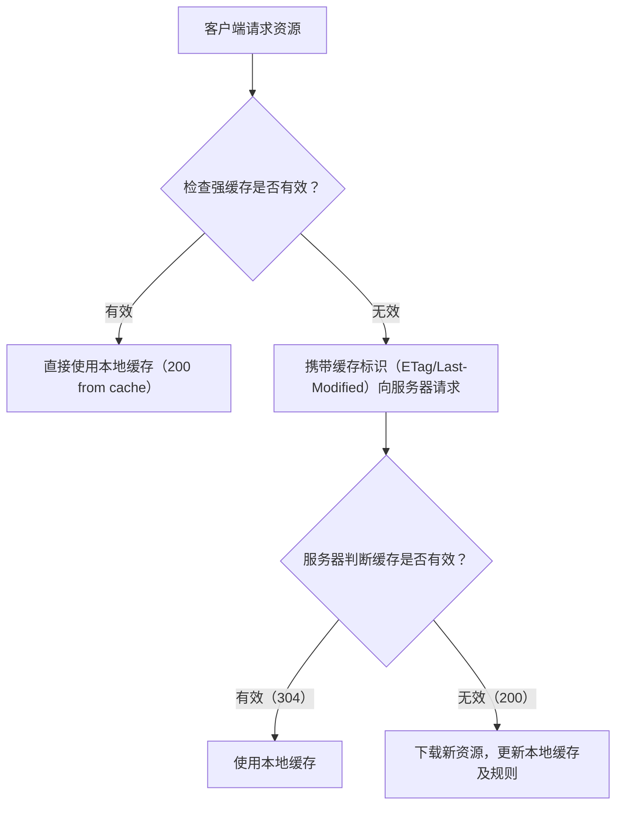

# 浏览器输入 URL 之后发生了什么

1. 浏览器先在地址栏（omnibox）解析用户输入：判断是“导航到 URL”还是“搜索”。 2. 若输入包含协议（如 `http://` 或 `https://`）或明显的主机名（通常含点且无空格），浏览器倾向于作为 URL 导航。 3. 若输入含空格、被识别为查询，或浏览器策略/用户设置决定使用搜索引擎，则作为搜索请求发送给默认搜索引擎。
2. 规范化与补全 5. 若缺少协议，浏览器可能补全默认协议（常为 `http://`），但会先检查安全策略（如 HSTS）。 6. 处理 IDN（punycode）、百分号编码等 URL 规范化工作。
3. 安全与策略检查 8. 检查 HSTS 列表或浏览器内存储的策略，必要时将 http 升级为 https。 9. 应用代理设置、企业策略或扩展对请求的改写／拦截。
4. 主机名解析（DNS）与优先级
5. <span style="color:red">本地优先</span>
   - 首先检查 hosts 文件（用户/管理员配置的静态映射）、浏览器内置的 DNS 缓存与操作系统的解析缓存（包括负缓存，即对 NXDOMAIN 的缓存）。这些本地条目最快且可用于覆盖网络解析结果。
6. 并行与优先策略
   - 浏览器/系统可能并行或按策略查询 A（IPv4）和 AAAA（IPv6）记录，并结合“Happy Eyeballs”策略决定使用 IPv4 还是 IPv6 建立连接以减少延迟。
7. <span style="color:red">网络解析器（递归解析器 / 本地解析器）</span>
   - 若本地未命中，客户端将向配置的 DNS 解析器发起查询（通常是本地路由器、ISP 或第三方解析器）。解析器会执行递归查询、跟随 CNAME 链并返回最终 A/AAAA 记录与 TTL。
8. 性能与优化点
   - DNS TTL、解析器缓存命中率、DoH/DoT 的延迟、CNAME 链长度与并发解析策略都会显著影响首字节时间（TTFB）与页面加载延迟。
9. 建立连接
10. <span style="color:red">根据最终 URL 协议发起网络连接</span>：TCP（三次握手）+ TLS（若 HTTPS）或 QUIC（基于 UDP）。
11. 完成 TLS 握手并验证证书（若适用）。
12. 发送请求并处理响应
13. 发送 HTTP 请求，可能被 Service Worker、代理或缓存拦截或命中。
14. 处理重定向、认证、响应缓存策略、压缩等。
15. 渲染与后续资源加载
16. <span style="color:red">HTML 解析与 DOM 构建</span>
    - 浏览器解析 HTML 生成节点流并逐步构建 DOM 树。遇到同步 `script`（未加 async/defer）会暂停解析并行脚本。
17. <span style="color:red">CSS 解析与 CSSOM / 样式计算</span>
    - 浏览器下载并解析 CSS，生成 CSSOM。DOM + CSSOM 合并生成渲染树（render tree），并进行样式计算（style）。
    - CSS 是渲染阻塞资源：未加载的样式会阻止首次绘制（first paint）。
18. <span style="color:red">布局（reflow / layout）</span>
    - 在渲染树基础上计算每个节点的几何位置与大小。布局开销高，读取 layout 相关属性（offsetWidth/height 等）可能触发强制回流（forced reflow）。
19. <span style="color:red">绘制（paint）</span>
    - 将布局结果转为绘制命令（绘制文本、边框、背景等）。绘制会产生像素级的工作（CPU/GPU）。
20. <span style="color:red">分层与合成（layers / compositing / rasterization）</span>
    - 浏览器将部分内容分入图层（layer），每层可单独合成（composite）。合成线程/GPU 可对各层进行 rasterization（光栅化）并在 GPU 上合成以减少主线程负担。
    - 创建图层有成本（内存、GPU 上传），不应滥用（如过度使用 will-change、复杂 CSS 过滤器、过多的 fixed/transform 元素）。
21. 后续资源加载与优先级
    - 图片、字体、脚本、样式等按优先级加载。可通过 rel=preload/preconnect、resource hints、HTTP/2 优先级、lazy-loading 等优化关键渲染路径（critical rendering path）。

## 相关八股

### 📊 首屏加载优化对照表

| 问题             | 优化手段                             | 示例                                                                         |
| ---------------- | ------------------------------------ | ---------------------------------------------------------------------------- |
| 资源体积过大     | 压缩与精简                           | JS 用 Terser 压缩、CSS 用 cssnano，图片转 WebP/AVIF                          |
| 请求数多，延迟高 | 资源合并/内联、小文件合并            | 将小图标合并雪碧图 / Base64 内联                                             |
| 网络请求慢       | 使用 HTTP/2 / QUIC、开启 Gzip/Brotli | Content-Encoding: br                                                         |
| DNS/TLS 连接慢   | 预连接与预加载                       | `<link rel="preconnect" href="...">`、`<link rel="preload" href="main.css">` |
| 阻塞渲染         | 异步/延迟加载                        | `<script src="xx.js" defer>`、动态 import()                                  |
| 代码冗余         | Tree Shaking、移除 dead code         | import { debounce } from 'lodash-es'（避免整包）                             |
| 依赖过重         | 替换为轻量库                         | dayjs 替代 moment，lodash-es 按需加载                                        |
| 白屏时间长       | SSR / SSG                            | Next.js / Nuxt.js 首屏直接返回 HTML                                          |
| 重复下载资源     | HTTP 缓存                            | 静态资源加 Cache-Control: max-age=31536000 + 文件 hash                       |
| 首屏访问慢       | Service Worker                       | 缓存关键资源 离线时依旧可加载首页 JS/CSS/HTML                                |

### FCP、FP、FMP 的区别

- FP（First Paint）
  浏览器第一次把非空白像素画到屏幕上（背景色、边框等最早的绘制）。
- FCP（First Contentful Paint）
  浏览器第一次绘制“有内容”的像素（文本、图片、svg、canvas 等）。比 FP 更能反映用户感知到“有内容”的时刻。
- FMP（First Meaningful Paint）
  试图度量“对用户有意义的主要内容首次渲染”，但该指标定义主观且不稳定，已在实践中被 LCP（Largest Contentful Paint）等更稳定指标取代。若需要 FMP，可用 LCP 或自定义页面关键元素的可见性作为近似。
  如何在浏览器中实现（推荐与回退方案）

1. 使用标准 API（首选）
   FP / FCP：PerformanceObserver 的 paint 条目
   推荐替代 FMP：使用 LCP（largest-contentful-paint）

```js
// 监听 FP / FCP
try {
  const po = new PerformanceObserver((list) => {
    for (const entry of list.getEntries()) {
      if (
        entry.name === "first-paint" ||
        entry.name === "first-contentful-paint"
      ) {
        // entry.startTime 单位 ms，相对 navigationStart / timeOrigin
        console.log(entry.name, Math.round(entry.startTime));
      }
    }
  });
  po.observe({ type: "paint", buffered: true });
} catch (e) {
  console.warn("PerformanceObserver(paint) not supported", e);
}

// 监听 LCP（作为更稳定的“有意义内容”指标）
try {
  const lcpObs = new PerformanceObserver((list) => {
    const entries = list.getEntries();
    const last = entries[entries.length - 1];
    if (last) {
      console.log("LCP", Math.round(last.startTime), last.element);
    }
  });
  lcpObs.observe({ type: "largest-contentful-paint", buffered: true });
} catch (e) {
  console.warn(
    "PerformanceObserver(largest-contentful-paint) not supported",
    e
  );
}
```

#### round、floor、ceil 的区别

- Math.round（四舍五入，round to nearest）  
  将数值四舍五入到最接近的整数。注意不同语言/实现对 `.5` 的处理不同：在 JavaScript 中，Math.round 在 `.5` 的情况下会向 +∞ 取整（Math.round(0.5) === 1；Math.round(-0.5) === 0）。

- Math.floor（向下取整，向 -∞）  
  返回小于或等于给定数的最大整数。例如：Math.floor(1.9) === 1；Math.floor(-1.1) === -2。

- Math.ceil（向上取整，向 +∞）  
  返回大于或等于给定数的最小整数。例如：Math.ceil(1.1) === 2；Math.ceil(-1.9) === -1。

- Math.trunc（向零取整）  
  去掉小数部分，直接截断。例如：Math.trunc(1.9) === 1；Math.trunc(-1.9) === -1。

```js
Math.round(1.5); // 2
Math.round(-1.5); // -1? 在 JS 是 -1 的情况下 Math.round(-1.5) === -1 表示 .5 时向 +∞
Math.floor(-1.1); // -2
Math.ceil(-1.9); // -1
Math.trunc(-1.9); // -1
```

#### 常见性能指标

- 核心（Core Web Vitals）
  LCP（Largest Contentful Paint）：最大可见元素渲染时间，衡量首屏主要内容加载速度。
  INP（Interaction to Next Paint）：交互体验指标，替代 FID，衡量交互响应质量。
  CLS（Cumulative Layout Shift）：累计布局偏移，衡量视觉稳定性。
- 加载/首包相关
  TTFB（Time To First Byte）：服务器响应首字节时间，常反映后端/网络延迟。
  FP（First Paint）、FCP（First Contentful Paint）：首次绘制 / 首次内容绘制，感知首屏开始。
  Speed Index：页面内容感知完成的速率，侧重视觉体验。
  TTI（Time To Interactive）：页面可交互时间（可能受 JS 阻塞影响）。
- 阻塞与主线程
  TBT（Total Blocking Time）：页面加载期间被长任务阻塞的总时长（与 TTI 相关）。
  Long Tasks / 最长任务：主线程上 >50ms 的任务，影响交互和帧率。
  主线程占用 / JS 执行时间：影响帧率与响应性。
- 资源与网络
  请求数（Number of Requests）与总流量（Total Page Size）：直接影响下载时间与连接开销。
  DNS / TCP / TLS 时延（分段度量）：定位网络链路瓶颈。
  缓存命中率（Cache Hit Ratio）、资源压缩与子资源优先级（critical request chains）。
- 渲染细节与可感知指标
  First Meaningful Paint（已弱化/不稳定，但在老文档中常见）
  First CPU Idle：首次 CPU 处于空闲可处理交互的时间点。
  Visually Complete / Perceptual metrics：视觉上页面“看起来完成”的时间。

### 如何检测用户白屏

1. 基于 DOM 渲染的检测
   核心思想：页面加载完成后，检查关键 DOM 元素是否存在或是否有内容。

```js
// 检测关键元素是否渲染成功
function checkWhiteScreenByDOM() {
  // 设定一个延迟，确保页面有足够时间渲染
  setTimeout(() => {
    // 检查body是否有子元素
    const bodyChildren = document.body.children.length;
    // 检查关键容器（如#app）是否有内容
    const appContainer = document.getElementById("app");
    const hasAppContent = appContainer && appContainer.innerHTML.trim() !== "";

    // 白屏判断条件：body无内容且关键容器无内容
    if (bodyChildren === 0 && !hasAppContent) {
      console.error("可能出现白屏：DOM无有效内容");
      // 上报白屏事件（这里可以对接埋点系统）
      reportWhiteScreen({
        type: "dom_empty",
        time: Date.now(),
        path: location.href,
      });
    }
  }, 3000); // 3秒后检测，可根据页面实际加载速度调整
}

// 页面加载完成后执行检测
window.addEventListener("load", checkWhiteScreenByDOM);
```

2. 基于视觉像素的检测
   核心思想：通过 Canvas 绘制页面部分区域，检测像素是否全为白色（或接近白色）。

```js
// 检测页面可视区域是否为白屏
function checkWhiteScreenByPixel() {
  return new Promise((resolve) => {
    // 等待页面渲染完成
    requestAnimationFrame(() => {
      const canvas = document.createElement("canvas");
      const ctx = canvas.getContext("2d");

      // 设置canvas大小为视口的1/10（减少性能消耗）
      canvas.width = window.innerWidth / 10;
      canvas.height = window.innerHeight / 10;

      // 绘制页面可视区域到canvas
      ctx.drawWindow(
        window,
        0,
        0,
        window.innerWidth,
        window.innerHeight,
        "white" // 背景色设为白色，用于对比
      );

      // 获取像素数据
      const imageData = ctx.getImageData(
        0,
        0,
        canvas.width,
        canvas.height
      ).data;
      let isWhite = true;

      // 抽样检测像素（每100个像素检测一个，提高效率）
      for (let i = 0; i < imageData.length; i += 400) {
        const r = imageData[i];
        const g = imageData[i + 1];
        const b = imageData[i + 2];
        // 像素不是白色（允许微小偏差，避免误判）
        if (r < 245 || g < 245 || b < 245) {
          isWhite = false;
          break;
        }
      }

      if (isWhite) {
        console.error("可能出现白屏：视觉像素检测为空白");
        reportWhiteScreen({
          type: "pixel_white",
          time: Date.now(),
          path: location.href,
        });
      }
      resolve(isWhite);
    });
  });
}

// 页面加载完成后执行
window.addEventListener("load", () => {
  // 延迟一段时间，确保渲染稳定
  setTimeout(checkWhiteScreenByPixel, 5000);
});
```

3. 基于性能指标的检测
   核心思想：通过`PerformanceObserver` 监控页面加载关键节点的耗时，若超过阈值则可能是白屏。
   这个可能存在误判，在客户端网络不佳且设备不好的情况下，可能会出现白屏一段时间之后再展示内容的情况

```js
// 检测白屏的性能指标
// 白屏检测配置（可根据业务需求调整阈值）
const WHITE_SCREEN_THRESHOLDS = {
  // 首次内容绘制超过3秒可能为白屏
  FCP: 3000,
  // 最大内容绘制超过5秒可能为白屏
  LCP: 5000,
  // DOM内容加载完成超过8秒可能为白屏
  DOM_CONTENT_LOADED: 8000,
  // 页面完全加载超过10秒可能为白屏
  LOAD: 10000,
};

// 存储性能指标的容器
const performanceMetrics = {};

// 白屏事件上报函数
function reportWhiteScreen(type, metrics) {
  console.error(`可能出现白屏: ${type}`, metrics);
  // 实际项目中可将数据上报到监控系统
  // fetch('/api/report/whitescreen', {
  //   method: 'POST',
  //   body: JSON.stringify({
  //     type,
  //     metrics,
  //     url: location.href,
  //     time: Date.now()
  //   })
  // });
}

// 检查是否触发白屏阈值
function checkThresholds() {
  // 检查首次内容绘制(FCP)
  if (
    performanceMetrics.FCP &&
    performanceMetrics.FCP.duration > WHITE_SCREEN_THRESHOLDS.FCP
  ) {
    reportWhiteScreen("FCP超时", {
      metric: "FCP",
      value: performanceMetrics.FCP.duration,
      threshold: WHITE_SCREEN_THRESHOLDS.FCP,
    });
  }

  // 检查最大内容绘制(LCP)
  if (
    performanceMetrics.LCP &&
    performanceMetrics.LCP.duration > WHITE_SCREEN_THRESHOLDS.LCP
  ) {
    reportWhiteScreen("LCP超时", {
      metric: "LCP",
      value: performanceMetrics.LCP.duration,
      threshold: WHITE_SCREEN_THRESHOLDS.LCP,
    });
  }

  // 检查DOMContentLoaded
  if (
    performanceMetrics.DOM_CONTENT_LOADED &&
    performanceMetrics.DOM_CONTENT_LOADED.duration >
      WHITE_SCREEN_THRESHOLDS.DOM_CONTENT_LOADED
  ) {
    reportWhiteScreen("DOM加载超时", {
      metric: "DOM_CONTENT_LOADED",
      value: performanceMetrics.DOM_CONTENT_LOADED.duration,
      threshold: WHITE_SCREEN_THRESHOLDS.DOM_CONTENT_LOADED,
    });
  }

  // 检查页面完全加载
  if (
    performanceMetrics.LOAD &&
    performanceMetrics.LOAD.duration > WHITE_SCREEN_THRESHOLDS.LOAD
  ) {
    reportWhiteScreen("页面加载超时", {
      metric: "LOAD",
      value: performanceMetrics.LOAD.duration,
      threshold: WHITE_SCREEN_THRESHOLDS.LOAD,
    });
  }
}

// 监控核心Web指标(FCP、LCP等)
const coreMetricsObserver = new PerformanceObserver((entries) => {
  entries.getEntries().forEach((entry) => {
    // 记录首次内容绘制时间
    if (
      entry.entryType === "paint" &&
      entry.name === "first-contentful-paint"
    ) {
      performanceMetrics.FCP = {
        value: entry.startTime,
        duration: entry.startTime, // FCP是时间点，直接使用开始时间
      };
    }

    // 记录最大内容绘制时间
    if (entry.entryType === "largest-contentful-paint") {
      performanceMetrics.LCP = {
        value: entry.startTime,
        duration: entry.startTime,
      };
    }

    checkThresholds();
  });
});

// 监控导航相关指标(DOMContentLoaded、load等)
const navigationObserver = new PerformanceObserver((entries) => {
  entries.getEntries().forEach((entry) => {
    if (entry.entryType === "navigation") {
      // 计算DOMContentLoaded完成时间
      performanceMetrics.DOM_CONTENT_LOADED = {
        value: entry.domContentLoadedEventEnd - entry.fetchStart,
        duration: entry.domContentLoadedEventEnd - entry.fetchStart,
      };

      // 计算页面完全加载时间
      performanceMetrics.LOAD = {
        value: entry.loadEventEnd - entry.fetchStart,
        duration: entry.loadEventEnd - entry.fetchStart,
      };

      checkThresholds();
    }
  });
});

// 启动监控
function startWhiteScreenMonitoring() {
  // 监控绘制指标(FCP)
  coreMetricsObserver.observe({ type: "paint", buffered: true });

  // 监控最大内容绘制(LCP)
  coreMetricsObserver.observe({
    type: "largest-contentful-paint",
    buffered: true,
  });

  // 监控导航指标
  navigationObserver.observe({ type: "navigation", buffered: true });

  // 为不支持PerformanceObserver的浏览器提供降级方案
  if (!window.PerformanceObserver) {
    console.warn("浏览器不支持PerformanceObserver，使用降级方案");
    window.addEventListener("load", () => {
      setTimeout(() => {
        const perfData = performance.getEntriesByType("navigation")[0];
        if (perfData) {
          performanceMetrics.DOM_CONTENT_LOADED = {
            value: perfData.domContentLoadedEventEnd - perfData.fetchStart,
            duration: perfData.domContentLoadedEventEnd - perfData.fetchStart,
          };
          performanceMetrics.LOAD = {
            value: perfData.loadEventEnd - perfData.fetchStart,
            duration: perfData.loadEventEnd - perfData.fetchStart,
          };
          checkThresholds();
        }
      }, 1000);
    });
  }
}

// 初始化监控
startWhiteScreenMonitoring();
```

4. 结合错误监控的检测
   白屏可能由 JavaScript 错误导致，可结合全局错误监听：

```js
// 监听全局JS错误
window.addEventListener("error", (event) => {
  console.error("JS错误可能导致白屏：", event.error);
  reportWhiteScreen({
    type: "js_error",
    error: event.error.message,
    stack: event.error.stack,
    path: location.href,
  });
});

// 监听资源加载错误（如CSS、图片加载失败可能导致白屏）
window.addEventListener("resourceerror", (event) => {
  console.error("资源加载失败可能导致白屏：", event.target.src);
  reportWhiteScreen({
    type: "resource_error",
    resource: event.target.src,
    path: location.href,
  });
});
//如果是监听全局的异步请求错误可以
window.addEventListener("unhandledrejection", (event) => {
  console.error("未处理的 Promise 拒绝：", event.reason);
  reportWhiteScreen({
    type: "unhandled_rejection",
    error: event.reason.message,
    stack: event.reason.stack,
    path: location.href,
  });
});
```

### 在建立连接时有什么优化

1. 对于后续的连接，可以使用 preconnect/dns-prefetch 等方式预连接/预解析域名，减少连接延迟。
2. 对于关键资源（如 CSS、JS 文件），可以使用 HTTP/2 的多路复用，并行加载，减少阻塞时间。

### 首屏加载时间如何优化

1. 网络层面

   1. 减少打包产物的体积
   2. 使用 HTTP2 以上协议+CDN 部署资源
   3. 关键资源优先加载使用 link 标签，将 rel 设置为 preload,prefetch,preconnect,dns-prefetch 等
   4. 非关键资源延迟加载，使用异步加载或动态导入 如 js 标签使用 async/defer，css 标签使用 media=print 等

      1. webpack 使用`html-webpack-plugin`

      ```js
      // 多 HtmlWebpackPlugin 实例，分别处理关键和非关键脚本
      module.exports = {
        plugins: [
          // 关键脚本：不添加 async/defer（默认阻塞）
          new HtmlWebpackPlugin({
            template: "./src/index.html",
            filename: "index.html",
            chunks: ["main"], // 仅包含入口 chunk（关键JS）
            scriptLoading: "blocking", // 默认值，可不写
          }),
          // 非关键脚本：添加 async/defer
          new HtmlWebpackPlugin({
            template: "./src/index.html",
            filename: "index.html",
            chunks: ["analytics", "ads"], // 非关键 chunk
            scriptLoading: "async", // 异步加载
            inject: "body", // 注入到 body 末尾
          }),
        ],
      };
      ```

      2. vite 使用`vite-plugin-html`

      ```js
      // vite.config.js
      import { createHtmlPlugin } from "vite-plugin-html";

      export default {
        plugins: [
          createHtmlPlugin({
            minify: true,
            inject: {
              // 为指定脚本添加 async/defer
              tags: [
                {
                  tag: "script",
                  attrs: {
                    src: "/js/analytics.js", // 非关键脚本路径
                    async: true, // 添加 async 属性
                  },
                  injectTo: "body",
                },
              ],
            },
          }),
        ],
      };
      ```

2. 代码层面

   1. 组件级分割：对大型组件（如表格、编辑器）采用动态导入，在用户交互时（如点击展开）再加载。
      示例（React）：
   2. 减少不必要的依赖

      - Tree Shaking：通过 Webpack/Rollup 的 Tree Shaking 移除未使用的代码（需确保代码是 ES 模块 import/export，且 mode 为 production）。比如 lodash 替换为 lodash-es

        > 对于 Tree Shaking 的必要条件：

        1. 写法需要使用 ES 模块的 import/export 语法
        2. 代码需要打包到生产环境（mode: 'production'）
        3. 需要 package.json 设置 sideEffects 为 false。//或者指定哪些文件存在副作用

        ```json
        // package.json
        {
          "sideEffects": [
            "*.css", // CSS 文件有副作用（插入样式），不能移除
            "src/utils/with-side-effect.js" // 明确标记有副作用的文件
            // 其他未列出的文件默认被视为「无副作用」
          ]
        }
        ```

        4. 配合代码压缩工具:Tree Shaking 本身只是「标记」未使用的代码，真正移除死代码的操作由压缩工具完成（如 Terser、UglifyJS 等）。
           - 构建工具在生产模式下通常会自动集成压缩工具（如 Webpack 内置 TerserPlugin），无需额外配置，但需确保压缩工具启用了「死代码删除（dead code elimination）」功能。
        5. 避免「间接引用」未使用的代码

           - 推荐使用「命名导出（named export）」而非「默认导出（default export）」导出多个成员，因为命名导出更易被静态分析。

           ```js
           // 导出一个对象（default export）❌
           export default {
             used: () => {},
             unused: () => {}, // 即使未被使用，也可能无法被移除
           };

           // 导入时只能整体导入，工具无法判断 unused 未被使用
           import utils from "./utils";
           utils.used();
           // 命名导出 ✅
           export const used = () => {};
           export const unused = () => {};

           // 只导入需要的成员
           import { used } from "./utils";
           used(); // unused 未被导入，可被安全移除
           ```

      - 替换重依赖：用轻量级库替代重量级库（如用 dayjs 替代 moment.js，体积减少 80%+）。

3. 缓存优化

   1. http 缓存
      - 对于静态资源设置长强缓存\(Cache-Control: max-age=31536000\) 开启内容 hash\(file.\[contenthash\].js\)解决更新问题
        > 强缓存 Cache-Control:max-age 协商缓存：ETag/Last-Modified、no-cache、不缓存：no-store
      - 非静态资源（如 API 接口）用协商缓存（ETag/Last-Modified）减少重复传输。
   2. Service Worker 缓存：通过 Service Worker 拦截请求，缓存首屏关键资源（如 HTML/CSS/ 核心 JS），实现「离线可用」和「二次加载瞬时响应」。

4. 服务端与构建优化
   1. SSR\(server side render\)服务端渲染和 SSG\(static site generation\)静态站点生态
      对 SEO 敏感或首屏渲染复杂的页面（如首页、详情页），采用 SSR（如 Next.js/Nuxt.js）在服务端生成 HTML，减少客户端渲染时间；纯静态页面用 SSG 预生成 HTML，直接返回给浏览器。

#### 强缓存和协商缓存

- 强缓存：客户端直接通过本地缓存规则判断有效性，无需与服务器通信。
- 协商缓存：强缓存失效后，客户端携带 “缓存标识” 向服务器发起请求，由服务器判断缓存是否有效。

##### 强缓存

- 强缓存工作流程
  - 首次请求：客户端向服务器发送资源请求（如 GET /style.css），服务器返回资源的同时，在响应头中附带强缓存规则（如 Cache-Control）。
  - 本地存储：客户端将资源内容、响应头中的缓存规则一起存储到本地（分为 “内存缓存” 和 “磁盘缓存”，下文说明）。
  - 后续请求：客户端先检查本地缓存的 “有效期”：
  - 若缓存仍在有效期内（未过期）：直接使用本地缓存，不向服务器发送任何请求。
  - 若缓存已过期：强缓存失效，进入协商缓存流程。
- 判断依据：响应头字段

  | 字段名        | 所属 HTTP 版本 | 作用说明                                                                   | 示例                                       |
  | ------------- | -------------- | -------------------------------------------------------------------------- | ------------------------------------------ |
  | Cache-Control | HTTP/1.1       | 用 “相对时间” 定义缓存有效期，是当前主流的强缓存规则（优先级高于 Expires） | Cache-Control: max-age=3600（缓存 1 小时） |
  | Expires       | HTTP/1.0       | 用 “绝对时间” 定义缓存过期时间（依赖客户端本地时间，存在精度问题）         | Expires: Wed, 20 Aug 2025 12:00:00 GMT     |

  - Cache-Control 字段
    - `no-cache`：不是 “不缓存”，而是 “跳过强缓存，直接进入协商缓存”（强制与服务器确认）。
    - `no-store`：完全不缓存（客户端不存储任何资源，每次请求都必须从服务器获取新资源）。
    - public：允许所有终端（如浏览器、CDN）缓存该资源（默认值，适用于公开资源）。
    - private：仅允许客户端（如浏览器）缓存，禁止 CDN 等中间节点缓存（适用于用户个性化资源，如登录后的页面）。
    - s-maxage：仅作用于 CDN 等 “共享缓存”，优先级高于 max-age（用于控制 CDN 的缓存时长）。

- 本地缓存的形式

  | 类型     | 存储位置   | 特点                                         | 适用场景                                        | 命中状态码                 |
  | -------- | ---------- | -------------------------------------------- | ----------------------------------------------- | -------------------------- |
  | 内存缓存 | 浏览器内存 | 读取速度极快，但关闭标签页后缓存消失         | 体积小、频繁使用的资源（如 JS 变量、小型 CSS）  | 200 OK (from memory cache) |
  | 磁盘缓存 | 本地硬盘   | 读取速度较慢，但持久化存储（重启浏览器仍在） | 体积大、不频繁变化的资源（如图片、大型 JS/CSS） | 200 OK (from disk cache)   |

##### 协商缓存

当强缓存过期（或资源设置了 no-cache）时，客户端需要与服务器 “协商”：确认本地缓存的资源是否仍为最新 —— 若服务器认为缓存有效，则返回 “304” 让客户端继续用本地缓存；若无效，则返回 “200” 和新资源。

- 协商缓存工作流程
  - 强缓存失效：本地缓存已过期，或响应头设置了 no-cache（跳过强缓存）。
  - 携带缓存标识请求：客户端向服务器发送请求时，在请求头中携带本地缓存的标识（如 If-Modified-Since）。
  - 服务器判断：服务器根据请求头中的标识，对比服务器端资源的最新状态：
    - 若服务器资源未更新（缓存仍有效）：返回 304 Not Modified，不携带资源内容（仅告知客户端 “用本地缓存”）。
    - 若服务器资源已更新（缓存无效）：返回 200 OK，携带新的资源内容和新的缓存规则（客户端更新本地缓存）。
  - 客户端处理：
    - 收到 304：使用本地缓存加载资源。
    - 收到 200：替换本地旧缓存，用新资源加载。
- 判断依据
  - 第一组：基于 “资源修改时间”——Last-Modified / If-Modified-Since
  - 第二组：基于 “资源内容哈希”——ETag / If-None-Match（优先级更高）因为这个判断更加精准



### 可能会追问的问题

#### 1. DNS 解析的进阶问题

- DNS 污染与防污染机制：
  比如 “为什么某些场景下 DNS 解析会返回错误 IP？
  如何通过 DNS-over-HTTPS（DoH）/DNS-over-TLS（DoT）解决？”
  （DoH/DoT 通过加密 DNS 查询流量，避免运营商或中间节点篡改解析结果，之前流程中仅提到 DoH/DoT 影响延迟，此处引申到安全与正确性）。
- DNS 负载均衡与容错：
  比如 “DNS 如何实现域名对应多 IP（轮询 / 加权）？本地 DNS 解析失败时，浏览器是否有重试逻辑？”（例如浏览器会尝试切换备用 DNS 服务器，或忽略 TTL 较短的失效记录）。
- DNS 预解析的边界：
  比如 “`<link rel="dns-prefetch">` 会预解析所有子域名吗？跨域场景下是否生效？”（默认不预解析跨域子域名，需显式指定；且预解析仅缓存 IP，不建立 TCP 连接，与 preconnect 区分）。

#### 2. 浏览器架构与进程 / 线程模型

1. 浏览器的多进程模型
   - **进程分工与隔离**：  
      比如 “浏览器有哪些进程？为什么单个标签页崩溃不会影响其他标签？”（Chrome 进程包括：**浏览器进程**（管理窗口 / 地址栏）、**渲染进程**（每个标签一个，负责 DOM/CSS/JS 渲染）、**GPU 进程**（处理图层合成）、**网络进程**（处理 DNS/TCP 请求）、**插件进程**（如 Flash）；进程间通过 IPC 通信，单个渲染进程崩溃不影响其他进程）。
   - **渲染进程的沙箱机制**：  
      比如 “为什么渲染进程要运行在沙箱（Sandbox）中？沙箱如何防止恶意 JS 攻击系统？”（沙箱限制渲染进程的系统调用权限（如读写本地文件），即使 JS 被注入恶意代码，也无法突破沙箱危害系统）。
2. 渲染进程的线程模型
   - **主线程的阻塞问题**：  
      比如 “JS 执行、DOM 解析、CSS 解析都在主线程，如何导致页面掉帧？长任务（>50ms）的危害是什么？”（主线程同时处理 “JS 执行” 和 “布局 / 绘制”，若 JS 执行超过 16.6ms（对应 60fps），会阻塞渲染，导致页面卡顿；长任务会延迟交互响应（如点击、滚动），影响 INP 指标）。
   - **合成线程与光栅化线程的作用**：  
      比如 “为什么 transform/opacity 动画比 width/height 动画更流畅？”（transform/opacity 仅触发 “合成” 阶段，由合成线程 / GPU 处理，不占用主线程；width/height 会触发 “布局 → 绘制 → 合成”，全部在主线程执行，易阻塞）。
   - **Worker 线程的限制**：  
      比如 “Web Worker 能操作 DOM 吗？为什么？如何解决 Worker 与主线程的通信开销？”（Worker 不能操作 DOM，因为 DOM 仅在主线程维护；Worker 与主线程通过 “消息传递” 通信，若传递大量数据，需用`Transferable Objects`（转移数据所有权，避免拷贝）优化）。

#### 3. 缓存机制的进阶与工程化实践

1.  浏览器缓存的优先级与细节
    - **缓存位置的加载顺序**：  
       比如 “浏览器获取资源时，会优先从哪个缓存位置读取？Service Worker 缓存与 Disk Cache 的优先级谁更高？”（优先级：**Service Worker 缓存** > **Memory Cache** > **Disk Cache** > **网络请求**；Service Worker 缓存由开发者手动控制，优先级最高，适合 PWA 离线场景）。
    - **缓存失效的特殊场景**：  
       比如 “为什么设置了`Cache-Control: max-age=31536000`的资源，在 URL 不变的情况下，服务器更新后客户端仍加载旧缓存？”（强缓存未过期时，客户端不会请求服务器；需通过 “内容哈希”（如`app.[contenthash].js`）修改 URL，让客户端认为是新资源，触发重新请求）。
    - **Cookie 与缓存的关联**：  
       比如 “带 Cookie 的请求会影响缓存吗？为什么静态资源要避免携带 Cookie？”（默认情况下，浏览器会为 “同域请求” 自动携带 Cookie，而服务器可能会根据 Cookie 生成不同内容，导致缓存键（Cache Key）包含 Cookie，降低缓存命中率；静态资源（如 CDN 上的 JS/CSS）应配置为 “不携带 Cookie”（通过 CDN 的`Cookie Filter`或`crossorigin="anonymous"`））。
2.  CDN 缓存的策略与问题
    - **CDN 缓存的原理与优化**：  
      比如 “CDN 如何实现‘边缘节点缓存’？如何避免 CDN 节点缓存旧资源（缓存刷新）？”（CDN 通过 “地理位置就近” 原则，将静态资源缓存到边缘节点；缓存刷新分为 “主动刷新”（开发者手动触发节点删除旧缓存）和 “被动刷新”（等待缓存 TTL 过期））。
    - **CDN 缓存穿透 / 击穿 / 雪崩**：  
      比如 “当大量请求访问 CDN 未缓存的资源（缓存穿透），如何避免回源压力过大？”（方案：1. 对不存在的资源缓存 “空结果”（短 TTL）；2. 用布隆过滤器过滤无效请求，避免回源）。
3.  PWA 与 Service Worker 缓存
    - **Service Worker 缓存的生命周期**：  
       比如 “Service Worker 如何更新？为什么更新后需要用户刷新页面才能生效？”（Service Worker 更新需满足：1. 新 SW 脚本与旧脚本有字节差异；2. 浏览器触发 “检查更新”（如页面刷新、`registration.update()`）；更新后旧 SW 仍控制当前页面，新 SW 需等待所有页面关闭后才激活，或通过`skipWaiting()`强制激活）。
    - **离线导航的实现**：  
       比如 “PWA 如何实现‘离线打开首页’？Service Worker 如何拦截 HTML 请求并返回缓存？”（首次加载时，Service Worker 缓存首页 HTML/CSS/ 核心 JS；离线时，SW 拦截`fetch`事件，若请求的是首页，则返回缓存的 HTML，实现离线访问）。

#### 4. 渲染机制的深入

1. 重排（Reflow）与重绘（Repaint）的优化
   - **触发重排 / 重绘的属性差异**：  
     比如 “哪些 CSS 属性会触发重排？哪些仅触发重绘？哪些不触发任何操作？”（触发重排：`width`/`height`/`margin`/`offsetTop`（读取）；触发重绘：`background-color`/`color`/`box-shadow`；不触发：`transform`/`opacity`（仅触发合成））。
   - **批量修改 DOM 的优化方案**：  
      比如 “频繁修改 DOM 会导致多次重排，如何优化？”（方案：1. 用`DocumentFragment`批量插入 DOM；2. 先将 DOM 脱离文档流（如`display: none`），修改后再恢复；3. 使用`requestAnimationFrame`将修改批量执行在 “重绘前”）。
   - **强制同步布局（Forced Synchronous Layout）的危害**：  
      比如 “为什么连续读取`offsetWidth`再修改`style.width`会导致性能问题？”（读取布局属性（如`offsetWidth`）会强制浏览器立即执行布局，若后续修改样式，会触发二次布局，形成 “读取 - 修改 - 读取 - 修改” 的恶性循环，增加主线程开销）。
2. 图层合成与性能
   - **图层创建的条件与成本**：  
      比如 “浏览器会自动为哪些元素创建独立图层？过度创建图层有什么问题？”（自动创建图层：`position: fixed`/`transform: translate`/`opacity < 1`/ 有 CSS 过滤器的元素；过度创建图层会占用更多 GPU 内存，导致内存溢出或 GPU 卡顿）。
   - **`will-change`的正确使用**：  
      比如 “`will-change: transform`能优化动画性能吗？为什么不能滥用？”（`will-change`提前告知浏览器 “该元素即将动画”，浏览器会提前创建图层并优化；滥用会导致浏览器提前分配大量资源，反而降低性能，建议仅用于 “即将动画的元素” 且指定具体属性）。
3. 常见渲染问题排查
   - **页面闪烁的原因与解决**：  
      比如 “页面加载时出现‘白屏 → 内容闪烁 → 稳定’，可能是什么原因？”（可能原因：1. CSS 加载延迟导致 “无样式内容闪烁（FOUC）”，需将关键 CSS 内联到 HTML；2. 图片未设置宽高导致布局偏移（CLS），需设置`aspect-ratio`或占位容器）。
   - **移动端页面缩放与 viewport 的关联**：  
      比如 “为什么移动端页面不设置`<meta name="viewport" content="width=device-width">`会导致渲染错乱？”（默认 viewport 宽度为 980px，移动端浏览器会将页面缩放到屏幕宽度，导致元素变小；设置`device-width`后，viewport 宽度与屏幕宽度一致，渲染正常）。

#### 5.安全机制的扩展

1. 内容安全策略（CSP）
   - **CSP 的作用与配置**：  
      比如 “CSP 如何防止 XSS 攻击？为什么`script-src 'self'`能限制脚本加载？”（CSP 通过`script-src`指定允许加载脚本的域名，仅允许`self`（当前域名）则无法加载外部恶意脚本；若页面被注入 XSS 脚本，CSP 会阻止其执行）。
   - **CSP 的常见报错与排查**：  
      比如 “CSP 报错‘Refused to load the script because it violates the following Content Security Policy directive’，如何解决？”（检查`script-src`是否包含脚本的域名，若为内联脚本需添加`'unsafe-inline'`（不推荐）或使用 “非 cei”（nonce）/ 哈希值授权）。
2. 跨域资源共享（CORS）
   - **CORS 的预检请求（OPTIONS）**：  
      比如 “为什么 POST 请求会先发送 OPTIONS 请求？哪些请求会触发预检？”（非简单请求（如带自定义头、Content-Type 为`application/json`）会触发预检，OPTIONS 请求用于询问服务器 “是否允许跨域”；简单请求（如 GET、POST 且 Content-Type 为`application/x-www-form-urlencoded`）直接发送，无需预检）。
   - **CORS 的跨域 cookie 传递**：  
      比如 “为什么跨域请求默认不携带 Cookie？如何开启？”（默认`XMLHttpRequest`/`fetch`不携带跨域 Cookie，需设置`withCredentials: true`（XHR）或`credentials: 'include'`（fetch），同时服务器需返回`Access-Control-Allow-Credentials: true`且`Access-Control-Allow-Origin`不能为`*`）。
