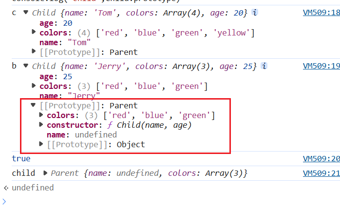

## JS 手写题

### 防抖节流

防抖：在多次调用时，只触发最近一次调用，类似于——回城，一旦重新点击，重新开始

节流：调用一次后，就不能再次调用除非冷却时间过去——类似技能冷却

debounce

```js
//debounce
function debounce(fn, times) {
  let timer;
  return function () {
    if (timer) {
      clearTimeout(timer);
    }
    timer = setTimeout(() => {
      timer = null;
      fn.apply(this, ...arguments);
    }, times);
  };
}
```

throttle

```js
function throttle(fn) {
  let flag = null; // 通过闭包保存一个标记
  return function () {
    if (flag) return; // 当定时器没有执行的时候标记永远是null
    flag = setTimeout(() => {
      fn.apply(this, arguments);
      // 最后在setTimeout执行完毕后再把标记设置为null(关键)
      // 表示可以执行下一次循环了。
      flag = null;
    }, 500);
  };
}
```

### 不使用 a 标签实现，a 标签的功能

首先我们需要知道，a 标签干了什么，a 标签实现了跳转，而且是本页还是新开页面跳转，此外还有 a 标签上面的样式改变

```js
document.querySelector(".a").addEventListener("click", () => {
  window.location.href = "https://www.baidu.com/";
  window.open("_blank");
});
```

a 标签的 href 就是 location.href 跳转的目标

window.open()即打开方式，即 a 的 target，然后在修改部分样式即可达到

### 不使用循环 API 来删除数组中指定位置的元素（如：删除第三位） 写越多越好

```js
//通过直接修改源数组
a.splice(2, 1);
//拷贝数组
a.slice(0, 2).concat(a.slice(3));

// 方法三 delete数组中的元素 再把这个元素给剔除掉
delete arr[2];
arr
  .join(" ")
  .replaceAll(/\s{1,2}/g, " ")
  .split(" ");
```

### 实现深/浅拷贝

不考虑循环引用

#### 浅拷贝

1.使用解构

```js
const obj = {
  a: 1,
  b: {
    c: 2,
  },
};

const objCopy = { ...obj };
objCopy.b.c = 3;
console.log(obj); // { a: 1, b: { c: 3 } }
console.log(objCopy); // { a: 1, b: { c: 3 } }
```

2.使用 Object.assign

```js
const obj = {
  a: 1,
  b: {
    c: 2,
  },
};
const obj1 = Object.assign({}, obj);
obj1.b.c = 4;
console.log(obj); // { a: 1, b: { c: 4 } }
console.log(obj1); // { a: 1, b: { c: 4 } }
```

3.使用遍历

```js
const obj2 = {};
for (let key in obj) {
  if (obj.hasOwnProperty(key)) {
    obj2[key] = obj[key];
  }
}
```

#### 深拷贝

1.手写深拷贝函数

```js
//深拷贝
function deepCopy(obj) {
  if (typeof obj !== "object" || obj === null) {
    return obj;
  }
  const newObj = Array.isArray(obj) ? [] : {};
  for (let key in obj) {
    if (obj.hasOwnProperty(key)) {
      newObj[key] = deepCopy(obj[key]);
    }
  }
  return newObj;
}
//测试
const obj = {
  a: 1,
  b: 2,
  c: {
    d: [1, 2, 3],
  },
};
const newObj = deepCopy(obj);

console.log(newObj === obj);
newObj.c.d.push(4);
console.log("obj", obj);
console.log("newObj", newObj);
```

2.使用 JSON

```js
const newObj = JSON.parse(JSON.stringify(obj));
```

如果出现循环引用，这两种方法都不行

```js
//处理循环引用问题
const obj2 = {
  a: 1,
};
const obj1 = {
  a: 1,
  b: obj2,
};
obj2.b = obj1;
```

使用 map 进行存储，各个 key 然后可以实现拷贝

```js
const deepCopyOptimization = (obj) => {
  const cache = new WeakMap();
  const copy = (obj) => {
    if (typeof obj !== "object" || obj === null) {
      return obj;
    }
    if (cache.has(obj)) {
      return cache.get(obj);
    }
    const newObj = Array.isArray(obj) ? [] : {};
    cache.set(obj, newObj);
    for (let key in obj) {
      if (obj.hasOwnProperty(key)) {
        newObj[key] = copy(obj[key]);
      }
    }
    return newObj;
  };
  return copy(obj);
};

const newObj2 = deepCopyOptimization(obj2);
const newObj1 = deepCopyOptimization(obj1);
console.log(newObj1);
console.log(newObj2);
console.log(newObj2.b === newObj2);
```

### 手写 Bind，Call，Apply

首先我们应该知道，bind，call，apply 分别做了什么

#### bind

bind，在函数上调用，将其 this 指向传入的对象，并且返回一个函数

```js
Function.prototype.myBind = function (context) {
  if (typeof this !== "function") {
    throw new TypeError("Error: this is not a function");
  }
  if (context === undefined || context === null) {
    context = window;
  } else {
    context = Object(context);
  }
  const self = this;
  const args = [...arguments].slice(1);
  return function () {
    return self.apply(context, args.concat([...arguments]));
  };
};
```

bind 高级板：可以 new

```js
Function.prototype.myBind2 = function () {
  const fn = this;
  if (typeof fn !== "function") {
    throw new TypeError("Bind must be called on a function");
  }
  const bindThis = arguments[0];
  const bindArgs = Array.prototype.slice.call(arguments, 1);
  function fBound() {
    const restArgs = Array.prototype.slice.call(arguments);
    const allArgs = bindArgs.concat(restArgs);
    return fn.apply(this instanceof fBound ? this : bindThis, allArgs);
  }
  fBound.prototype = Object.create(fn.prototype || Function.prototype);
  return fBound;
};
```

`版本2`

```js
Function.prototype.myBind1 = function (context, ...args) {
  const fn = this;
  return function (...restArgs) {
    if (new.target) {
      return new fn(...args, ...restArgs);
    }
    return fn.apply(context, args.concat(restArgs));
  };
};
```

#### call

call，在函数上调用，将其 this 指向传入的对象，第二个参数是正常传参，并且返回一个执行结果

```js
Function.prototype.myCall = function (context) {
  if (typeof this !== "function") {
    throw new TypeError("Error: this is not a function");
  }
  if (context === undefined || context === null) {
    context = window;
  } else {
    context = Object(context);
  }
  const args = [...arguments].slice(1);
  const sy = Symbol("fn");
  context[sy] = this;
  const result = context[sy](...args);
  delete context[sy];
  return result;
};
```

#### apply

apply 在函数上调用，将其 this 指向传入的对象，第二个参数是`数组`，并且返回一个执行结果

```js
Function.prototype.myApply = function (context) {
  if (typeof this !== "function") {
    throw new TypeError("Error: this is not a function");
  }
  if (context === undefined || context === null) {
    context = window;
  } else {
    context = Object(context);
  }
  //因为是数组直接取第二位就行了

  const args = [...arguments][1];
  const sy = Symbol("fn");
  context[sy] = this;
  //这里要改变一下，因为传入的参数是一个数组需要结构一下
  const result = arguments.length > 1 ? context[sy](...args) : context[sy]();
  delete context[sy];
  return result;
};
```

### 继承

这里需要知道原型链相关的知识

#### ES6 之前

原型继承——即将子类的 prototype **指向为一个父类的实例**

缺点：父类的引用类型，会被所有子类共享

```js
//原型链继承
function Person() {
  this.shared = ["a", "b", "c"];
}

function Student() {}
Student.prototype = new Person();

let p = new Student("Mary", 25);

p.shared.push("d");
let s = new Student("John", 20, 3);

console.log("s.shared", s.shared); //s.shared [ 'a', 'b', 'c', 'd' ]
console.log("p.shared", p.shared); //  p.shared [ 'a', 'b', 'c', 'd' ]
```

2.构造函数继承

使用父类的构造函数来增强子类**实例**，等同于复制父类的实例给子类（不使用原型）
**在子类中调用父类的构造函数，需要将函数绑定在子类上，否则子类实例的`constructor`属性会指向父类**

```js
//构造函数继承
function Father() {
  this.colors = ["red", "blue", "green"];
  this.sayGoodbye = () => {
    console.log("goodbye");
  };
}
Father.prototype.sayHello = function () {
  console.log("hello");
};
function Son() {
  Father.call(this);
}

let s = new Son();
let f = new Son();
s.colors.push("yellow");
console.log("s.colors", s.colors); //s.colors [ 'red', 'blue', 'green', 'yellow' ]
console.log("f.colors", f.colors); //f.colors [ 'red', 'blue', 'green' ]
s.sayGoodbye(); //goodbye
s.sayHello(); //报错，不存在这个东东
console.log(s.sayGoodbye === f.sayGoodbye); // false
```

核心代码是 Father.call(this)，创建子类实例时调用`Father`构造函数，于是`Son`的每个实例都会将 SuperType 中的属性复制一份。

但是，只能继承父类的实例属性和方法，原型上的不可得到，而且每个子类都有父类的实例函数副本，没有实现复用，浪费性能

**组合继承**

结合了上面两者的优点，使用原型链进行原型继承，借用构造函数实现实例属性的继承

```js
//组合继承
function Parent(name) {
  this.name = name;
  this.colors = ["red", "blue", "green"];
}
Parent.prototype.sayHello = function () {
  console.log("hello");
};
function Child(name, age) {
  Parent.call(this, name);
  this.age = age;
}
Child.prototype = new Parent();
Child.prototype.constructor = Child;

let c = new Child("Tom", 20);
let b = new Child("Jerry", 25);
c.colors.push("yellow");
console.log("c", c); // c Child { name: 'Tom',colors: [ 'red', 'blue', 'green', 'yellow' ], age: 20}
console.log("b", b); // b Child { name: 'Jerry', colors: [ 'red', 'blue', 'green' ], age: 25 }
console.log(c.sayHello === b.sayHello); // true
console.log("child", Child.prototype);
```

缺点：会给 Child.prototype 添加两个属性“name”和“colors”

而且会给 Child 的实例上添加 name 和 colors 属性


**寄生继承**

核心：在原型式继承的基础上，增强对象，返回构造函数

```js
function createAnother(original) {
  var clone = object(original); // 通过调用 object() 函数创建一个新对象
  clone.sayHi = function () {
    // 以某种方式来增强对象
    alert("hi");
  };
  return clone; // 返回这个对象
}

var person = {
  name: "Nicholas",
  friends: ["Shelby", "Court", "Van"],
};
var anotherPerson = createAnother(person);
anotherPerson.sayHi(); //"hi"
```

缺点：原型链继承多个实例的引用类型属性指向相同，存在篡改的可能。无法传递参数
类似于 Py 的继承方式，把父类作为参数传递
**组合寄生继承**

最成熟的方法，也是当前库所有 的方法

```js
//寄生组合继承
function inheritPrototype(child, parent) {
  var prototype = Object.create(parent.prototype); // 创建对象，创建父类原型的一个副本
  prototype.constructor = child; // 增强对象，弥补因重写原型而失去的默认的constructor 属性
  child.prototype = prototype; // 指定对象，将新创建的对象赋值给子类的原型
}
function Parent(name) {
  this.name = name;
  this.colors = ["red", "blue", "green"];
}
function Child(name, age) {
  Parent.call(this, name); // 调用父类的构造函数，并传入参数
  this.age = age;
}
inheritPrototype(Child, Parent); // 继承父类原型

Parent.prototype.sayName = function () {
  console.log(this.name);
};

var child1 = new Child("John", 25);
var child2 = new Child("Mary", 30);
child1.colors.push("yellow");
console.log(child1);
console.log(child2);
```

只有子类实例上有方法，而父类没有


#### ES6 及之后

```js
class Person {
  constructor(name) {
    this.name = name;
  }

  sayHello() {
    console.log(`Hello, my name is ${this.name}`);
  }
}
class Child extends Person {
  constructor(name, age) {
    super(name);
    this.age = age;
  }
}
const child1 = new Child("John", 10);
child1.sayHello(); // Output: Hello, my name is John
console.log(child1); //
```

### 实现 new 操作符

首先，我们需要知道 new 操作符，干了什么。

new 操作符，创建了一个对象，然后将属性附加在对象上

```js
function myNew(constructor, ...args) {
  const obj = Object.create(constructor.prototype);

  const result = constructor.call(obj, ...args);
  return typeof result === "object" ? result : obj;
}
```

### 如何拦截全局 Promise reject，但并没有设定 reject 处理器 时候的错误

`try catch`只能拦截这个块里面的

可以给 window 对象添加一个`unhandledrejection`方法

```js
// 使用 unhandledrejection 来拦截全局错误  （这个是对的）
window.addEventListener("unhandledrejection", (event) => {
  event && event.preventDefault();
  console.log("event", event);
});
```

### 如何拦截 普通 JS 错误

```js
window.addEventListener("error", (event) => {
  event && event.preventDefault();
  console.log("event", event);
});
```

### 手写实现 sleep

```js
(async function () {
  console.log("start sleep");
  await sleep(3000);
  console.log("end sleep");
  function sleep(ms) {
    return new Promise((res) => {
      setTimeout(() => {
        res();
      }, ms);
    });
  }
})();
```

通过 await 异步阻塞

通过 while 循环完全阻塞进程

```js
(function () {
  console.log("start sleep");
  sleep(3000);
  console.log("end sleep");
  function sleep(ms) {
    const start = Date.now();
    while (Date.now() - start < ms) {
      // continue;
    }
  }
})();
```

### 实现 add(1)(2)

```js
function add(x) {
  let sum = x;
  let temp = function (y) {
    sum += y;
    return temp;
  };
  temp.toString = function () {
    return sum;
  };
  return temp;
}
alert(add(1)(2)); //3
```

这里利用了 alert 参数为 string 的方法，如果不是 string 会调用 toString()

### 数组分组改成减法运算

比如`[5,[[4,3],2],1]`换为`(5-((4-3)-2)-1)`

1.转化为字符串然后进行遍历替换

```js
//比如`[5,[[4,3],2],1]`换为`(5-((4-3)-2)-1)`
const arr = [5, [[4, 3], 2], 1];
console.log(JSON.stringify(arr).split(""));

const fn = JSON.stringify(arr)
  .split("")
  .map((item) => {
    if (item === ",") return "-";
    else if (item === "[") return "(";
    else if (item === "]") return ")";
    else return item;
  })
  .join("");
let res = new Function(`return ${fn}`)();
console.log(res); // 5
```

reduce 的递归调用

```js
const convert = (arr) => {
  return arr.reduce((pre, cur) => {
    const first = Array.isArray(pre) ? convert(pre) : pre;
    const second = Array.isArray(cur) ? convert(cur) : cur;
    return first - second;
  });
};

console.log(convert(arr)); // 5
```

手写 flat

```js
const flat = (arr, deep = 1) => {
  const res = [];
  for (let a of arr) {
    if (Array.isArray(a) && deep > 0) {
      res.push(...flat(a, deep - 1));
    } else {
      res.push(a);
    }
  }
  return res;
};
```

还有巧计，只求最大的话

```js
arr.toString().split(",").map(Number);
```

等同于

```js
arr.flat(Infinity);
```

### 实现数组的 Map

使用：arr.map(fn(value,index,arr),context);

```js
Array.prototype.myMap = function (fn) {
  if (typeof fn !== "function") {
    throw new TypeError("fn is not a function");
  }
  const context = arguments[1] ? arguments[1] : this;
  const result = [];
  for (let i = 0; i < this.length; i++) {
    result.push(fn.call(context, this[i], i, this));
  }
  return result;
};
```

### 数组转为 tree

```js
function convert(arr, parentId) {
  const filter = arr.filter((item) => {
    return parentId === undefined
      ? item.parent === -1
      : item.parent === parentId;
  });
  return filter.map((item) => {
    item.childNode = convert(arr, item.id);
    return item;
  });
}
```

### 正则处理字符串

这里介绍一下 replace 方法
String.prototype.replace(`pattern`,`replacement`)，将匹配的 pattern 替换为`replacement`
pattern 可以是字符串，可以是正则表达式，如果是字符串只会替换第一个匹配项
如果需要全部替换最好采用正则表达式或者`replaceAll`方法
replacement 可以是字符串可以是函数

下划线变小驼峰

```js
const snakeCaseToCamelCase(str){
	return str.replace(/_([a-z])/g,(match,p1)=>{
		return p1.toUpperCase()
	})
}
```

小驼峰转下划线

```js
const camelCaseToSnakeCase(str){
	return str.replace(/([a-z])([A-Z])/g,"$1_$2").toLowerCase()
}
```

这里`$1和$2`是满足匹配项 1,2.然后不做更改，只在$1 和$2 之间添加了一个下划线
这里 toLowerCase 是为了保证全部为小写
等同于下面

```js
function camelCaseToSnakeCase(str) {
  const regx = /([a-z])([A-Z])/g;
  // return str.replace(regx,'$1_$2').toLowerCase()
  return str.replace(/([a-z])([A-Z])/g, (match, p1, p2) => {
    return `${p1}_${p2.toLowerCase()}`;
  });
}
```

### 柯里化和偏函数

柯里化
将一个带有 n 个参数函数拆分 n 个单参数函数进行调用
即`函数柯里化就是指把一个多元（多参数）函数转换为一个嵌套的一元函数的过程。`

```js
const add = (x) => (y) => (z) => x + y + z;

console.log(add(1)(2)(4));
```

如何去实现

```js
const curry = (fn) => {
  if (typeof fn !== "function") {
    throw new TypeError("fn is not a function");
  }
  return function curryInnerFn(...args) {
    if (args.length < fn.length) {
      //传入的参数小于函数参数个数，继续返回一个函数，保存原来的参数
      return function () {
        return curryInnerFn.apply(null, args.concat([...arguments]));
      };
    }
    return fn.apply(null, args); //如果参数个数大于等于函数参数个数，直接调用函数
  };
};

const add = (x, y, z) => x + y + z;
const addCurry = curry(add);
console.log(addCurry(1)(2)(3)); // 6
console.log(addCurry(1)(2, 3)); // 6
console.log(addCurry(1, 2)(3)); // 6
```

偏函数
将一个带有 n 个参数的函数拆分为 n-x 个函数调用
**偏函数是指开发者可以部分地对函数固定参数进行相关操作**
比如封装一个延时函数

```js
function partial(func, ...fixedArgs) {
  return function (...args) {
    return func.apply(this, fixedArgs.concat(args));
  };
}

const setTimeout1s = partial(setTimeout, undefined, 1000);

setTimeout1s(() => {
  console.log("111");
});
```

### 实现 sum 的链式调用

实现功能：`sum(1)(2).sumof()`得到 3

```js
function sum(x) {
  let total = x;
  function add(y) {
    total += y;
    return add;
  }
  add.sumOf = function () {
    return total;
  };
  return add;
}
```

### 实现 express 洋葱模型

```js
function compose(middkeware) {
  return function (req, res, next) {
    let index = -1;
    function dispatch(i) {
      if (i <= index) {
        return Promise.reject(new Error("next() called multiple times"));
      }
      index = i;
      let fn = i === middkeware.length ? next : middkeware[i];
      if (!fn) {
        return Promise.resolve();
      }
      try {
        return Promise.resolve(fn(req, res, dispatch.bind(null, i + 1)));
      } catch (err) {
        return Promise.reject(err);
      }
    }
    return dispatch(0);
  };
}
const http = require("http");
class Express {
  constructor() {
    this.middlewares = [];
  }
  use(fn) {
    if (typeof fn !== "function") {
      throw new TypeError("fn is not a function");
    }
    this.middlewares.push(fn);
    return this;
  }
  listen(port, callback) {
    const server = http.createServer((req, res) => {
      const runner = compose(this.middlewares);
      runner(req, res).catch((err) => console.error(err));
    });
    server.listen(port);
    if (callback) {
      server.on("listening", callback);
    }
  }
}

const app = new Express();
app.use(async function (req, res, next) {
  console.log("1");
  await next();
  console.log("4");
});
app.use(async function (req, res, next) {
  console.log("2");
  await next();
  console.log("5"); // 添加了一个新的日志点来表示中间件2完成
});
app.use(function (req, res, next) {
  console.log("3");
  res.end("nihao");
});
app.listen(3000, () => {
  console.log(`Server listening on port ${3000}`);
});
```

### 事件循环

看代码说输出，可以画出来事件循环图

```js
console.log("1");

setTimeout(() => {
  console.log("2");
  Promise.resolve()
    .then(() => {
      console.log("3");
      return new Promise((resolve) => {
        console.log("4");
        setTimeout(() => {
          console.log("5");
          resolve("6");
        }, 40);
      });
    })
    .then((res) => {
      console.log(res);
      setTimeout(() => {
        console.log("7");
      }, 0);
    });
}, 0);

Promise.reject("8")
  .catch((err) => {
    console.log(err);
    return "9";
  })
  .then(async (res) => {
    console.log(res);
    await Promise.resolve()
      .then(() => {
        console.log("10");
        return new Promise((resolve) => {
          setTimeout(() => {
            console.log("11");
            resolve("12");
          }, 30);
        });
      })
      .then((res) => {
        console.log(res);
      });
    console.log("13");
  })
  .finally(() => {
    console.log("14");
  });

(async () => {
  console.log("15");
  await new Promise((resolve) => {
    console.log("16");
    setTimeout(() => {
      console.log("17");
      resolve();
    }, 20);
  });
  console.log("18");
})();

setTimeout(() => {
  console.log("19");
  Promise.resolve()
    .then(() => {
      console.log("20");
      return Promise.reject("21");
    })
    .catch((err) => {
      console.log(err);
      return "22";
    })
    .then((res) => {
      console.log(res);
      return new Promise((resolve) => {
        console.log("23");
        setTimeout(() => {
          console.log("24");
          resolve("25");
        }, 10);
      });
    })
    .then((res) => {
      console.log(res);
    });
}, 10);

console.log("26");
```

## JS 技巧

### 用于异步 IIFE 的  void  守卫 (The Void Guard)

问题所在：  立即调用的异步函数 (IIFE) 可能会创建“悬空 Promise (floating promises)”，如果处理不当，会导致内存泄漏和未捕获的异常。

```js
// ❌ 风险操作 - 返回一个悬空的 promise，其结果或错误未被处理
(async () => {
  await initializeApp();
})();

// ✅ 安全操作 - 使用 void 明确表示我们不关心其返回结果
void (async () => {
  await initializeApp();
})();
```

说明：void  操作符会执行其后的表达式，然后返回  undefined。这等于明确地丢弃了 Promise 的返回值，向代码阅读者和静态分析工具表明，我们是有意不处理这个 Promise 的结果，从而有效防止了“未处理的 Promise rejection”警告。此模式对于应用启动时执行的“即发即忘”(fire-and-forget) 型异步操作至关重要。

### 高精度异步计时

```js
/**
 * 测量一个异步函数的执行时间
 * @param name - 测量项的名称，用于在性能条目中识别
 * @param fn - 需要被测量的、返回 Promise 的异步函数
 * @returns 返回原始异步函数的执行结果
 */
const measureAsync = async (name, fn) => {
  // 标记测量开始点
  performance.mark(`${name}-start`);
  try {
    // 执行并等待传入的异步函数 fn 完成
    return await fn();
  } finally {
    // 标记测量结束点
    performance.mark(`${name}-end`); // 计算从开始到结束的耗时，并创建一个名为 `name` 的性能测量条目

    performance.measure(name, `${name}-start`, `${name}-end`); // 获取刚刚创建的测量条目

    const [entry] = performance.getEntriesByName(name); // 打印格式化的耗时，精确到毫秒后三位
    console.log(`⏱️ ${name}: ${entry.duration.toFixed(3)}ms`); // 清除标记，避免性能条目列表无限增长导致内存问题

    performance.clearMarks(`${name}-start`);
    performance.clearMarks(`${name}-end`);
    performance.clearMeasures(name);
  }
};

// 使用示例:
await measureAsync("数据库事务", () => db.transaction(complexQuery));
```

核心优势：  此方法会自动生成详细的性能时间线，这些数据可以在 Chrome 开发者工具的  Performance（性能）面板中进行可视化分析。

### 使用  AbortController  进行 Promise 编排

```js
/**
 * 创建一个可被取消的 Promise 池
 * @param promises - 一组待执行的 Promise
 * @param signal - AbortSignal 实例，用于发出取消信号
 * @returns 返回一个 Promise.all 包装的 Promise
 */
const createCancellablePool = (
  promises: Promise<any>[],
  signal: AbortSignal
) => {
  return Promise.all(
    promises.map((p) =>
      newPromise((resolve, reject) => {
        // 如果信号已经发出，立即拒绝
        if (signal.aborted) {
          return reject(new DOMException("操作已取消", "AbortError"));
        } // 监听 abort 事件，一旦触发就拒绝 Promise

        signal.addEventListener("abort", () =>
          reject(new DOMException("操作已取消", "AbortError"))
        ); // 正常执行原始 Promise

        p.then(resolve).catch(reject);
      })
    )
  );
};

// 使用示例:
const controller = new AbortController();

// 2秒后发出取消信号
setTimeout(() => controller.abort(), 2000);

try {
  await createCancellablePool(
    [
      analyticsSync(), // 模拟分析数据同步
      cacheHydration(), // 模拟缓存预热
    ],
    controller.signal
  );
} catch (err) {
  if (err.name === "AbortError") {
    console.log("后台任务已被成功取消！");
  }
}
```

关键用例：  当用户在单页应用 (SPA) 中切换路由时，可以利用此模式取消仍在后台运行的数据同步或预加载任务，避免不必要的计算和网络资源浪费。

### 使用生成器 (Generators) 实现惰性 Promise 流

```js
/**
 * 异步生成器函数，用于按需获取和产出数据
 * @param urls - URL 数组
 */
async function* streamResults<T>(urls: string[]): AsyncGenerator<T> {
for (const url of urls) {
    const response = await fetch(url);
    // `yield` 会暂停函数执行，并产出一个值
    // 当消费者请求下一个值时，函数会从此处继续
    yield response.json() as T;
  }
}

// 使用示例:
// 创建一个视频数据流，此时并不会立即发起所有请求
const videoStream = streamResults<Video>(videoUrls);

// 使用 for await...of 循环来按需消费数据流
for await (const video of videoStream) {
// 可以在任何时候停止处理
if (shouldStopProcessing(video)) {
    break; // 退出循环，未处理的 URL 请求将不会被发出
  }
  renderPreview(video);
}
```

### 使用类型化数组 (Typed Arrays) 精通二进制数据

```js
/**
 * 高效合并多个 ArrayBuffer
 * @param buffers - ArrayBuffer 数组
 * @returns 合并后的新 ArrayBuffer
 */
const mergeBuffers = (buffers: ArrayBuffer[]) => {
  // 计算所有 buffer 的总字节长度
  const totalLength = buffers.reduce((sum, b) => sum + b.byteLength, 0);
  // 创建一个足够大的 Uint8Array 视图来容纳所有数据
  const result = newUint8Array(totalLength);

  let offset = 0;
  buffers.forEach((buffer) => {
    // 将每个 buffer 的数据设置到结果数组的正确位置
    result.set(newUint8Array(buffer), offset);
    // 更新偏移量，为下一个 buffer 做准备
    offset += buffer.byteLength;
  });

  // 返回底层的 ArrayBuffer
  return result.buffer;
};

/**
 * 零拷贝切片 ( Bonus: Zero-copy slicing )
 * 注意：ES2017+ 的 ArrayBuffer.prototype.slice() 会创建副本。
 * TypedArray.prototype.subarray() 才是真正的零拷贝（共享同一底层 buffer）。
 * 这里为了与原文保持一致，使用了 slice，但在现代 JS 中，这会是拷贝操作。
 * 真正的零拷贝视图应该用 subarray。
 * @param buffer - 原始 ArrayBuffer
 * @param start - 开始字节索引
 * @param end - 结束字节索引
 * @returns 一个新的 ArrayBuffer，包含切片的数据
 */
const sliceWithCopy = (buffer: ArrayBuffer, start: number, end: number) => {
  // buffer.slice 是一个拷贝操作
  return buffer.slice(start, end);
};
```

### Promise 并发池 (Promise Pool)

```js
class PromisePool {
  private running = 0; // 当前正在运行的任务数
  private queue: (() => void)[] = []; // 等待执行的任务队列

  constructor(private concurrency: number) {} // 并发上限

  /**
   * 运行一个任务
   * @paramtask - 一个返回 Promise 的函数
   * @returns 返回一个 Promise，其结果与 task 的 Promise 一致
   */
  async run<T>(task: () => Promise<T>): Promise<T> {
    return new Promise((resolve, reject) => {
      // 将要执行的任务封装一下
      const execute = async () => {
        this.running++;
        try {
          const result = await task();
          resolve(result);
        } catch (err) {
          reject(err);
        } finally {
          this.running--;
          // 当前任务完成后，尝试执行队列中的下一个任务
          this.next();
        }
      };

      // 将任务推入队列，并尝试立即执行
      this.queue.push(execute);
      this.next();
    });
  }

  /**
   * 检查是否可以执行新任务，并从队列中取出一个来执行
   */
  private next() {
    // 当队列不为空且当前运行的任务数小于并发上限时
    while (this.queue.length > 0 && this.running < this.concurrency) {
      // 从队列头部取出一个任务并执行
      this.queue.shift()!();
    }
  }
}

// 使用示例:
// 创建一个并发数为 3 的池子 (比如数据库最大连接数是3)
const pool = newPromisePool(3);
// 假设有10个报告要生成
const tasks = Array.from({ length: 10 }, (_, i) => pool.run(() => generateReport(i + 1)));
await Promise.all(tasks);
```
