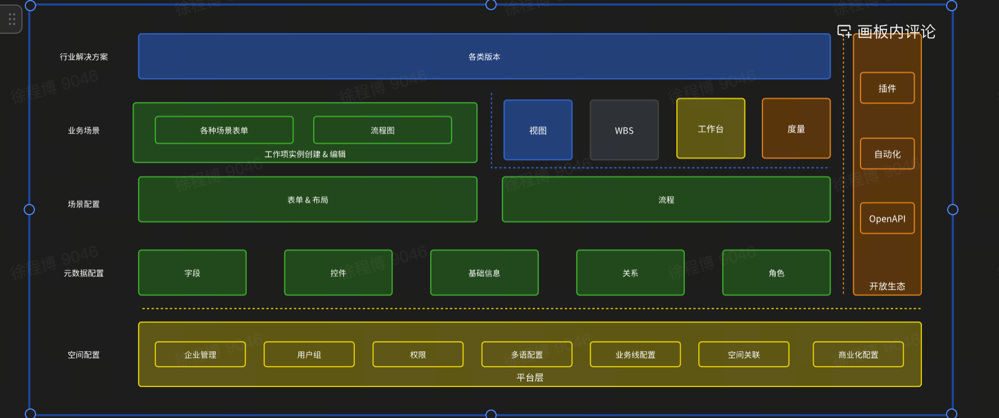

工作项

1. 工作项是做什么的
   主要是负责 meego 标品的哪一块内容

   业务压力比较大，技术挑战度还行。迭代需求多 工作项+视图作为产品的底层能力

   Meego 的核心引擎 绿色的就是工作项的内容
   
   明年会有更多的子产品出来，架构会做解耦

2. 团队那边对于校招生的期望是什么
   将校招生培养为独挡一面的角色，也会辅助成长。成长到晋升都有全方面的辅导

3. 团队氛围：以结果为导向，比较轻松，鼓励去做技术的探索
4. 裁人看法：
   1. 业务形态决定，飞书 people 营收负担不起付出。
   2. 人员组织调整，表现好的同学不会去动。培养成本高
      1. 绩效不好可能裁人，裁人有硬性指标。**meego 目前近两年没有**
   3. 目前 meego 到了第二个阶段，找其他的增长曲线。 飞书裁人是因为 people 找第二增长曲线负担 不起因此裁人
