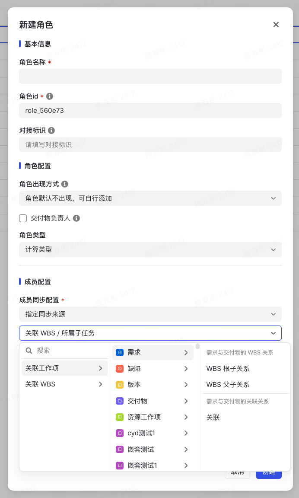

# 一、基本信息

| **姓名**         | @陈双彬                                                                                                                                                             |
| ---------------- | ------------------------------------------------------------------------------------------------------------------------------------------------------------------- | --- |
| **教育经历**     | 西南石油大学 物联网工程 26 届本科                                                                                                                                   |
| **实习经历**     | 暂时无法在飞书文档外展示此内容                                                                                                                                      |
| **字节入职时间** | 2024 年 10 月 21 日入职字节，总计实习出勤 181 工作日                                                                                                                | \   |
|                  | 2025 年 4 月 7 日入职 Meego，总计实习出勤 81 工作日                                                                                                                 | \   |
|                  |                                                                                                                                                                     | \   |
|                  | > 出勤数据截止于 2025 年 08 月 05 日                                                                                                                                |
| **工作职责**     | 负责 Meego 行业专版的前端开发工作，包括泳道图、计算角色、交付物等功能模块的设计与实现；参与需求分析和技术方案设计；与产品、设计和后端团队协作，确保功能的高质量交付 |
| **Mentor**       | @任为                                                                                                                                                               |

# 二、业务理解

## Meego

Meego 是一个具有强大自定义配置能力和高可扩展性的项目管理系统。它本质上是一个抽象的通用流程管理系统，能够支持字节跳动内部数千个大大小小的项目。
特点：

1. Meego 提供灵活可配置、可拓展的特性，支持流程迭代与透明化，并具备强大的视图和 BI 能力，与飞书深度集成。

前景：

1. 自 2022 年开始对外商业化，其市场表现优越。已成为专业项目管理工具的首选之一，被上千家客户选择。覆盖互联网、汽车制造、消费电子、金融、医疗健康、新消费等各行各业。

行业格局分析

**市场规模数据**

- **全球市场** ：企业协作工具市场规模预计将从 2024 年的 1009.88 亿元人民币增长到 2030 年的 1897.42 亿元人民币，年复合增长率达 11.08%
- **中国市场** ：2024 年达到 280.34 亿元人民币
- **市场渗透率** ：超过 70%的全球企业使用某种形式的项目管理软件

## Meego PPM

PPM（Project Portfolio Management，项目组合管理）是 Meego 的战略扩展业务方向。PPM 的核心目标是将 Meego 从软件研发场景拓展至更多高价值场景，如硬件制造和传统行业，以驱动企业战略决策与落地，提升客单价和市场天花板。

业务进展 Q2 季度 Meego 专版 ARR 占比 26%，平均客单价 38.2w，约为 Meego 标品的 5 倍

**战略意义**
PPM 是 Meego 近几年最重要的业务发展机会之一，通过深度探索硬件制造行业，于 2024 年发布了 IPD（集成产品开发）行业解决方案，实现了显著的商业价值提升。

个人理解

> **核心业务定位与战略**
> Meego 定位为 **高度可配置、可扩展的通用流程管理系统**，能够支持不同规模与类型的项目管理需求。经过发展，Meego 已从软件研发场景成功拓展至更多行业，并凭借与 **飞书的深度集成**，逐渐成为企业协作工具市场的重要参与者。
>
> ---
>
> **PPM 战略：深耕高价值行业**
> Meego PPM（项目组合管理）是 Meego 的战略延伸方向，目标在于突破软件研发的局限，深度渗透至 **硬件制造及传统产业** 等高价值领域。
>
> - 通过提供 **IPD\*\***（集成产品开发）\*\* 等专业化解决方案，PPM 致力于提升企业战略决策与执行落地能力。
> - 这一战略不仅有助于提高 **客单价**，更能显著扩大 Meego 的市场天花板。
>
> **市场格局**
> 当前项目管理工具主要分为三大赛道：
>
> 1. **传统项目管理软件**（如 Microsoft Project）；
> 2. **协同式软件研发工具**（如 Jira Software）；
> 3. **团队任务协同工具（\*\***CWM\***\*）**（如 Monday）。
>
> Meego 在上述多个赛道均有覆盖，并凭借 PPM 业务，率先开辟了 **面向硬件制造的** **IPD** **解决方案**，目前在国内尚无成熟的直接竞品。
> 2025 年 Q1 至 Q2 期间，Meego PPM 的核心目标是深化与 BYD 的合作，推动硬件制造及传统行业垂类解决方案落地。
> 同时，得益于与飞书的深度集成，飞书生态中的众多合作伙伴可转化为 Meego 的潜在客户；
> 加之国家大力推进数字化转型，传统产业面临升级需求，Meego 有望借此契机挖掘更多客户资源。
> **市场竞争优势与机会**
> 未来，Meego 可能将依托 PPM 战略持续强化 **行业垂直解决方案能力**，尤其聚焦硬件制造领域的标杆合作；同时，凭借飞书生态的渠道优势与国家政策东风，Meego 有望在 **传统产业数字化转型浪潮** 中脱颖而出，形成差异化竞争壁垒。

---

# 三、工作内容及产出

## 业务范围概览

**泳道图\*\***/流程图业务\*\*
• 节点恢复功能开发
• 状态条样式优化
• 节点定位能力增强

**计算角色业务**
• 配置侧能力增强
• 批量创建功能
• 组件架构重构

**交付物业务**
• 计算角色增强
• 计算字段扩展
• 数据联动实现

<br />

暂时无法在飞书文档外展示此内容

---

## 关键产出

### 泳道图相关

#### 泳道图支持恢复被删除节点

**项目亮点**：作为技术负责人，独立完成了复杂的数据恢复逻辑设计，实现了与流程图功能的完全对齐


恢复节点入口
恢复态

**📋 项目背景**

用户在使用泳道图进行节点裁剪时，经常需要恢复被删除的节点。计划表、流程图均支持删除/恢复功能，但泳道图仅支持删除，不支持恢复，导致用户体验不一致。

**🎯 项目目标**

抹平用户在使用流程图和泳道图时的功能差异，提升泳道图的使用体验，补齐泳道图基础能力。

**📊 用户体验流程**

暂时无法在飞书文档外展示此内容

**💡 核心技术挑战与解决方案**

1. 数据一致性：建立 readAfterWrite 机制保证数据一致性• **数据同步机制**

**⚠️ 问题反思与改进**

- **问题识别**：改动范围较广，自测不充分，导致后续产生两起 oncall
- **改进措施**：建立影响范围评估机制，在初期就进行 100%自测

---

#### 泳道图状态条里程碑展示优化


优化前：里程碑重叠
优化后：清晰展示

**📋 项目背景**：泳道图全量发布时的遗留问题——状态条上里程碑在同一水平位置时完全重叠，不利于展示里程碑节点。

**🎯 项目目标**：优化里程碑在状态条上的展示效果，提升交互体验。

**💡 核心技术挑战与解决方案**

1. 重构状态条里程碑布局算法——将原本的基础布局算法拓展为检测重叠分组算法 **核心逻辑**

   暂时无法在飞书文档外展示此内容

   ```TypeScript
   // 重叠检测核心算法
   if (milestone.left - prevMilestone.left < MILESTONE_OVERLAP_THRESHOLD) {
     // 重叠，加入当前组
     currentGroup.push(milestone);
   } else {
     // 不重叠，结束当前组，创建新组
     if (currentGroup.length > 0) {
       groups.push([...currentGroup]);
     }
     currentGroup = [milestone];
   }
   ```

   3. 计算每个节点的基本位置信息
   4. 按水平位置(left)排序，便于检测重叠
   5. 检测重叠并将相邻重叠的节点分组
   6. 处理重叠组，生成 MilestoneGroup 所需数据
   7. 应用最终结果 相关代码

   ```TypeScript
   export const phaseBarHeight = 200 - 56;

   /**
    * 构建在阶段进度条上的里程碑渲染/布局数据
    */

   /**
    * 检测里程碑节点是否重叠的阈值（像素）
    * 当两个节点的水平距离小于此值时，认为它们重叠
    * 使用图标大小的1.2倍作为判断标准
    */
   const MILESTONE_OVERLAP_THRESHOLD = milestoneStyles.iconSize * 1.2;

   /**
    * 构建在阶段进度条上的里程碑渲染/布局数据
    * 包含检测和处理重叠节点的逻辑
    *
    * 处理流程：
    * 1. 计算每个节点的基本位置信息
    * 2. 按水平位置(left)排序，便于检测重叠
    * 3. 检测重叠并将相邻重叠的节点分组
    * 4. 处理重叠组，生成MilestoneGroup所需数据
    * 5. 应用最终结果
    */
   export const nodesToPhaseMilestones = ({
     milestonesInfos,
     phasesList,
     unitWidth,
     presetXOffset = 0,
   }: {
     milestonesInfos: NodeInfo[];
     unitWidth: number;
     phasesList: PhaseData[];
     presetXOffset?: number;
   }): PhaseBarMilestoneItem[] => {
     const getPhaseBlockHeightInProgress = ({ phase, progressRatio }: { phase: PhaseData; progressRatio: number }) => {
       const [, topRight, bottomRight] = getShapePoints({
         precisionLevel: phase.precisionLevel,
         blockShape: phase.blockShape,
         width: phase.width,
         progressRatio,
       });

       return bottomRight.y - topRight.y;
     };

     /**
      * 查找里程碑所属的阶段
      */
     const findPhaseForMilestone = (axisStartLeft: number, phasesList: PhaseData[]) => {
           let currentPhaseIndex = 0;
       while (currentPhaseIndex < phasesList.length) {
         const currentPhase = phasesList[currentPhaseIndex];
         if (axisStartLeft < currentPhase.left) break;
         if (axisStartLeft <= currentPhase.left + currentPhase.width) {
           return currentPhase;
         }
         currentPhaseIndex++;
       }
       return null;
     };
     /**
      * 计算单个里程碑的基本位置信息
      */
     const calculateBaseMilestone = (node: NodeInfo) => {
       const level: MilestoneLevel = match(node.milestoneCategory)
         .with(MilestoneCategory.Stage, () => MilestoneLevel.L1)
         .with(MilestoneCategory.Key, () => MilestoneLevel.L2)
         .otherwise(() => MilestoneLevel.L3);

       const axisStartLeft = unitWidth * node.axisStartDay;
       let phase: PhaseData | null = findPhaseForMilestone(axisStartLeft, phasesList);

       const gapTopBottom = calculateGapTopBottom(phase, axisStartLeft, unitWidth);

       return {
         key: node.nodeUUID,
         status: getNodeStatus(node),
         isDelayed: getIsNodeDelayed(node),
         isSubprocess: node.nodeType === 'sub_process',
         level,
         name: node.name,
         left: presetXOffset + axisStartLeft - milestoneStyles.iconSize / 2,
         top: node.milestoneCategory === MilestoneCategory.Stage ? gapTopBottom : undefined,
         bottom: node.milestoneCategory === MilestoneCategory.Key ? gapTopBottom : undefined,
       };
     };
     /**
      * 计算里程碑到顶部/底部的间距
      */
     const calculateGapTopBottom = (phase: PhaseData | null, axisStartLeft: number, unitWidth: number) => {
       if (!phase) return 28;

       const progressRatio = (axisStartLeft - phase.left) / phase.width;
       const phaseHeight = getPhaseBlockHeightInProgress({ phase, progressRatio });

       return phaseBarHeight / 2 - phaseHeight / 2 - milestoneStyles.height - milestoneStyles.paddingBlock;
     };

     // 第一步：计算每个节点的基本位置信息
     const baseMilestones = milestonesInfos.map(calculateBaseMilestone);

     // 第二步：按left值排序，便于检测重叠
     const sortedMilestones = [...baseMilestones].sort((a, b) => a.left - b.left);

     // 第三步：检测重叠并分组
     // 将相邻且位置接近的节点归为一组，以便后续处理
     const groups: Array<Array<(typeof sortedMilestones)[0]>> = [];
     let currentGroup: Array<(typeof sortedMilestones)[0]> = [];

     sortedMilestones.forEach((milestone, index) => {
       if (index === 0) {
         // 第一个节点直接加入当前组
         currentGroup.push(milestone);
         return;
       }

       const prevMilestone = sortedMilestones[index - 1];
       // 检查当前节点与前一个节点是否重叠
       // 考虑节点图标的宽度，当两个节点的中心点距离小于阈值时，认为它们重叠
       if (milestone.left - prevMilestone.left < MILESTONE_OVERLAP_THRESHOLD) {
         // 重叠，加入当前组
         currentGroup.push(milestone);
       } else {
         // 不重叠，结束当前组，创建新组
         if (currentGroup.length > 0) {
           groups.push([...currentGroup]);
         }
         currentGroup = [milestone];
       }

       // 处理最后一个节点
       if (index === sortedMilestones.length - 1 && currentGroup.length > 0) {
         groups.push([...currentGroup]);
       }
     });

     /**
      * 第四步：处理重叠组，生成MilestoneGroup所需数据
      * 创建最终的里程碑节点列表，包括单个节点和重叠组
      */
     const finalMilestones: PhaseBarMilestoneItem[] = [];

     groups.forEach(group => {
       if (group.length <= 1) {
         // 单个节点直接加入最终列表
         finalMilestones.push(...group);
         return;
       }

       // 对于重叠组，创建一个特殊的节点，表示整个组
       const groupNode: PhaseBarMilestoneGroup = {
         key: `group-${group[0].key}`, // 使用组内第一个节点的key作为组的key前缀
         isGrouped: true, // 标记为分组节点
         mileStoneList: group.map(node => ({
           // 存储组内所有节点的信息
           key: node.key,
           status: node.status,
           isDelayed: node.isDelayed,
           isSubprocess: node.isSubprocess,
           level: node.level,
           name: node.name,
           left: node.left,
           top: node.top,
           bottom: node.bottom,
         })),
       };

       // 将组节点加入最终列表
       finalMilestones.push(groupNode);
     });

     return finalMilestones;
   };
   ```

#### 泳道图跳转节点能力


跳转到第一个进行中的节点

<br />

跳转指定节点

> 工作台打开泳道图

跳转指定节点

> 泳道图从常态变化到恢复态

**📋 项目背景**：流程图具备跳转节点能力，但泳道图缺失该功能，影响用户体验一致性。

**🎯 项目目标**：为泳道图增加节点跳转能力，优化使用体验，实现功能对齐。

**📊 用户体验流程**
暂时无法在飞书文档外展示此内容

<br />

<br />

### 配置侧相关

#### 计算角色消费 WBS 关系


计算角色消费 WBS 根子/父子关系
批量创建计算角色到其他工作项

**📋 项目背景**
在整车项目的计划管理中，同一项目共用一套项目角色，每个计划任务的负责人均来自项目组成员。在事项拆解模式下，需要将项目角色传递至每个事项，目前需要配置大量同步规则，性能和准确性存在风险。

**🎯 项目目标**

- 支持计算角色同步自 WBS 父、根工作项中的角色
- 支持管理员基于当前工作项角色创建计算角色至其他工作项

**📊 用户体验流程**
组件变更范围

**💡 核心技术挑战与解决方案**

1. 批量创建计算角色到其他工作项角色命名规则
   1. 命名规则如下：
      1. 角色名称、角色 id 与当前工作项一致
         1. 名称重复，加后缀 1、2、3...
   2. 困难场景
      1. 在当前工作项获取目标工作项中的角色并校验角色名称的正确性
      2. 目标工作项为当前工作项时，角色名称的校验

暂时无法在飞书文档外展示此内容

<br />

```TypeScript
const getNewRoleName = async ({
  role,
  projectId,
  typeKey,
  index,
}: {
  role: WorkItemRole;
  projectId: string;
  typeKey: string;
  index: number;
}) => {
  const targetRolesManager = await getRolesManager(projectId, typeKey, {});
  const targetRoles = targetRolesManager?.roles || [];

  // 1. 解析源角色名称
  const [baseName, sourceSuffix] = parseBaseNameAndSuffix(role.role_name);

  // 2. 收集目标工作项中所有相关角色名称
  const relatedNames = targetRoles.map(r => r.role_name).filter(name => name.startsWith(baseName));

  // 3. 处理源角色有后缀的情况
  if (sourceSuffix) {
    const namePattern = new RegExp(`^${escapeRegExp(baseName)}-${sourceSuffix}-(\\d+)$`);
    const existingSuffixes = extractSuffixes(relatedNames, namePattern);
    const nextSuffix = existingSuffixes.length > 0 ? Math.max(...existingSuffixes) + 1 : 1;

    return `${baseName}-${sourceSuffix}-${nextSuffix + index}`;
  }

  // 4. 处理源角色无后缀的情况
  const basePattern = new RegExp(`^${escapeRegExp(baseName)}(?:-(\\d+))?$`);
  const allSuffixes = extractSuffixes(relatedNames, basePattern);

  // 计算下一个可用序号（0表示无后缀）
  let nextAvailableSuffix = 0;
  if (allSuffixes.length > 0) {
    const maxSuffix = Math.max(...allSuffixes);
    nextAvailableSuffix = maxSuffix + 1;
  } else {
    // 没有匹配角色时，第一个角色使用无后缀
    return index === 0 ? baseName : `${baseName}-${index}`;
  }

  return `${baseName}-${nextAvailableSuffix + index}`;
};
```

#### 计算角色在交付物工作项的增强


交付物工作项新增消费 WBS 负责人关系
收敛关联工作项

**📋 项目背景**：BYD 电动化项目中，节点/子工作项负责人直接指定人员，不使用角色。需要支持交付物角色成员从 WBS 计划表的负责人进行同步。

**用户流程图：**
暂时无法在飞书文档外展示此内容

**💡 核心技术挑战与解决方案**

1. 重构 workItemSelector 的数据结构
   1. 问题：因为对交付物的特化增强破坏了原本的展示结构
      暂时无法在飞书文档外展示此内容 3. 解决方案
2. 增加了策略模式，以便继续支撑后续对特定工作项的增强。同时简化 if-else 带来的代码可读性破坏

   ```TypeScript
   const strategies: Record<string, WorkItemTypeStrategy> = {
     delivery: new DeliveryWorkItemStrategy(),
     default: new DefaultWorkItemStrategy(),
   };

   export function getStrategy(typeKey: string): WorkItemTypeStrategy {
     return strategies[typeKey] || strategies.default;
   }
   ```

#### 计算字段在交付物工作项的增强


**📋 项目背景**：支持通过计算字段、度量获取交付物在 WBS 中对应的"节点所属状态"，用于区分不同项目阶段产生的交付物实例。
**🎯 项目目标**

- 支持计算字段消费交付物在 WBS 根节点的"节点所属状态"
- 支持计算字段获取工作项交付物字段

**关键词：** 计算角色、交付物

### 技术需求——Meego MCP

暂时无法在飞书文档外展示此内容

<br />


使用效果

**技术创新亮点**：在 WBS 计划表重构项目中，探索 AI 辅助开发，期望提升团队整体效率

**📋 项目背景**
WBS 计划表重构项目投入大量开发资源，项目复杂且工作量巨大。核心挑战是如何在保证高质量交付的同时，有效缓解开发团队压力，提升整体效率。

**🎯 项目目标**：重构过程中提高 AI 代码的覆盖率，探索 AI 与传统开发流程的结合方式。

⭐️**未来愿景：**

1. 沉淀其他 Meego 团队相关库的回答，如 MForm、Canvas 等
