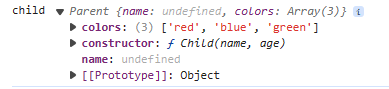
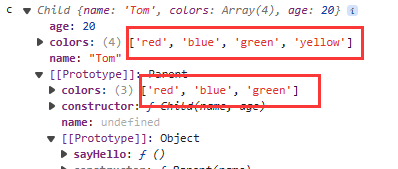
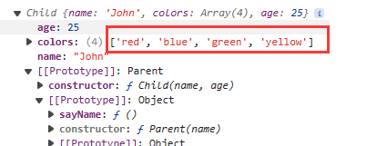
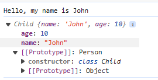

# JS 手写题

### 防抖节流

防抖：在多次调用时，只触发最近一次调用，类似于——回城，一旦重新点击，重新开始

节流：调用一次后，就不能再次调用除非冷却时间过去——类似技能冷却

debounce

```js
//debounce
function debounce(fn, times) {
  let timer;
  return function () {
    if (timer) {
      clearTimeout(timer);
    }
    timer = setTimeout(() => {
      timer = null;
      fn.apply(this, ...arguments);
    }, times);
  };
}
```

throttle

```js
function throttle(func, wait) {
  let waiting = false;
  let lastArgs = null;
  function startCooling() {
    setTimeout(() => {
      if (lastArgs) {
        // 冷却期内有过调用 → 执行最后一次的参数，重新启动冷却
        func.apply(this, lastArgs);
        lastArgs = null; // 清空参数
        startCooling(); // 重新启动冷却（处理可能的后续调用）
      } else {
        // 冷却期内无调用 → 结束冷却状态
        waiting = false;
      }
    }, wait);
  }
  return function (...args) {
    if (!waiting) {
      // 情况1：不在冷却期 → 立即执行原始函数，进入冷却期
      func.apply(this, args);
      waiting = true;
      startCooling.call(this); // 启动冷却定时器
    } else {
      // 情况2：在冷却期 → 记录最后一次调用的参数
      lastArgs = args;
    }
  };
}
```

### 不使用 a 标签实现，a 标签的功能

首先我们需要知道，a 标签干了什么，a 标签实现了跳转，而且是本页还是新开页面跳转，此外还有 a 标签上面的样式改变

```js
document.querySelector(".a").addEventListener("click", () => {
  window.location.href = "https://www.baidu.com/";
  window.open("_blank");
});
```

a 标签的 href 就是 location.href 跳转的目标

window.open()即打开方式，即 a 的 target，然后在修改部分样式即可达到

### 不使用循环 API 来删除数组中指定位置的元素（如：删除第三位） 写越多越好

```js
//通过直接修改源数组
a.splice(2, 1);
//拷贝数组
a.slice(0, 2).concat(a.slice(3));

// 方法三 delete数组中的元素 再把这个元素给剔除掉
delete arr[2];
arr
  .join(" ")
  .replaceAll(/\s{1,2}/g, " ")
  .split(" ");
```

### 实现深/浅拷贝

不考虑循环引用

#### 浅拷贝

1.使用解构

```js
const obj = {
  a: 1,
  b: {
    c: 2,
  },
};

const objCopy = { ...obj };
objCopy.b.c = 3;
console.log(obj); // { a: 1, b: { c: 3 } }
console.log(objCopy); // { a: 1, b: { c: 3 } }
```

2.使用 Object.assign

```js
const obj = {
  a: 1,
  b: {
    c: 2,
  },
};
const obj1 = Object.assign({}, obj);
obj1.b.c = 4;
console.log(obj); // { a: 1, b: { c: 4 } }
console.log(obj1); // { a: 1, b: { c: 4 } }
```

3.使用遍历

```js
const obj2 = {};
for (let key in obj) {
  if (obj.hasOwnProperty(key)) {
    obj2[key] = obj[key];
  }
}
```

#### 深拷贝

1.手写深拷贝函数

```js
//深拷贝
function deepCopy(obj) {
  if (typeof obj !== "object" || obj === null) {
    return obj;
  }
  const newObj = Array.isArray(obj) ? [] : {};
  for (let key in obj) {
    if (obj.hasOwnProperty(key)) {
      newObj[key] = deepCopy(obj[key]);
    }
  }
  return newObj;
}
//测试
const obj = {
  a: 1,
  b: 2,
  c: {
    d: [1, 2, 3],
  },
};
const newObj = deepCopy(obj);

console.log(newObj === obj);
newObj.c.d.push(4);
console.log("obj", obj);
console.log("newObj", newObj);
```

2.使用 JSON

```js
const newObj = JSON.parse(JSON.stringify(obj));
```

如果出现循环引用，这两种方法都不行

```js
//处理循环引用问题
const obj2 = {
  a: 1,
};
const obj1 = {
  a: 1,
  b: obj2,
};
obj2.b = obj1;
```

使用 map 进行存储，各个 key 然后可以实现拷贝

```js
const deepCopyOptimization = (obj) => {
  const cache = new WeakMap();
  const copy = (obj) => {
    if (typeof obj !== "object" || obj === null) {
      return obj;
    }
    if (cache.has(obj)) {
      return cache.get(obj);
    }
    const newObj = Array.isArray(obj) ? [] : {};
    cache.set(obj, newObj);
    for (let key in obj) {
      if (obj.hasOwnProperty(key)) {
        newObj[key] = copy(obj[key]);
      }
    }
    return newObj;
  };
  return copy(obj);
};

const newObj2 = deepCopyOptimization(obj2);
const newObj1 = deepCopyOptimization(obj1);
console.log(newObj1);
console.log(newObj2);
console.log(newObj2.b === newObj2);
```

### 手写 Bind，Call，Apply

首先我们应该知道，bind，call，apply 分别做了什么

bind，在函数上调用，将其 this 指向传入的对象，并且返回一个函数

```js
Function.prototype.myBind = function (context, ...args) {
  if (typeof this !== "function") {
    throw new TypeError("Bind must be called on a function");
  }

  const fn = this;

  function boundFunction(...restArgs) {
    // 如果作为构造函数调用，this 是新对象，忽略 context
    return fn.apply(
      this instanceof boundFunction ? this : context,
      args.concat(restArgs)
    );
  }

  // 继承原函数的 prototype
  boundFunction.prototype = Object.create(fn.prototype);
  return boundFunction;
};
```

call，在函数上调用，将其 this 指向传入的对象，第二个参数是正常传参，并且返回一个执行结果

```js
Function.prototype.myCall = function (context) {
  if (typeof this !== "function") {
    throw new TypeError("Error: this is not a function");
  }
  if (context === undefined || context === null) {
    context = window;
  } else {
    context = Object(context);
  }
  const args = [...arguments].slice(1);
  const sy = Symbol("fn");
  context[sy] = this;
  const result = context[sy](...args);
  delete context[sy];
  return result;
};
```

apply 在函数上调用，将其 this 指向传入的对象，第二个参数是`数组`，并且返回一个执行结果

```js
Function.prototype.myApply = function (context) {
  if (typeof this !== "function") {
    throw new TypeError("Error: this is not a function");
  }
  if (context === undefined || context === null) {
    context = window;
  } else {
    context = Object(context);
  }
  //因为是数组直接取第二位就行了

  const args = [...arguments][1];
  const sy = Symbol("fn");
  context[sy] = this;
  //这里要改变一下，因为传入的参数是一个数组需要结构一下
  const result = arguments.length > 1 ? context[sy](...args) : context[sy]();
  delete context[sy];
  return result;
};
```

### 继承

这里需要知道原型链相关的知识

#### ES6 之前

原型继承——即将子类的 prototype 指向为一个父类的实例

缺点：父类的引用类型，会被所有子类共享

```js
//原型链继承
function Person() {
  this.shared = ["a", "b", "c"];
}

function Student() {}
Student.prototype = new Person();

let p = new Student("Mary", 25);

p.shared.push("d");
let s = new Student("John", 20, 3);

console.log("s.shared", s.shared); //s.shared [ 'a', 'b', 'c', 'd' ]
console.log("p.shared", p.shared); //  p.shared [ 'a', 'b', 'c', 'd' ]
```

2.构造函数继承

使用父类的构造函数来增强子类**实例**，等同于复制父类的实例给子类（不使用原型）

```js
//构造函数继承
function Father() {
  this.colors = ["red", "blue", "green"];
  this.sayGoodbye = () => {
    console.log("goodbye");
  };
}
Father.prototype.sayHello = function () {
  console.log("hello");
};
function Son() {
  Father.call(this);
}

let s = new Son();
let f = new Son();
s.colors.push("yellow");
console.log("s.colors", s.colors); //s.colors [ 'red', 'blue', 'green', 'yellow' ]
console.log("f.colors", f.colors); //f.colors [ 'red', 'blue', 'green' ]
s.sayGoodbye(); //goodbye
s.sayHello(); //报错，不存在这个东东
console.log(s.sayGoodbye === f.sayGoodbye); // false
```

核心代码是 Father.call(this)，创建子类实例时调用`Father`构造函数，于是`Son`的每个实例都会将 SuperType 中的属性复制一份。

但是，只能继承父类的实例属性和方法，原型上的不可得到，而且每个子类都有父类的实例函数副本，没有实现复用，浪费性能

**组合继承**

结合了上面两者的优点，使用原型链进行原型继承，借用构造函数实现实例属性的继承

```js
//组合继承
function Parent(name) {
  this.name = name;
  this.colors = ["red", "blue", "green"];
}
Parent.prototype.sayHello = function () {
  console.log("hello");
};
function Child(name, age) {
  Parent.call(this, name);
  this.age = age;
}
Child.prototype = new Parent();
Child.prototype.constructor = Child;

let c = new Child("Tom", 20);
let b = new Child("Jerry", 25);
c.colors.push("yellow");
console.log("c", c); // c Child { name: 'Tom',colors: [ 'red', 'blue', 'green', 'yellow' ], age: 20}
console.log("b", b); // b Child { name: 'Jerry', colors: [ 'red', 'blue', 'green' ], age: 25 }
console.log(c.sayHello === b.sayHello); // true
console.log("child", Child.prototype);
```

缺点：会给 Child.prototype 添加两个属性“name”和“colors”

而且会给 Child 的实例上添加 name 和 colors 属性


**寄生继承**

核心：在原型式继承的基础上，增强对象，返回构造函数

```js
function createAnother(original) {
  var clone = object(original); // 通过调用 object() 函数创建一个新对象
  clone.sayHi = function () {
    // 以某种方式来增强对象
    alert("hi");
  };
  return clone; // 返回这个对象
}

var person = {
  name: "Nicholas",
  friends: ["Shelby", "Court", "Van"],
};
var anotherPerson = createAnother(person);
anotherPerson.sayHi(); //"hi"
```

缺点：原型链继承多个实例的引用类型属性指向相同，存在篡改的可能。无法传递参数

**组合寄生继承**

最成熟的方法，也是当前库所有 的方法

```js
//寄生组合继承
function inheritPrototype(child, parent) {
  var prototype = Object.create(parent.prototype); // 创建对象，创建父类原型的一个副本
  prototype.constructor = child; // 增强对象，弥补因重写原型而失去的默认的constructor 属性
  child.prototype = prototype; // 指定对象，将新创建的对象赋值给子类的原型
}
function Parent(name) {
  this.name = name;
  this.colors = ["red", "blue", "green"];
}
function Child(name, age) {
  Parent.call(this, name); // 调用父类的构造函数，并传入参数
  this.age = age;
}
inheritPrototype(Child, Parent); // 继承父类原型

Parent.prototype.sayName = function () {
  console.log(this.name);
};

var child1 = new Child("John", 25);
var child2 = new Child("Mary", 30);
child1.colors.push("yellow");
console.log(child1);
console.log(child2);
```

只有子类实例上有方法，而父类没有



#### ES6 及之后

```js
class Person {
  constructor(name) {
    this.name = name;
  }

  sayHello() {
    console.log(`Hello, my name is ${this.name}`);
  }
}
class Child extends Person {
  constructor(name, age) {
    super(name);
    this.age = age;
  }
}
const child1 = new Child("John", 10);
child1.sayHello(); // Output: Hello, my name is John
console.log(child1); //
```



### 实现 new 操作符

首先，我们需要知道 new 操作符，干了什么。

new 操作符，创建了一个对象，然后将属性附加在对象上

```js
function myNew(constructor, ...args) {
  const obj = Object.create(constructor.prototype);

  const result = constructor.call(obj, ...args);
  return typeof result === "object" ? result : obj;
}
```

### 如何拦截全局 Promise reject，但并没有设定 reject 处理器 时候的错误

`try catch`只能拦截这个块里面的

可以给 window 对象添加一个`unhandledrejection`方法

```js
// 使用 unhandledrejection 来拦截全局错误  （这个是对的）
window.addEventListener("unhandledrejection", (event) => {
  event && event.preventDefault();
  console.log("event", event);
});
```

### 手写实现 sleep

```js
(async function () {
  console.log("start sleep");
  await sleep(3000);
  console.log("end sleep");
  function sleep(ms) {
    return new Promise((res) => {
      setTimeout(() => {
        res();
      }, ms);
    });
  }
})();
```

通过 await 异步阻塞

通过 while 循环完全阻塞进程

```js
(function () {
  console.log("start sleep");
  sleep(3000);
  console.log("end sleep");
  function sleep(ms) {
    const start = Date.now();
    while (Date.now() - start < ms) {
      // continue;
    }
  }
})();
```

### 实现 add(1)(2)

```js
function add(x) {
  let sum = x;
  let temp = function (y) {
    sum += y;
    return temp;
  };
  temp.toString = function () {
    return sum;
  };
  return temp;
}
alert(add(1)(2)(1)(2)); //3
```

这里利用了 alert 参数为 string 的方法，如果不是 string 会调用 toString()

### 数组分组改成减法运算

比如`[5,[[4,3],2],1]`换为`(5-((4-3)-2)-1)`

1.转化为字符串然后进行遍历替换

```js
//比如`[5,[[4,3],2],1]`换为`(5-((4-3)-2)-1)`
const arr = [5, [[4, 3], 2], 1];
console.log(JSON.stringify(arr).split(""));

const fn = JSON.stringify(arr)
  .split("")
  .map((item) => {
    if (item === ",") return "-";
    else if (item === "[") return "(";
    else if (item === "]") return ")";
    else return item;
  })
  .join("");
let res = new Function(`return ${fn}`)();
console.log(res); // 5
```

reduce 的递归调用

```js
const convert = (arr) => {
  return arr.reduce((pre, cur) => {
    const first = Array.isArray(pre) ? convert(pre) : pre;
    const second = Array.isArray(cur) ? convert(cur) : cur;
    return first - second;
  });
};

console.log(convert(arr)); // 5
```

手写 flat

```js
const flat = (arr, deep = 1) => {
  const res = [];
  for (let a of arr) {
    if (Array.isArray(a) && deep > 0) {
      res.push(...flat(a, deep - 1));
    } else {
      res.push(a);
    }
  }
  return res;
};
const myFlat = (arr, d = Infinity) => {
  return d > 0
    ? arr.reduce(
        (acc, cur) =>
          Array.isArray(cur) ? acc.concat(myFlat(cur, d - 1)) : acc.concat(cur),
        []
      )
    : arr;
};
```

还有巧计，只求最大的话

```js
arr.toString().split(",").map(Number);
```

等同于

```js
arr.flat(Infinity);
```

### 数组转为 tree

```js
function convert(arr, parentId) {
  const filter = arr.filter((item) => {
    return parentId === undefined
      ? item.parent === -1
      : item.parent === parentId;
  });
  return filter.map((item) => {
    item.childNode = convert(arr, item.id);
    return item;
  });
}
```

### Promise 手写

### 计算小数

```js
//给出两个数，计算他们相除的结果，如果小数部分有循环，`0.(6)`，如果没有循环那么直接返回值
function calculateDecimal(a, b) {
  // 如果没有循环直接返回，比如1/2 = 0.5 有循环则返回循环后的，比如2/3 = 0.(6)
  if (numerator % denominator === 0) {
    return `${numerator / denominator}`;
  }

  // 处理负数情况
  const sign = (numerator < 0) ^ (denominator < 0) ? "-" : "";
  numerator = Math.abs(numerator);
  denominator = Math.abs(denominator);

  // 整数部分
  const integerPart = Math.floor(numerator / denominator);
  let remainder = numerator % denominator;

  // 小数部分
  let decimalPart = "";
  const remainderMap = new Map(); // 记录余数和其在小数部分的位置
  let position = 0;

  // 计算小数部分，直到余数为0或者出现循环
  while (remainder !== 0 && !remainderMap.has(remainder)) {
    remainderMap.set(remainder, position++);
    remainder *= 10;
    decimalPart += Math.floor(remainder / denominator);
    remainder %= denominator;
  }

  // 如果余数为0，表示除尽了，没有循环
  if (remainder === 0) {
    return `${sign}${integerPart}.${decimalPart}`;
  } else {
    // 出现循环
    const index = remainderMap.get(remainder);
    const nonRepeating = decimalPart.substring(0, index);
    const repeating = decimalPart.substring(index);
    return `${sign}${integerPart}.${nonRepeating}(${repeating})`;
  }
}
```

### React 自定义 hook

#### useFetch

```ts
import { useEffect, useState, useRef } from "react";
/**
 * 优化后的useFetch Hook
 * @param {Function} fetchFn - 发起请求的函数，接收参数并返回Promise
 * @param {any[]} deps - 触发请求重新执行的依赖项（类似useEffect的依赖）
 * @returns {Object} - { data, isLoading, error, refetch }
 */
const useFetch = <T>(
  fetchFn: (...args: any[]) => Promise<T>,
  deps: any[] = []
) => {
  const [data, setData] = (useState < T) | (null > null); // 用泛型支持任意类型，初始为null
  const [isLoading, setIsLoading] = useState(false);
  const [error, setError] = (useState < Error) | (null > null);

  // 用于取消请求的控制器
  const abortControllerRef = (useState < AbortController) | (null > null[0]);

  // 封装请求逻辑，支持手动调用（refetch）
  const fetchData = useCallback(
    async (...args: any[]) => {
      // 取消之前的请求（解决竞态条件）
      if (abortControllerRef) {
        abortControllerRef.abort();
      }
      const controller = new AbortController();
      abortControllerRef = controller;

      setIsLoading(true);
      setError(null); // 重置错误状态

      try {
        // 传递信号给fetch，支持取消
        const response = await fetchFn(...args, { signal: controller.signal });
        setData(response);
      } catch (err) {
        // 忽略取消请求导致的错误
        if (err instanceof Error && err.name !== "AbortError") {
          setError(err);
        }
      } finally {
        // 只有当控制器未被取消时，才更新loading（避免组件卸载后更新）
        if (!controller.signal.aborted) {
          setIsLoading(false);
        }
      }
    },
    [fetchFn]
  );

  // 初始请求：依赖变化时自动执行
  useEffect(() => {
    const controller = new AbortController();
    abortControllerRef = controller;

    fetchData();

    // 组件卸载时取消请求
    return () => {
      controller.abort();
    };
  }, [fetchData, ...deps]); // 依赖deps和fetchData

  return { data, isLoading, error, refetch: fetchData };
};

export default useFetch;
```

## Node 面试题

https://elemefe.github.io/node-interview/#/sections/zh-cn/
